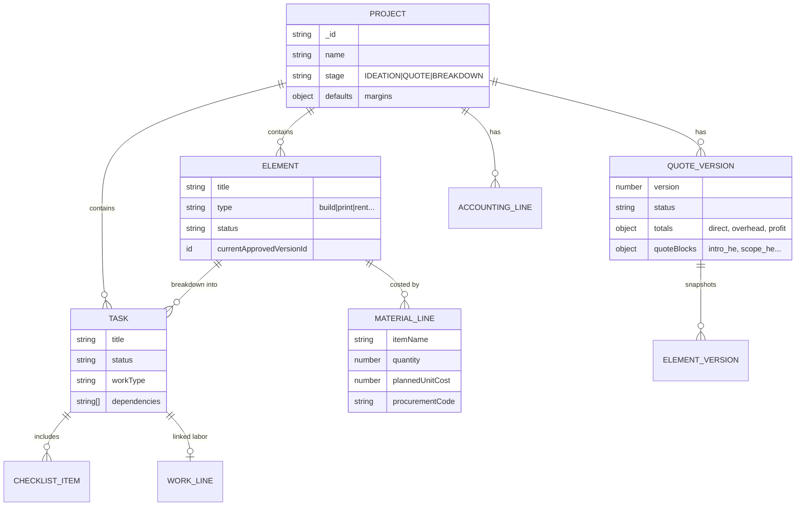
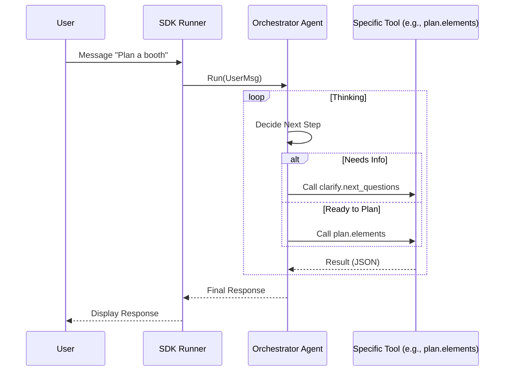

# StudioAgent System Documentation (Rebuild Spec v1)

**Version:** 1.0  
**Date:** 2026-02-14  
**Generated By:** Repository Documentation Agent  
**Purpose:** Comprehensive guide to rebuild the StudioAgent system from scratch without access to the original codebase.

---

## Table of Contents

1. [Repository Inventory Snapshot](#1-repository-inventory-snapshot)
2. [Frontend (UI/UX) Deep Map](#2-frontend-uiux-deep-map)
3. [Backend (Convex) API Surface](#3-backend-convex-api-surface)
4. [Data Model (DB) Deep Spec](#4-data-model-db-deep-spec)
5. [Agents, Skills, & SDK Architecture](#5-agents-skills--sdk-architecture)
6. [Cross-cutting Concerns](#6-cross-cutting-concerns)
7. [Rebuild Blueprint](#7-rebuild-blueprint)

---

## 1. Repository Inventory Snapshot

### 1.1 Tech Stack & Runtime
*   **Frontend:** Next.js 16 (App Router), React 19, TailwindCSS 4, Lucide React (Icons).
*   **Backend:** Convex (Serverless Realtime DB + Functions).
*   **Language:** TypeScript (Strict).
*   **Testing:** Playwright (E2E), Node Native Test Runner (SDK unit tests).
*   **External Services:** OpenAI (GPT-4o, GPT-5-mini), Trello API.
*   **File Handling:** `pdf-parse`, `mammoth` (Word), `xlsx` (Excel).

### 1.2 Repo Map (Top-Level)
| Path | Purpose | Key Files |
| :--- | :--- | :--- |
| `src/app/` | Next.js App Router Pages | `projects/[id]/layout.tsx`, `projects/page.tsx` |
| `convex/` | Backend Logic | `schema.ts`, `agent.ts`, `quotes.ts`, `accounting.ts` |
| `convex/sdk/` | **New** Agent SDK | `registry.ts`, `runner.ts`, `agent.ts` |
| `convex/skills/` | **Legacy** Skill System | `registry.ts`, `runner.ts` |
| `convex/flow/` | Flow Engine (Graph-based) | `graph.ts`, `flowRunnerV3.ts` |
| `Specs/` | Documentation & Specs | `Accounting_codex.md`, `gpt spec v2.txt` |

### 1.3 System-at-a-glance

```mermaid
graph TD
    User((User)) -->|Browser| NextJS[Next.js App Router]
    NextJS -->|Queries/Mutations| Convex[Convex Backend]
    
    subgraph "Convex Backend"
        API[API Surface]
        DB[(Convex DB)]
        
        subgraph "Agent System"
            LegacyAgent[Legacy Agent (agent.ts)]
            SDKAgent[New SDK Agent (sdk/)]
            Skills[Skill Registry]
        end
        
        subgraph "Pipelines"
            Ingest[File Ingestion]
            Quote[Quote Engine]
            Acct[Accounting Engine]
            Trello[Trello Sync]
        end
        
        API --> DB
        API --> LegacyAgent
        API --> SDKAgent
        SDKAgent --> Skills
        SDKAgent --> DB
        Ingest --> DB
    end
    
    SDKAgent -->|OpenAI API| LLM[LLM Provider]
    Trello -->|REST| TrelloAPI[Trello API]
```

---

## 2. Frontend (UI/UX) Deep Map

### 2.1 Routes Inventory
All routes reside in `src/app/`. The core application revolves around the Project Workspace.

| Route Path | Component File | Description | Key Components / Logic |
| :--- | :--- | :--- | :--- |
| `/` | `src/app/page.tsx` | Landing / Redirect | Redirects to `/projects` or login. |
| `/projects` | `src/app/projects/page.tsx` | Project List | `ProjectList`, `CreateProjectModal`. |
| `/projects/[id]` | `src/app/projects/[id]/layout.tsx` | Project Workspace | Sidebar nav, Context Providers (`ConvexClientProvider`). |
| `.../overview` | `src/app/projects/[id]/overview/page.tsx` | Project Dashboard | Status summary, key metrics. |
| `.../knowledge` | `src/app/projects/[id]/knowledge/page.tsx` | Context & Files | File upload (`UploadButton`), Parsed text view. |
| `.../elements` | `src/app/projects/[id]/elements/page.tsx` | Element Breakdown | List of deliverables (Build/Print/Rent). |
| `.../tasks` | `src/app/projects/[id]/tasks/page.tsx` | Task Management | Kanban/List view, Gantt chart. |
| `.../accounting` | `src/app/projects/[id]/accounting/page.tsx` | Budget/BOM | `MaterialLines`, `WorkLines`, Cost vs Price. |
| `.../quote` | `src/app/projects/[id]/quote/page.tsx` | Quote Builder | `QuotePreview`, `QuoteEditor` (He). |
| `.../studio` | `src/app/projects/[id]/studio/page.tsx` | Production View | Internal studio facing view. |
| `.../flow-agent` | `src/app/projects/[id]/flow-agent/page.tsx` | **Legacy** Flow UI | Graph visualization of flow steps. |
| `.../sdk-agent` | `src/app/projects/[id]/sdk-agent/page.tsx` | **New** Agent Chat | Chat interface for SDK Agent. |

### 2.2 Key UI Patterns
*   **Navigation:** Sidebar based, persistent layout in `projects/[id]/layout.tsx`.
*   **Data Loading:** Convex React hooks (`useQuery`, `useMutation`). Realtime updates.
*   **Modals:** Used for "Create Project", "Add Element", "Upload File".
*   **Hebrew Support:** UI labels often have `_he` suffix in DB but rendered as plain text. `direction: rtl` supported in specific containers.

---

## 3. Backend (Convex) API Surface

### 3.1 Major Modules (`convex/`)

#### A. Core Business Logic
*   **`projects.ts`**: CRUD for Projects. `create`, `update`, `getOverview`.
*   **`elements.ts`**: CRUD for Elements. `create`, `patch`, `delete`.
*   **`tasks.ts`**: Task management. `create`, `patch`, `delete`, `listForProject`.
*   **`accounting.ts`**: Financial lines.
    *   `addMaterialLine`, `updateMaterialLine`: Manage BOM items.
    *   `addWorkLine`, `updateWorkLine`: Manage Labor items.
*   **`quotes.ts`**: Quote generation engine.
    *   `generateQuoteV2`: The main aggregation logic (Direct Cost -> Margins -> Quote).
    *   `createDraftFromUi`: Starts a new quote version.
*   **`filesActions.ts`**: File processing.
    *   `saveUploadedFile`: Action that triggers `pdf-parse` / `mammoth`.

#### B. Integrations
*   **`trelloSync.ts`**: One-way sync (Studio -> Trello).
    *   `sync`: Iterates tasks, maps to Trello cards, updates labels/dates/checklists.
    *   `listBoards`, `listLists`: Helper actions.

#### C. Agent/AI (See Section 5)
*   **`agent.ts`**: Legacy monolithic agent endpoint.
*   **`sdk/`**: New modular agent system.

### 3.2 Ingestion Pipeline
**File:** `convex/filesActions.ts`
1.  **Upload:** Client gets upload URL via `generateUploadUrl`.
2.  **Action:** `saveUploadedFile` is called with `storageId`.
3.  **Extraction:**
    *   **PDF:** Uses `pdf-parse`.
    *   **Word:** Uses `mammoth`.
    *   **Excel:** Uses `xlsx`.
    *   **Text/MD:** Raw read.
4.  **Enrichment:** Calls `gpt-5.2` (via `extractStructuredInfo`) to extract topics, domain, entities, summary.
5.  **Storage:** Saves to `projectFiles` table.
6.  **Memory:** Appends summary to `memoryDocs` (via `api.memory.appendRunningMemory`).

---

## 4. Data Model (DB) Deep Spec

**Source:** `convex/schema.ts`

### 4.1 Core Entity Relationships (ERD)



### 4.2 Key Tables & Fields
*   **`projects`**: Root entity. Tracks `stage`, `defaults` (profit/overhead %).
*   **`elements`**: High-level deliverables.
*   **`tasks`**: Executable units. Key fields: `workType` (enum), `checklist` (array of objects), `dependencies` (array of taskIds).
*   **`materialLines`**: BOM items. Linked to `elementId` or `taskId`. Tracks `quantity`, `plannedUnitCost`, `vendorName`.
*   **`workLines`**: Labor costs. Tracks `roleHe`, `days`, `rate`.
*   **`quoteVersions`**: Immutable snapshots of quotes. Stores full JSON structure of the generated quote (`quoteBlocks`, `totals`).
*   **`projectFiles`**: Stores file metadata and extracted text.
*   **`conversations` / `messages`**: Chat history.

### 4.3 Lifecycle State Machines
*   **Project Stage:** `IDEATION` -> `QUOTE` -> `BREAKDOWN`. (Driven by `projectsStage.ts` or manual override).
*   **Quote Status:** `draft` -> `generated` -> `approved` | `rejected`.

---

## 5. Agents, Skills, & SDK Architecture

### 5.1 Architecture Overview
The system is transitioning from a **Legacy Monolithic Agent** to a **New SDK Agent**.

| Feature | Legacy System | New SDK System |
| :--- | :--- | :--- |
| **Location** | `convex/agent.ts` | `convex/sdk/` |
| **Definition** | `SKILL_CATALOG` (`convex/skills/registry.ts`) | `REGISTRY` (`convex/sdk/registry.ts`) |
| **Execution** | Manual switch/case in `agent.ts` | `runAgentInternal` loop in `runner.ts` |
| **Tooling** | Hardcoded logic | JSON Schema validated tools |

### 5.2 New SDK Architecture (`convex/sdk/`)

#### A. Registry (`registry.ts`)
Defines two types of capabilities:
1.  **Agents (`kind: 'agent'`)**: Iterative loops using Tools.
    *   `orchestrator`: The boss. Delegates to other agents.
    *   `clarify.next_questions`: Asks user for missing info.
    *   `pricing.resolve_lines`: Web searches for prices.
2.  **Tools (`kind: 'tool'`)**: Single-shot completions.
    *   `plan.elements`: Generates element list.
    *   `cost.build_budget`: Generates BOM.
    *   `quote.generate`: Drafts quote text.

#### B. Orchestrator Flow


#### C. ChangeSets (`changeset.ts`)
A critical pattern for modifying the DB. The agent **never** writes to `tasks` or `elements` directly.
1.  Agent produces a `ChangeSet` (JSON describing `op: add`, `op: update`).
2.  System saves it to `changeSets` table.
3.  User (or Auto-Approver) calls `applyChangeSet`.
4.  System executes mutations transactionally.

### 5.3 Key Skills (Legacy & New Mapping)
*   **`TASKS_BUILDER_FULL` (Legacy)** -> **`plan.tasks` (SDK)**
*   **`QUOTE_WRITER_FULL` (Legacy)** -> **`quote.generate` (SDK)**
*   **`SHOPPING_PLANNER_WEB` (Legacy)** -> **`procurement.shopping_plan` (SDK)**

---

## 6. Cross-cutting Concerns

### 6.1 Authentication
*   **File:** `convex/users.ts`.
*   **Logic:**
    1.  Checks `ctx.auth.getUserIdentity()`.
    2.  If logged in, fetches from `users` table by email.
    3.  **Dev Fallback:** If no auth, fetches "global" settings from `appSettings` table (Key: `global`). This allows local dev without login.

### 6.2 Configuration & Secrets
*   **Trello:** Credentials stored in `users.trelloCredentials` OR `projects.tasksConfiguration.trelloConfig`.
*   **OpenAI:** Key stored in `process.env.OPENAI_API_KEY`.

### 6.3 Trello Sync Logic
**File:** `convex/trelloSync.ts`
*   **Direction:** Studio -> Trello (1-way).
*   **Mapping:** Tasks are mapped to Cards by title.
*   **Logic:**
    *   Creates/Updates Cards based on Task Title.
    *   Syncs Due Date, Description, Labels (based on `workType`).
    *   Syncs Checklists.
    *   Moves cards between lists based on `status` mapping config.

---

## 7. Rebuild Blueprint

Follow this order to rebuild the system from zero.

### Step 1: Foundation
1.  **Init Convex:** `npx convex dev`.
2.  **Schema:** Copy `convex/schema.ts`. This is the source of truth.
3.  **Auth:** Implement `convex/users.ts` with the dev fallback.

### Step 2: Core Data Modules
1.  **Projects:** Implement `convex/projects.ts` (CRUD).
2.  **Elements/Tasks:** Implement `convex/elements.ts` and `convex/tasks.ts`.
3.  **Financials:** Implement `convex/accounting.ts`.

### Step 3: Pipelines (The "Hard" Stuff)
1.  **File Ingestion:**
    *   Install `pdf-parse`, `mammoth`, `xlsx`.
    *   Implement `convex/filesActions.ts` (upload & extract).
2.  **Quote Engine:**
    *   Implement `convex/quotes.ts` (`generateQuoteV2`).
    *   Ensure math matches: `(Direct + Overhead + Risk) * Profit`.

### Step 4: Agent System (SDK)
1.  **Scaffold SDK:** Create `convex/sdk/` folder.
2.  **Registry:** Define `REGISTRY` in `convex/sdk/registry.ts`.
3.  **Runner:** Implement `runAgentInternal` in `convex/sdk/runner.ts` handling the loop.
4.  **Prompts:** Copy prompts from `convex/sdk/prompts.ts` (assumed existing).

### Step 5: Frontend
1.  **Scaffold App:** `npx create-next-app`.
2.  **Routes:** Create folders `src/app/projects/[id]/...`.
3.  **Components:** Build the "Project Layout" sidebar.
4.  **Wiring:** Connect pages to Convex queries.

### Step 6: Trello Integration (Optional)
1.  Implement `convex/trelloSync.ts` if external sync is needed.

---

**End of Spec**
