# Rebuildable System Documentation v2

Generated on 2026-02-15 from repository source files.

This document is grounded in code and local docs only. Where an expected entity was not found, it is marked `NOT FOUND` with the exact search used.

## Table of Contents
- [Glossary / Canonical Naming Map](#glossary--canonical-naming-map)
- [Phase 0 - Repository Inventory Snapshot](#phase-0--repository-inventory-snapshot)
- [Phase 1 - Frontend (UI/UX) Deep Map](#phase-1--frontend-uiux-deep-map)
- [Phase 2 - Backend (Convex) API Surface + Pipelines](#phase-2--backend-convex-api-surface--pipelines)
- [Phase 3 - Data Model (DB) Deep Spec](#phase-3--data-model-db-deep-spec)
- [Phase 4 - Agents, Skills, Prompts (SDK-Agent Focus)](#phase-4--agents-skills-prompts-sdk-agent-focus)
- [Phase 5 - Cross-cutting Concerns](#phase-5--cross-cutting-concerns)
- [Phase 6 - Rebuild Blueprint](#phase-6--rebuild-blueprint)
- [Where To Look (Subsystem File Map)](#where-to-look-subsystem-file-map)
- [Completeness Check](#completeness-check)
- [NOT FOUND Ledger + Searches](#not-found-ledger--searches)
- [Targeted Open Questions](#targeted-open-questions)
- [Appendix A - Full Convex Endpoint Catalog](#appendix-a--full-convex-endpoint-catalog)
- [Appendix B - Full Schema Table Spec](#appendix-b--full-schema-table-spec)

## Glossary / Canonical Naming Map
- `Legacy Agent UI`: `/projects/[id]/agent` (`src/app/projects/[id]/agent/page.tsx:15`, `AgentPage`).
- `Flow Agent UI`: `/projects/[id]/flow-agent` (`src/app/projects/[id]/flow-agent/page.tsx:45`, `FlowAgentPage`).
- `SDK Agent UI`: `/projects/[id]/sdk-agent` (`src/app/projects/[id]/sdk-agent/page.tsx:10`, `SdkAgentPage`).
- `Project Planning Tab`: structured planning sub-tab (`src/app/projects/[id]/sdk-agent/_components/ProjectPlanningTab.tsx:43`).
- `Agent Tab`: conversational orchestration sub-tab (`src/app/projects/[id]/sdk-agent/_components/AgentTab.tsx:181`).
- `ChangeSet`: approval-gated write bundle (`convex/changeSets.ts`, table `changeSets` at `convex/schema.ts:916`).
- `Skill`: catalog item in table `skills` (`convex/schema.ts:1487`) seeded from `SKILL_CATALOG` (`convex/skills/registry.ts:38`).
- `SDK Tool/Agent`: `REGISTRY` entry (`convex/sdk/registry.ts:16`) executed by `runToolInternal` / `runAgentInternal` (`convex/sdk/runner.ts`).
- `VNext Pipeline`: staged deterministic SDK path (`convex/sdk/vnext/pipeline.ts`), gated by `ff_sdk_vnext_pipeline` (`convex/featureFlags.ts:28`).

## Phase 0 - Repository Inventory Snapshot
### 0.1 Tech stack & runtime
- Frontend: Next.js App Router + React 19 + Tailwind v4 (`package.json`, `src/app/layout.tsx:11`, `src/app/globals.css`).
- Backend: Convex (`convex/schema.ts:238`, endpoint files under `convex/`).
- LLM runtime: OpenAI wrapper with tracing (`convex/lib/llm.ts`).
- Agent package presence: `openai-agents` dependency (`package.json:33`); `OpenAIAgent` symbol usage at `convex/skills/runner.ts:1915`.
- Build/dev commands: `npm run dev|build|start|lint` (`package.json:scripts`).
- CI/deploy: `.github/workflows/ci.yml`, `.github/workflows/convex-deploy.yml`.

### 0.2 Top-level repo map
- `src/`: Next.js pages/layouts/components.
- `convex/`: schema + all query/mutation/action logic + agents + orchestration.
- `docs/`: rollout/contracts (for example `docs/autoflow_v2_1_contract.md`, `docs/sdk-vnext-rollout.md`).
- `Specs/`: internal design/spec docs, including `Specs/Rebuild_Spec_v1.md`.
- `scripts/`: local utility scripts (seed/smoke/debug).
- `shared/`: shared templates/utilities (for example quote print template).

### 0.3 System-at-a-glance architecture
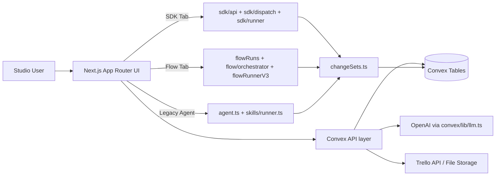
Evidence: `src/app/layout.tsx:11`, `src/app/projects/[id]/sdk-agent/page.tsx:10`, `src/app/projects/[id]/flow-agent/page.tsx:45`, `convex/sdk/dispatch.ts:1430`, `convex/flowRuns.ts:281`, `convex/changeSets.ts:1950`, `convex/trelloSync.ts:138`.

### 0.4 Important file map (selected)
- App shell/navigation: `src/app/layout.tsx`, `src/components/nav/StudioTopNav.tsx`, `src/app/management/layout.tsx`, `src/app/projects/[id]/layout.tsx`.
- Project pages: all routes listed in Phase 1 table (32 pages total, extracted from `src/app/**/page.tsx`).
- Core backend files:
  - `convex/schema.ts`
  - `convex/projects.ts`
  - `convex/elements.ts`
  - `convex/tasks.ts`
  - `convex/accounting.ts`
  - `convex/financials.ts`
  - `convex/quotes.ts`
  - `convex/changeSets.ts`
  - `convex/skills/registry.ts`
  - `convex/skills/runner.ts`
  - `convex/flowRuns.ts`
  - `convex/flow/orchestrator.ts`
  - `convex/flow/flowRunnerV3.ts`
  - `convex/sdk/registry.ts`
  - `convex/sdk/runner.ts`
  - `convex/sdk/dispatch.ts`
  - `convex/sdk/api.ts`
  - `convex/sdk/projectPlanning.ts`
  - `convex/sdk/vnext/pipeline.ts`
  - `convex/sdk/vnext/compiler.ts`
  - `convex/sdk/changeset.ts`
  - `convex/sdk/context.ts`
  - `convex/sdk/telemetry.ts`
  - `convex/memory.ts`
  - `convex/files.ts`
  - `convex/filesActions.ts`
  - `convex/trelloSync.ts`
  - `convex/tracing.ts`

## Phase 1 - Frontend (UI/UX) Deep Map
### 1.1 Navigation structure
```mermaid
flowchart TD
  ROOT[/] --> PROJ[/projects/]
  ROOT --> TASKS[/tasks/]
  ROOT --> ACC[/accounting/]
  ROOT --> CUST[/customers/]
  ROOT --> MGMT[/management/]
  PROJ --> PID[/projects/[id]/overview/]
  PID --> AG[/projects/[id]/agent/]
  PID --> FLOW[/projects/[id]/flow-agent/]
  PID --> SDK[/projects/[id]/sdk-agent/]
  PID --> EL[/projects/[id]/elements/]
  PID --> AC2[/projects/[id]/accounting/]
  PID --> T2[/projects/[id]/tasks/]
  PID --> Q2[/projects/[id]/quote/]
  MGMT --> MV[/management/vendors/]
  MGMT --> MC[/management/catalog/]
  MGMT --> MP[/management/prices/]
  MGMT --> MTR[/management/tracing/]
```
Evidence: `src/components/nav/StudioTopNav.tsx`, `src/app/projects/[id]/layout.tsx:34`, `src/app/management/layout.tsx:18`.

### 1.2 Routes Inventory Table
Source extraction: `logs/page_inventory.json` + `logs/page_ui_extract.json` + `logs/doc_data.json`.

| Route | Page component | Layout wrappers | Key UI components | Main user actions | Convex calls | Data dependencies | Loading/error/flags |
|---|---|---|---|---|---|---|---|
| / | src/app/page.tsx:3 (Home) | src/app/layout.tsx:11 | none | view/query-driven | none | NOT FOUND | basic render |
| /accounting | src/app/accounting/page.tsx:26 (GlobalAccountingPage) | src/app/layout.tsx:11 | none | tabs | accountingStudio.getGlobalSummary -> convex/accountingStudio.ts:4 | customers | loading checks |
| /customers | src/app/customers/page.tsx:9 (CustomersPage) | src/app/layout.tsx:11 | none | tabs | customersStudio.listCustomersStudio -> convex/customersStudio.ts:4 | NOT FOUND | loading checks |
| /customers/[customerId] | src/app/customers/[customerId]/page.tsx:10 (CustomerDetailPage) | src/app/layout.tsx:11 | none | tabs | customersStudio.getCustomerStudio -> convex/customersStudio.ts:56<br/>customersStudio.listProjectsByCustomer -> convex/customersStudio.ts:74 | customers | loading checks; error checks |
| /management | src/app/management/page.tsx:7 (ManagementPage) | src/app/layout.tsx:11, src/app/management/layout.tsx:6 | none | view/query-driven | management.listVendors -> convex/management.ts:97<br/>management.searchTemplates -> convex/management.ts:282<br/>management.listProposed -> convex/management.ts:850<br/>management.listPriceRecords -> convex/management.ts:582 | NOT FOUND | basic render |
| /management/analytics | src/app/management/analytics/page.tsx:34 (AnalyticsPage) | src/app/layout.tsx:11, src/app/management/layout.tsx:6 | ../../../lib/llmPricing | buttons:1, tabs | projects.list -> convex/projects.ts:43<br/>tracing.listRunIds -> convex/tracing.ts:103<br/>tracing.analyticsFiltered -> convex/tracing.ts:126 | projects | loading checks; error checks |
| /management/catalog | src/app/management/catalog/page.tsx:17 (CatalogPage) | src/app/layout.tsx:11, src/app/management/layout.tsx:6 | none | buttons:10, forms:5 | management.searchTemplates -> convex/management.ts:282<br/>management.listVariantsAll -> convex/management.ts:304<br/>management.listCategories -> convex/management.ts:126<br/>management.listUoms -> convex/management.ts:172<br/>management.listSynonyms -> convex/management.ts:406<br/>management.createTemplate -> convex/management.ts:178<br/>management.createVariant -> convex/management.ts:310<br/>management.createCategory -> convex/management.ts:107<br/>management.createUom -> convex/management.ts:132<br/>management.createSynonym -> convex/management.ts:412 | materialCategories, materialTemplates | loading checks; error checks |
| /management/customers | src/app/management/customers/page.tsx:7 (CustomersPage) | src/app/layout.tsx:11, src/app/management/layout.tsx:6 | none | buttons:2, forms:2 | customers.listWithContacts -> convex/customers.ts:51<br/>customers.findOrCreateByName -> convex/customers.ts:5<br/>customers.addContact -> convex/customers.ts:78 | NOT FOUND | loading checks |
| /management/employees | src/app/management/employees/page.tsx:8 (EmployeesPage) | src/app/layout.tsx:11, src/app/management/layout.tsx:6 | none | buttons:3, forms:1, tabs | management.listEmployees -> convex/management.ts:840<br/>management.createEmployee -> convex/management.ts:821 | NOT FOUND | basic render |
| /management/inventory | src/app/management/inventory/page.tsx:8 (InventoryPage) | src/app/layout.tsx:11, src/app/management/layout.tsx:6 | none | buttons:4, forms:1, tabs | inventory.listInventoryItems -> convex/inventory.ts:34<br/>management.searchTemplates -> convex/management.ts:282<br/>management.listVariantsAll -> convex/management.ts:304<br/>inventory.createInventoryItem -> convex/inventory.ts:40<br/>inventory.updateInventoryStock -> convex/inventory.ts:81 | materialTemplates, materialVariants, inventoryItems | loading checks |
| /management/prices | src/app/management/prices/page.tsx:33 (PricesPage) | src/app/layout.tsx:11, src/app/management/layout.tsx:6 | none | buttons:2, forms:2, tabs | management.listPriceRecords -> convex/management.ts:582<br/>management.listVendors -> convex/management.ts:97<br/>management.searchTemplates -> convex/management.ts:282<br/>management.listVariantsAll -> convex/management.ts:304<br/>management.createPriceRecord -> convex/management.ts:588<br/>management.listPricingFormulas -> convex/management.ts:649<br/>management.createPricingFormula -> convex/management.ts:655 | materialVariants, materialTemplates, vendors | loading checks; error checks |
| /management/proposed | src/app/management/proposed/page.tsx:6 (ProposedPage) | src/app/layout.tsx:11, src/app/management/layout.tsx:6 | none | buttons:2 | management.listProposed -> convex/management.ts:850<br/>management.acceptProposed -> convex/management.ts:886<br/>management.rejectProposed -> convex/management.ts:903 | proposedUpdates | basic render |
| /management/purchases | src/app/management/purchases/page.tsx:25 (PurchasesPage) | src/app/layout.tsx:11, src/app/management/layout.tsx:6 | none | buttons:1, forms:1, tabs | management.listPurchases -> convex/management.ts:759<br/>management.listVendors -> convex/management.ts:97<br/>management.searchTemplates -> convex/management.ts:282<br/>management.listVariantsAll -> convex/management.ts:304<br/>management.listUoms -> convex/management.ts:172<br/>management.createPurchase -> convex/management.ts:765 | projects, vendors | loading checks |
| /management/receipts | src/app/management/receipts/page.tsx:21 (ManagementReceiptsPage) | src/app/layout.tsx:11, src/app/management/layout.tsx:6 | none | buttons:8, forms:1 | projects.list -> convex/projects.ts:43<br/>management.listVendors -> convex/management.ts:97<br/>receipts.listByProject -> convex/receipts.ts:177<br/>files.listProjectFiles -> convex/files.ts:43<br/>financials.getAccountingView -> convex/financials.ts:226<br/>receipts.listLineOptions -> convex/receipts.ts:262<br/>files.generateUploadUrl -> convex/files.ts:8<br/>filesActions.saveUploadedFile -> convex/filesActions.ts:16<br/>receipts.createReceipt -> convex/receipts.ts:21<br/>receipts.updateReceipt -> convex/receipts.ts:233<br/>receipts.upsertReceiptItems -> convex/receipts.ts:45<br/>receipts.approveReceipt -> convex/receipts.ts:75<br/>receiptsActions.analyzeReceipt -> convex/receiptsActions.ts:27<br/>receipts.listItems -> convex/receipts.ts:210 | projects, _storage | loading checks; error checks |
| /management/settings | src/app/management/settings/page.tsx:14 (SettingsPage) | src/app/layout.tsx:11, src/app/management/layout.tsx:6 | none | buttons:2 | users.getViewer -> convex/users.ts:4<br/>users.updatePreferredModel -> convex/users.ts:25<br/>management.getFreshnessDefaults -> convex/management.ts:552<br/>management.setFreshnessDefaults -> convex/management.ts:562<br/>management.getProcurementPrefs -> convex/management.ts:730<br/>management.setProcurementPrefs -> convex/management.ts:740 | NOT FOUND | basic render |
| /management/tracing | src/app/management/tracing/page.tsx:57 (TracingPage) | src/app/layout.tsx:11, src/app/management/layout.tsx:6 | ../../../lib/llmPricing | buttons:1, tabs | projects.list -> convex/projects.ts:43<br/>tracing.listRunIds -> convex/tracing.ts:103<br/>tracing.list -> convex/tracing.ts:5<br/>tracing.get -> convex/tracing.ts:58 | projects, llmTraces | loading checks; error checks |
| /management/vendors | src/app/management/vendors/page.tsx:8 (VendorsPage) | src/app/layout.tsx:11, src/app/management/layout.tsx:6 | none | buttons:4, forms:2, tabs | management.listVendors -> convex/management.ts:97<br/>management.createVendor -> convex/management.ts:77<br/>management.listVendorLocations -> convex/management.ts:699<br/>management.createVendorLocation -> convex/management.ts:705 | vendors | loading checks |
| /management/web-prices | src/app/management/web-prices/page.tsx:6 (WebPriceResultsPage) | src/app/layout.tsx:11, src/app/management/layout.tsx:6 | none | tabs | management.listPriceRecords -> convex/management.ts:582 | NOT FOUND | loading checks |
| /projects | src/app/projects/page.tsx:11 (ProjectsPage) | src/app/layout.tsx:11 | ./_components/NewProjectDialog | buttons:5, tabs | projects.list -> convex/projects.ts:43<br/>projects.updateProjectDetails -> convex/projects.ts:241<br/>projects.deleteProject -> convex/projects.ts:516 | projects | basic render |
| /projects/[id]/accounting | src/app/projects/[id]/accounting/page.tsx:112 (AccountingPage) | src/app/layout.tsx:11, src/app/projects/[id]/layout.tsx:17 | ../../../../lib/exportUtils, ./AccountingSummaryBlock, ./ApprovedBudgetRow, ./ElementBreakdownTable | buttons:26, tabs | financials.getFinancialSummary -> convex/financials.ts:156<br/>financials.getAccountingView -> convex/financials.ts:226<br/>tasks.listForProject -> convex/tasks.ts:108<br/>accounting.addMaterialLine -> convex/accounting.ts:6<br/>accounting.updateMaterialLine -> convex/accounting.ts:31<br/>accounting.deleteMaterialLine -> convex/accounting.ts:81<br/>accounting.addWorkLine -> convex/accounting.ts:91<br/>accounting.updateWorkLine -> convex/accounting.ts:116<br/>accounting.deleteWorkLine -> convex/accounting.ts:159 | projects, elements, materialLines, workLines | loading checks; error checks |
| /projects/[id]/agent | src/app/projects/[id]/agent/page.tsx:15 (AgentPage) | src/app/layout.tsx:11, src/app/projects/[id]/layout.tsx:17 | ./_components/SkillsDock, ./_components/AgentChat, ../_components/ConversationsSidebar, ./_components/ElementsRail | buttons:1 | projects.resolveProjectId -> convex/projects.ts:126<br/>skills.runner.listAgentConversations (NOT MAPPED)<br/>elements.listByProject -> convex/elements.ts:350<br/>skills.runner.createAgentConversation (NOT MAPPED)<br/>skills.runner.renameConversation (NOT MAPPED)<br/>skills.runner.generateConversationTitle (NOT MAPPED)<br/>flowRuns.start -> convex/flowRuns.ts:212 | projects | loading checks; error checks |
| /projects/[id]/elements | src/app/projects/[id]/elements/page.tsx:41 (ElementsPage) | src/app/layout.tsx:11, src/app/projects/[id]/layout.tsx:17 | ../../../../lib/exportUtils, ./ElementRunbookTemplatePanel | buttons:25 | elements.listByProject -> convex/elements.ts:350<br/>elements.updateElementMeta -> convex/elements.ts:455<br/>elements.deleteElement -> convex/elements.ts:473<br/>tasks.createTask -> convex/tasks.ts:73<br/>tasks.updateTask -> convex/tasks.ts:50<br/>tasks.deleteTask (NOT MAPPED)<br/>accounting.addMaterialLine -> convex/accounting.ts:6<br/>accounting.updateMaterialLine -> convex/accounting.ts:31<br/>accounting.deleteMaterialLine -> convex/accounting.ts:81<br/>accounting.addWorkLine -> convex/accounting.ts:91<br/>accounting.updateWorkLine -> convex/accounting.ts:116<br/>accounting.deleteWorkLine -> convex/accounting.ts:159<br/>elements.getComposite -> convex/elements.ts:390 | projects, elements, tasks, materialLines, workLines | loading checks; error checks |
| /projects/[id]/flow-agent | src/app/projects/[id]/flow-agent/page.tsx:45 (FlowAgentPage) | src/app/layout.tsx:11, src/app/projects/[id]/layout.tsx:17 | ./_components/FlowRunHeader, ./_components/FlowTimeline, ./_components/FlowDebugPanel, ./_components/FlowQuestionsLane, ./_components/FlowElementsHealthPanel, ./_components/FlowWorkflowGpsPanel | buttons:5, tabs | projects.resolveProjectId -> convex/projects.ts:126<br/>featureFlags.getAll -> convex/featureFlags.ts:60<br/>flowRuns.getActiveByProject -> convex/flowRuns.ts:119<br/>flowRuns.listByProject -> convex/flowRuns.ts:143<br/>flowSteps.listByRun -> convex/flowSteps.ts:19<br/>flowNodeRuns.listByRun -> convex/flowNodeRuns.ts:19<br/>flowChangeSetApplyLogs.listByRun -> convex/flowChangeSetApplyLogs.ts:19<br/>flowRuns.start -> convex/flowRuns.ts:212<br/>flowRuns.pause -> convex/flowRuns.ts:460<br/>flowRuns.resume -> convex/flowRuns.ts:471<br/>flowRuns.cancel -> convex/flowRuns.ts:482<br/>flowRuns.runNext -> convex/flowRuns.ts:281<br/>flowRuns.setToggles -> convex/flowRuns.ts:292<br/>flowRuns.setApprovalMode -> convex/flowRuns.ts:349<br/>flow.audit.run (NOT MAPPED)<br/>featureFlags.setFlag -> convex/featureFlags.ts:94<br/>flow.audit.getStaleness (NOT MAPPED) | NOT FOUND | loading checks; error checks; flags: ff_flow_agent_tab, ff_flow_agent_backend, ff_flow_runner_v1/v2/v3 |
| /projects/[id]/knowledge | src/app/projects/[id]/knowledge/page.tsx:6 (KnowledgePage) | src/app/layout.tsx:11, src/app/projects/[id]/layout.tsx:17 | none | tabs | none | NOT FOUND | basic render |
| /projects/[id]/overview | src/app/projects/[id]/overview/page.tsx:12 (OverviewPage) | src/app/layout.tsx:11, src/app/projects/[id]/layout.tsx:17 | ./ProjectKnowledgePanel | buttons:11, tabs | projects.getOverview -> convex/projects.ts:77<br/>files.listProjectFiles -> convex/files.ts:43<br/>projects.listProjects -> convex/projects.ts:49<br/>projects.listLinkedProjects -> convex/projects.ts:338<br/>files.generateUploadUrl -> convex/files.ts:8<br/>filesActions.saveUploadedFile -> convex/filesActions.ts:16<br/>files.deleteProjectFile -> convex/files.ts:64<br/>agent.createElementFromStructured -> convex/agent.ts:1786<br/>projects.updateProjectDetails -> convex/projects.ts:241<br/>projects.deleteProject -> convex/projects.ts:516<br/>projectsCustomers.setProjectCustomerByName -> convex/projectsCustomers.ts:5<br/>projects.linkProject -> convex/projects.ts:376<br/>projects.unlinkProject -> convex/projects.ts:414<br/>projects.generateProjectDigest -> convex/projects.ts:434<br/>projects.generateOverviewSummary -> convex/projects.ts:287<br/>projects.retrySummary -> convex/projects.ts:1039 | projects, structuredAnswers, _storage, projectFiles | loading checks; error checks |
| /projects/[id]/quote | src/app/projects/[id]/quote/page.tsx:11 (QuotePage) | src/app/layout.tsx:11, src/app/projects/[id]/layout.tsx:17 | ./QuotePrintView, ../../../../../shared/quotePrintTemplate | buttons:8 | quotes.listQuotes -> convex/quotes.ts:508<br/>quotes.getQuote -> convex/quotes.ts:198<br/>quotes.getDiff -> convex/quotes.ts:519<br/>projects.getOverview -> convex/projects.ts:77<br/>files.listProjectFiles -> convex/files.ts:43<br/>files.getFileUrl -> convex/files.ts:54<br/>quotes.createDraftFromUi -> convex/quotes.ts:72<br/>quotes.generateQuoteV2 -> convex/quotes.ts:231<br/>financials.approveQuoteAsBaseline -> convex/financials.ts:6<br/>quotePdf.generateQuotePdf -> convex/quotePdf.ts:9 | projects, quoteVersions, structuredAnswers, projectFiles | loading checks |
| /projects/[id]/receipts | src/app/projects/[id]/receipts/page.tsx:18 (ReceiptsPage) | src/app/layout.tsx:11, src/app/projects/[id]/layout.tsx:17 | none | buttons:7, forms:1 | receipts.listByProject -> convex/receipts.ts:177<br/>management.listVendors -> convex/management.ts:97<br/>files.listProjectFiles -> convex/files.ts:43<br/>receipts.listLineOptions -> convex/receipts.ts:262<br/>receipts.createReceipt -> convex/receipts.ts:21<br/>receipts.updateReceipt -> convex/receipts.ts:233<br/>receipts.upsertReceiptItems -> convex/receipts.ts:45<br/>receipts.approveReceipt -> convex/receipts.ts:75<br/>receipts.listItems -> convex/receipts.ts:210 | projects | loading checks |
| /projects/[id]/sdk-agent | src/app/projects/[id]/sdk-agent/page.tsx:10 (SdkAgentPage) | src/app/layout.tsx:11, src/app/projects/[id]/layout.tsx:17 | ./_components/ProjectPlanningTab, ./_components/AgentTab | buttons:2, tabs | projects.resolveProjectId -> convex/projects.ts:126<br/>featureFlags.getAll -> convex/featureFlags.ts:60 | NOT FOUND | loading checks; flags: ff_sdk_agent_tab, ff_sdk_agent_backend, ff_sdk_vnext_pipeline/ui |
| /projects/[id]/studio | src/app/projects/[id]/studio/page.tsx:24 (StudioAgentPage) | src/app/layout.tsx:11, src/app/projects/[id]/layout.tsx:17 | ../../../../lib/agentPrompts | buttons:10 | users.getViewer -> convex/users.ts:4<br/>agent.listConversations -> convex/agent.ts:404<br/>agent.listConversationMessages -> convex/agent.ts:450<br/>projects.getOverview -> convex/projects.ts:77<br/>projectsStage.resolveStage -> convex/projectsStage.ts:48<br/>agent.createConversation -> convex/agent.ts:432<br/>agent.setConversationMode -> convex/agent.ts:561<br/>agent.setConversationTitle -> convex/agent.ts:572<br/>agent.appendUserMessage -> convex/agent.ts:463<br/>agent.appendEventMessage -> convex/agent.ts:480<br/>changeSets.applyChangeSet -> convex/changeSets.ts:1950<br/>changeSets.discardChangeSet -> convex/changeSets.ts:316<br/>agent.cancelRunningAgent -> convex/agent.ts:1369<br/>agent.agentRespond -> convex/agent.ts:594 | projects, structuredAnswers, conversations, changeSets, elements | loading checks; error checks |
| /projects/[id]/suggested | src/app/projects/[id]/suggested/page.tsx:8 (SuggestedPage) | src/app/layout.tsx:11, src/app/projects/[id]/layout.tsx:17 | none | buttons:2 | suggestions.listSuggested -> convex/suggestions.ts:4<br/>suggestions.approveSuggestedElement (NOT MAPPED)<br/>suggestions.rejectSuggestedElement (NOT MAPPED) | projects | basic render |
| /projects/[id]/tasks | src/app/projects/[id]/tasks/page.tsx:45 (TasksPage) | src/app/layout.tsx:11, src/app/projects/[id]/layout.tsx:17 | ./_components/types, ./_components/TasksTopBar, ./_components/TaskControlsBar, ./_components/KanbanBoard, ./_components/GanttView, ./_components/StudioBoard | view/query-driven | tasks.listForProject -> convex/tasks.ts:108<br/>tasks.updateTask -> convex/tasks.ts:50<br/>tasks.createTask -> convex/tasks.ts:73<br/>agent_tasks.runEstimator -> convex/agent_tasks.ts:5<br/>projects.getTaskOrder -> convex/projects.ts:658<br/>projects.updateTaskOrder -> convex/projects.ts:496<br/>management.listEmployees -> convex/management.ts:840<br/>trelloSync.getConfig -> convex/trelloSync.ts:47<br/>trelloSync.saveConfig -> convex/trelloSync.ts:5<br/>trelloSync.sync -> convex/trelloSync.ts:138<br/>trelloSync.listBoards -> convex/trelloSync.ts:73<br/>trelloSync.listLists -> convex/trelloSync.ts:101<br/>trelloSync.createBoard -> convex/trelloSync.ts:118 | projects, tasks, elements | loading checks; error checks |
| /tasks | src/app/tasks/page.tsx:25 (GlobalTasksPage) | src/app/layout.tsx:11 | ../../lib/exportUtils | buttons:1, tabs | projects.list -> convex/projects.ts:43<br/>tasksStudio.listGlobal -> convex/tasksStudio.ts:5 | projects | loading checks |

### 1.3 Design intent vs current implementation
- SDK tab separation is implemented with two tabs (`Project Planning` and `Agent`) in `src/app/projects/[id]/sdk-agent/page.tsx:16` and described in `IMPLEMENTATION_REPORT.md:6-8` and `SDK_AGENT_SEPARATION_SUMMARY.md:5`.
- VNext rollout intent is documented (`docs/sdk-vnext-rollout.md:7-11`), but defaults keep VNext pipeline/UI disabled (`convex/featureFlags.ts:28-29`).
- Flow clarification intent (event-triggered, no spam) is documented in `docs/autoflow_v2_1_contract.md:45`; UI consumes `flowQuestionSets` + history (`FlowQuestionsLane` at `src/app/projects/[id]/flow-agent/_components/FlowQuestionsLane.tsx:48-50`).

## Phase 2 - Backend (Convex) API Surface + Pipelines
### 2.1 API catalog summary
- Total exported endpoints cataloged: **478** (`logs/convex_endpoint_catalog.json`).
- Kind counts: `query=143`, `mutation=168`, `action=56`, `internalQuery=25`, `internalMutation=77`, `internalAction=9`.
- Full symbol-level catalog with file + line + frontend caller mapping is in [Appendix A](#appendix-a--full-convex-endpoint-catalog).

### 2.2 Pipeline sequence diagrams
#### Ingestion pipeline (upload ? extract ? memory)
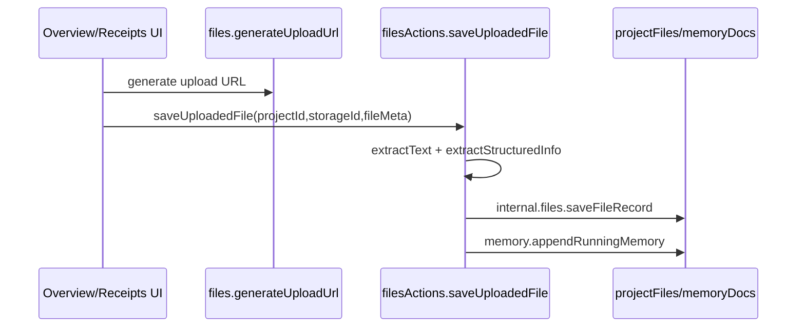
Evidence: `convex/files.ts:8`, `convex/filesActions.ts:16`, `convex/filesActions.ts:31`, `convex/filesActions.ts:43`.

#### Retrieval pipeline (context packs, no vector index path found)
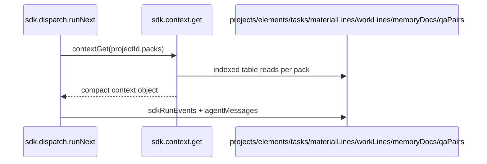
Evidence: `convex/sdk/dispatch.ts:1798`, `convex/sdk/context.ts:4`, `convex/sdk/context.ts:163`, `convex/sdk/telemetry.ts:170`.

#### Task generation pipeline
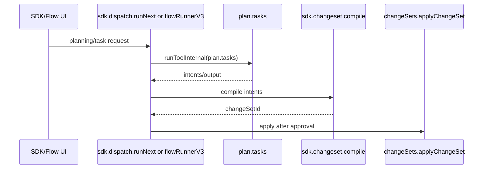
Evidence: `convex/sdk/registry.ts` (`plan.tasks`), `convex/sdk/dispatch.ts:1854`, `convex/sdk/changeset.ts:130`, `convex/sdk/api.ts:1967`, `convex/changeSets.ts:1950`.

#### Accounting generation pipeline
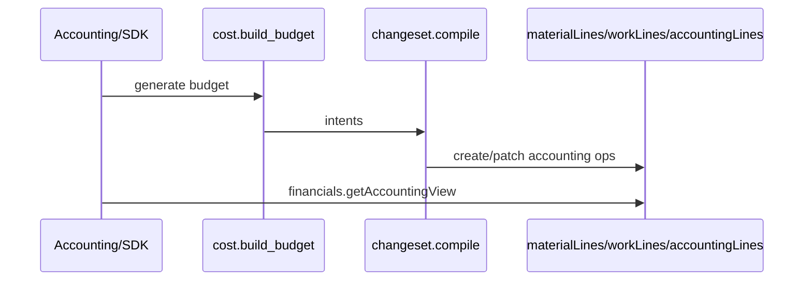
Evidence: `convex/sdk/registry.ts` (`cost.build_budget`), `convex/sdk/changeset.ts:283`, `convex/changeSets.ts:1403`, `convex/financials.ts:226`.

#### Quote generation pipeline
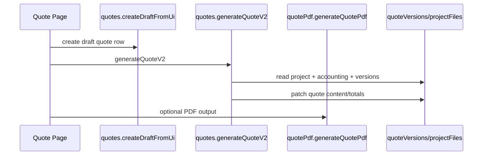
Evidence: `src/app/projects/[id]/quote/page.tsx:47-50`, `convex/quotes.ts:72`, `convex/quotes.ts:231`, `convex/quotePdf.ts:9`.

#### Trello sync pipeline
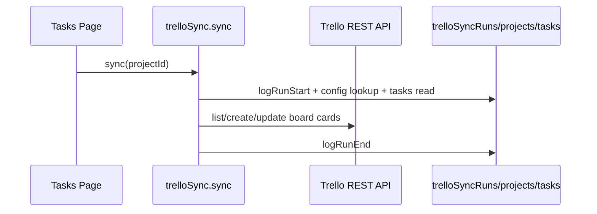
Evidence: `src/app/projects/[id]/tasks/page.tsx:61-64`, `convex/trelloSync.ts:138`, `convex/trelloSync.ts:326`, `convex/trelloSync.ts:337`.

#### Conversation/telemetry pipeline
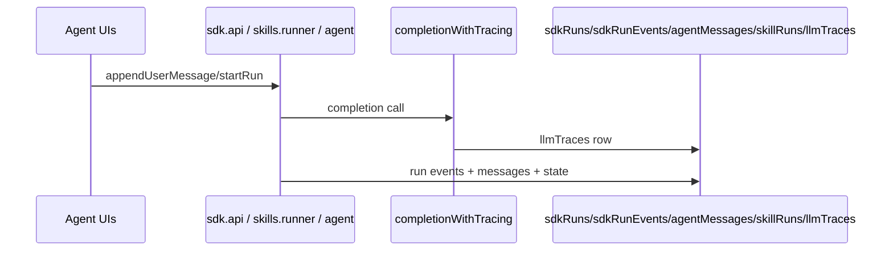
Evidence: `convex/sdk/api.ts:330`, `convex/sdk/telemetry.ts:7`, `convex/lib/llm.ts:12`, `convex/skills/runner.ts:547`, `convex/agent.ts:594`.


### 2.4 Output-schema note (per-endpoint)
- Explicit per-endpoint output schemas are **NOT FOUND** as centralized typed contracts; most handlers return ad-hoc objects.
- Inputs are explicit via `v.*` validators and captured in Appendix A (`argsText` / table refs).
- Searches used:
  - `rg -n "export const .* = (query|mutation|action|internalQuery|internalMutation|internalAction)\(" convex`
  - `rg -n "zod|schemaName|return \{|handler: async" convex`
## Phase 3 - Data Model (DB) Deep Spec
Schema source of truth: `convex/schema.ts`.
Extracted inventory: **83 tables** (`logs/schema_inventory.json`).

### 3.1 ERD (core subset)
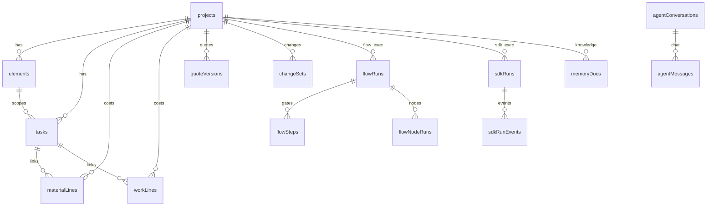
Evidence: table definitions in `convex/schema.ts:240-2116`.

### 3.2 Lifecycle state machines
#### `projects.status`
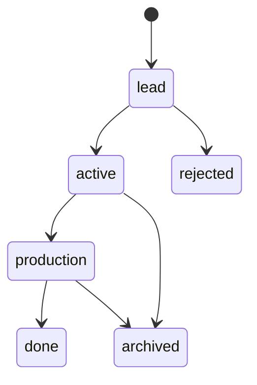
Evidence: `convex/schema.ts:5`, `convex/schema.ts:268`.

#### `flowRuns.status`
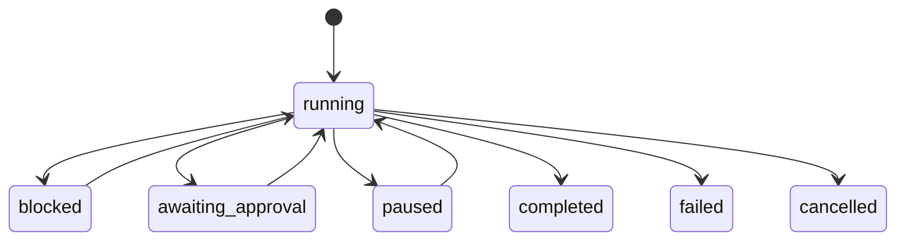
Evidence: `convex/schema.ts:1560`, transitions in `convex/flowRuns.ts` and `convex/flow/flowRunnerV3.ts`.

#### `sdkRuns.status`
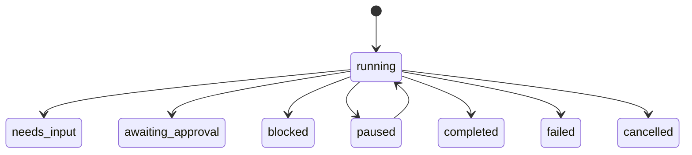
Evidence: `convex/schema.ts:2018`, updates in `convex/sdk/telemetry.ts:38`, `convex/sdk/dispatch.ts:1485`.

#### `changeSets.status`
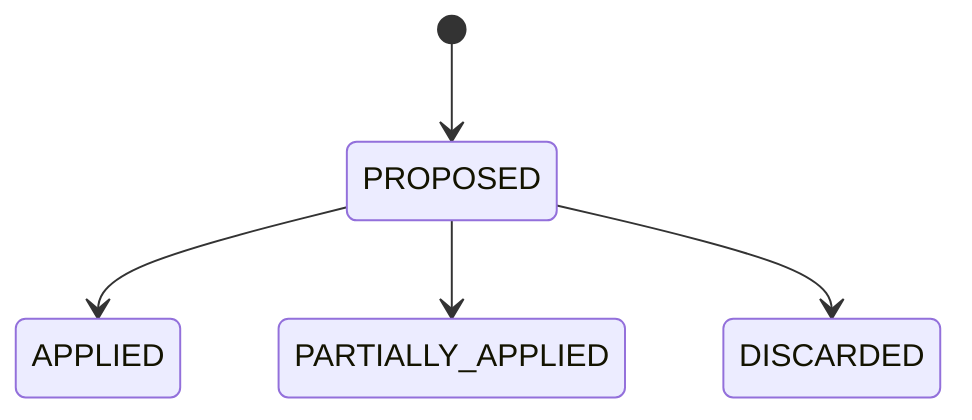
Evidence: `convex/schema.ts:920`, `convex/changeSets.ts:1950`, `convex/changeSets.ts:2091`, `convex/changeSets.ts:2224`.

### 3.3 Canonical domain boundaries
- Planning domain: `projects`, `elements`, `tasks`, `qaPairs`, `projectDigests`, `projectLinks`.
- Costing domain: `materialLines`, `workLines`, `accountingLines`, `accountingSections`, `taskAccountingLinks`.
- Quote/financial domain: `quoteVersions`, `budgetBaselines`, `changeOrders`, `budgetAdjustments`, `projectCost*`.
- Agent runtime domain: `agentConversations`, `agentMessages`, `skills`, `skillRuns`, `sdkRuns`, `sdkRunEvents`, `flowRuns`, `flowSteps`, `flowNodeRuns`, `flowQuestionSets`, `flowQuestionSetResponses`.
- Management/procurement domain: `vendors`, `vendorLocations`, `materialTemplates`, `materialVariants`, `catalogPriceRecords`, `purchases`, `receipts`, `receiptItems`, `inventory*`.
- Observability domain: `llmTraces`, `skillToolLogs`, `flowRunTimelineEvents`, `flowAuditRuns`, `agentDataLogs`.

### 3.4 Integrity rules and idempotency
- ChangeSet staleness guards validate `baseSnapshot` (`convex/changeSets.ts:459-482`, apply path `convex/changeSets.ts:515`).
- Dedup behavior exists for tasks and lines using `dedupKey` checks (`convex/changeSets.ts:723`, `882`, `1050`, `1462`).
- Deterministic compile fallback exists (`convex/sdk/changeset.ts:140`, `261`) using deterministic compiler (`convex/sdk/vnext/compiler.ts`).
- Hard-delete safety gate in op-level apply (`convex/changeSets.ts:2247`, `allowHardDelete`).

Full per-table field/index spec is in [Appendix B](#appendix-b--full-schema-table-spec).

## Phase 4 - Agents, Skills, Prompts (SDK-Agent Focus)
### 4.1 Current agent architecture
| Engine | Primary files | UI trigger surface | Context assembly | Outputs/persistence | Failure handling | Observability |
|---|---|---|---|---|---|---|
| Legacy chat agent | `convex/agent.ts` | `/projects/[id]/studio` | project overview + conversation + elements/tasks/accounting reads | `conversationMessages`, optional `changeSets` | try/catch with fallback behaviors | `llmTraces`, conversation messages |
| Skills runtime | `convex/skills/runner.ts` | `/projects/[id]/agent`, Flow skill execution | `buildContext`, optional `contextManager.pull.ctxPull`, clarification state | `skillRuns`, `agentMessages`, `clarificationSessions`, `skillToolLogs`, optional `quoteVersions` | progress state + `failRun` + tool fallbacks | `skillToolLogs`, `llmTraces` |
| Flow runtime | `convex/flowRuns.ts`, `convex/flow/orchestrator.ts`, `convex/flow/flowRunnerV3.ts` | `/projects/[id]/flow-agent` controls | snapshot + answer state + stage skill mappings | `flowRuns`, `flowSteps`, `flowNodeRuns`, `flowQuestionSets`, `flowRunTimelineEvents` | run status machine + approval gate | flow logs/tables |
| SDK runtime | `convex/sdk/dispatch.ts`, `convex/sdk/runner.ts`, `convex/sdk/api.ts` | `/projects/[id]/sdk-agent` (Agent + Project Planning) | `sdk.context.get` packs chosen by intent/mode | `sdkRuns`, `sdkRunEvents`, `agentMessages`, `sdkStageArtifacts`, `sdkStageDecisions`, `changeSets` | no-progress guards + deterministic fallback + approval token gate | `sdkRunEvents`, `llmTraces` |

Evidence: `convex/agent.ts:594`, `convex/skills/runner.ts:74`, `convex/flowRuns.ts:281`, `convex/flow/flowRunnerV3.ts:293`, `convex/sdk/dispatch.ts:1430`, `convex/sdk/api.ts:330`.

### 4.2 SDK-agent orchestration details
- Main orchestrator action: `sdk.dispatch.runNext` (`convex/sdk/dispatch.ts:1430`).
- Intent policy and tool scope: `convex/sdk/chatPolicy.ts`.
- VNext pipeline is conditional: `ff_sdk_vnext_pipeline` and planning mode (`convex/sdk/dispatch.ts:1441-1458`).
- Context packs are fetched on demand (`convex/sdk/dispatch.ts:1795-1801`, `convex/sdk/context.ts`).
- Deterministic branch: deterministic tools + compile fallback (`convex/sdk/dispatch.ts:2041-2134`, `convex/sdk/changeset.ts:261`).
- Approval gate: `pendingChangeSetId` + `approvalToken` (`convex/sdk/dispatch.ts:1954-1959`, apply in `convex/sdk/api.ts:1967`).

### 4.3 Skills system details
- Skill source-of-truth in code: `SKILL_CATALOG` (`convex/skills/registry.ts:38`).
- Persisted schema: `skills` table (`convex/schema.ts:1487-1519`).
- Seeding/upsert: `seedSkills`, `ensureSkillsSeeded` (`convex/skills/registry.ts` export section).
- Execution entrypoints: `runSkill`, `sendMessageAndRun` (`convex/skills/runner.ts:74`, `368`).
- Tool logging: `skillToolLogs` (`convex/skills/runner.ts:1376`, table `convex/schema.ts:1961`).

### 4.4 End-to-end orchestration flow mapping (requested chain)
| Requested chain stage | Current mapping | Trigger | Stored output |
|---|---|---|---|
| Intake | SDK stage `brief` (`intake.parse_brief`, `clarify.next_questions`) | `startVnextRun` / continue planning | `sdkStageArtifacts(brief)`, `qaPairs`, `agentMessages` |
| Clarify | Clarification tools/blocks in SDK/Flow/Skills | chat turns and gate events | `qaPairs`, `flowQuestionSets`, `clarificationSessions` |
| Plan | `plan.elements`, `plan.tasks`, skill builders, V3 stage B | SDK/Flow/skills requests | `elements`, `tasks`, `changeSets` |
| Accounting | `cost.build_budget`, accounting builders, V3 stage C | planning progression | `materialLines`, `workLines`, `accountingLines` |
| Quote | `quote.generate`, `quotes.generateQuoteV2`, V3 stage E | quote actions / orchestrator | `quoteVersions`, optional PDF file |
| Procurement | `procurement.shopping_plan`, Trello and purchase workflows | explicit run/action | `purchases`, `catalogPriceRecords`, `trelloSyncRuns` |
| Install | `runbook.installation`, `ops.daily_plan` | explicit run/stage | `runbooks`, `runbookItems`, task updates |
| Teardown | represented in task stage enum/runbooks, no dedicated SDK stage | manual planning/tasks | task/runbook state |

### 4.5 Determinism & approval
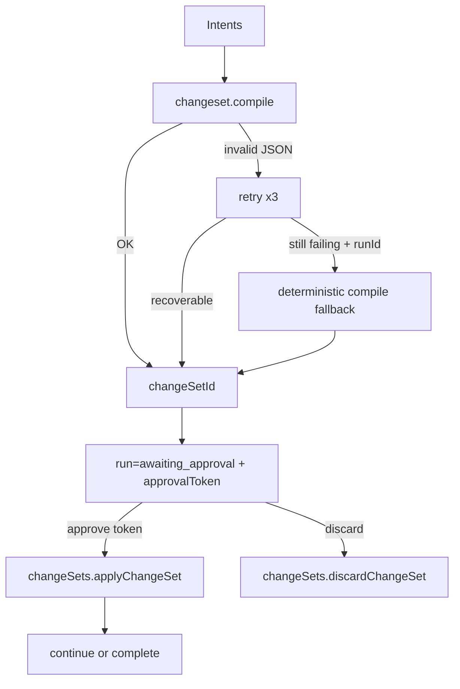
Evidence: `convex/sdk/changeset.ts:164-274`, `convex/sdk/dispatch.ts:1954-1959`, `convex/sdk/api.ts:1967-2006`, `convex/changeSets.ts:1950`.

### 4.6 SDK registry table
Source: `logs/sdk_registry_extract.json` (extracted from `convex/sdk/registry.ts`).

| ID | Kind | Model | Reasoning | Schema | Evidence |
|---|---|---|---|---|---|
| clarify.next_questions | agent | gpt-5-mini | none | clarify.next_questions | convex/sdk/registry.ts:57 |
| chat.free | agent | gpt-5-mini | none | chat.free | convex/sdk/registry.ts:68 |
| pricing.resolve_lines | agent | gpt-5-mini | none | pricing.resolve_lines | convex/sdk/registry.ts:79 |
| procurement.shopping_plan | agent | gpt-5-mini | none | procurement.shopping_plan | convex/sdk/registry.ts:90 |
| finance.ingest_receipt | agent | gpt-5-mini | none | finance.ingest_receipt | convex/sdk/registry.ts:101 |
| audit.project | agent | gpt-5.2 | none | audit.project | convex/sdk/registry.ts:112 |
| qa.print_files | agent | gpt-5-mini | none | qa.print_files | convex/sdk/registry.ts:123 |
| maint.sync_and_repair | agent | gpt-5.2 | none | maint.sync_and_repair | convex/sdk/registry.ts:134 |
| intake.parse_brief | tool | gpt-5-mini | none | intake.parse_brief | convex/sdk/registry.ts:147 |
| draft.plan_and_questions | tool | gpt-5.2 | medium | draft.plan_and_questions | convex/sdk/registry.ts:158 |
| plan.elements | tool | gpt-5-mini | medium | plan.elements | convex/sdk/registry.ts:169 |
| plan.tasks | tool | gpt-5-mini | medium | plan.tasks | convex/sdk/registry.ts:180 |
| plan.execution_phases | tool | gpt-5-mini | none | plan.execution_phases | convex/sdk/registry.ts:191 |
| cost.build_budget | tool | gpt-5-mini | medium | cost.build_budget | convex/sdk/registry.ts:202 |
| quote.generate | tool | gpt-5-mini | none | quote.generate | convex/sdk/registry.ts:213 |
| runbook.installation | tool | gpt-5-mini | none | runbook.installation | convex/sdk/registry.ts:224 |
| ops.daily_plan | tool | gpt-5-mini | none | ops.daily_plan | convex/sdk/registry.ts:235 |
| changeset.compile | tool | gpt-5-mini | none | changeset.compile | convex/sdk/registry.ts:246 |
| changeset.review | tool | gpt-5-mini | none | changeset.review | convex/sdk/registry.ts:257 |
| finalize.build_structured_package | tool | gpt-5-mini | none | finalize.build_structured_package | convex/sdk/registry.ts:268 |
| admin.set_labor_rates | tool | gpt-5-mini | none | admin.set_labor_rates | convex/sdk/registry.ts:279 |
| admin.confirm_measurements | tool | gpt-5-mini | none | admin.confirm_measurements | convex/sdk/registry.ts:290 |
| knowledge.summarize_or_update | tool | gpt-5-mini | none | knowledge.summarize_or_update | convex/sdk/registry.ts:301 |

### 4.7 Skills catalog table
Source: `logs/skills_catalog_extract.json` (extracted from `convex/skills/registry.ts`).

| Skill ID | Model | Output contract | Enabled default | Evidence |
|---|---|---|---|---|
| knowledge | gpt-5-mini | blocks | implicit true | convex/skills/registry.ts:43 |
| HELLO_WORLD_TEST | gpt-4o-mini | blocks | implicit true | convex/skills/registry.ts:77 |
| CLARIFICATIONS_GATE | gpt-5-mini | blocks | false | convex/skills/registry.ts:95 |
| CONTEXT_GENERATION | gpt-5-mini | blocks | implicit true | convex/skills/registry.ts:114 |
| CHANGESET_REVIEWER | gpt-5-mini | blocks | false | convex/skills/registry.ts:133 |
| PROJECT_BRIEF_BUILDER | gpt-5-mini | blocks | false | convex/skills/registry.ts:152 |
| ELEMENTS_BUILDER_FULL | gpt-5-mini | changeset | implicit true | convex/skills/registry.ts:172 |
| TASKS_BUILDER_FULL | gpt-5.2 | changeset | implicit true | convex/skills/registry.ts:192 |
| ACCOUNTING_BUILDER_FULL | gpt-5.2 | changeset | implicit true | convex/skills/registry.ts:212 |
| QUOTE_WRITER_FULL | gpt-5-mini | changeset | true | convex/skills/registry.ts:232 |
| ELEMENTS_TO_TASKS_SYNC | gpt-5-mini | changeset | implicit true | convex/skills/registry.ts:253 |
| TASKS_CRITICAL_PATH_POLISH | gpt-5-mini | changeset | implicit true | convex/skills/registry.ts:272 |
| TASK_ACCOUNTING_MAPPING_REPAIR | gpt-5-mini | changeset | implicit true | convex/skills/registry.ts:291 |
| GAP_AUDIT | gpt-5-mini | suggestions | implicit true | convex/skills/registry.ts:310 |
| RISK_REVIEW | gpt-5-mini | suggestions | implicit true | convex/skills/registry.ts:329 |
| COST_VARIANCE_ANALYZER | gpt-5-mini | suggestions | false | convex/skills/registry.ts:348 |
| DAILY_EXECUTION_PLANNER | gpt-5-mini | blocks | false | convex/skills/registry.ts:368 |
| INSTALL_RUNBOOK_BUILDER | gpt-5-mini | blocks | implicit true | convex/skills/registry.ts:388 |
| SHOPPING_PLANNER_WEB | gpt-5-mini | changeset | implicit true | convex/skills/registry.ts:407 |
| BUYING_ASSISTANT_WEB | gpt-5-mini | suggestions | false | convex/skills/registry.ts:426 |
| RESEARCH_INSPIRATION_WEB | gpt-5-mini | suggestions | false | convex/skills/registry.ts:446 |
| RESEARCH_PRICING_ESTIMATES_WEB | gpt-5-mini | changeset | implicit true | convex/skills/registry.ts:466 |
| PRINT_QA | gpt-5-mini | suggestions | implicit true | convex/skills/registry.ts:485 |
| RECEIPT_PARSE_AND_MAP | gpt-5-mini | changeset | false | convex/skills/registry.ts:504 |
| BOM_DUPLICATE_ANALYZER | gpt-5-mini | changeset | implicit true | convex/skills/registry.ts:524 |
| BUILD_PLANNER | gpt-5-mini | blocks | implicit true | convex/skills/registry.ts:543 |
| TASKS_SYNC_FROM_LABOR_LINES | gpt-5-mini | changeset | implicit true | convex/skills/registry.ts:562 |
| PRICING_LOOKUP_CATALOG_BATCH | gpt-5-mini | changeset | implicit true | convex/skills/registry.ts:581 |
| PRICING_RESEARCH_WEB_BATCH | gpt-5-mini | changeset | implicit true | convex/skills/registry.ts:599 |
| PRICING_ESTIMATE_FALLBACK_BATCH | gpt-5-mini | changeset | implicit true | convex/skills/registry.ts:617 |
| TASKS_ENRICH_FROM_ACCOUNTING_BATCH | gpt-5-mini | changeset | implicit true | convex/skills/registry.ts:635 |
| OVERHEAD_AND_LOGISTICS_COMPLETER | gpt-5-mini | changeset | implicit true | convex/skills/registry.ts:653 |
| QUOTE_BUILD_OR_FIX | gpt-5-mini | changeset | implicit true | convex/skills/registry.ts:671 |
| FINAL_AUDIT_FIXER | gpt-5-mini | changeset | implicit true | convex/skills/registry.ts:689 |
| setLaborRates | gpt-5-mini | changeset | implicit true | convex/skills/registry.ts:707 |
| confirmMeasurements | gpt-5-mini | blocks | implicit true | convex/skills/registry.ts:725 |
| V3_Q_A_INTAKE | gpt-5-mini | blocks | implicit true | convex/skills/registry.ts:746 |
| V3_Q_B_PLAN | gpt-5-mini | blocks | implicit true | convex/skills/registry.ts:764 |
| V3_Q_C_COST | gpt-5-mini | blocks | implicit true | convex/skills/registry.ts:782 |
| V3_Q_D_POLISH_APPROVALS | gpt-5-mini | blocks | implicit true | convex/skills/registry.ts:800 |
| V3_Q_E_QUOTE | gpt-5-mini | blocks | implicit true | convex/skills/registry.ts:818 |
| V3_BUILD_A_MEMORYDOCS | gpt-5-mini | blocks | implicit true | convex/skills/registry.ts:836 |
| V3_BUILD_B_PLAN | gpt-5-mini | changeset | implicit true | convex/skills/registry.ts:854 |
| V3_BUILD_BC_COMBINED_PLAN_ACCOUNTING | gpt-5.2 | changeset | implicit true | convex/skills/registry.ts:872 |
| V3_BUILD_C_ACCOUNTING | gpt-5-mini | changeset | implicit true | convex/skills/registry.ts:890 |
| V3_BUILD_D_POLISH | gpt-5.2 | changeset | implicit true | convex/skills/registry.ts:908 |
| V3_BUILD_E_QUOTE | gpt-5-mini | blocks | implicit true | convex/skills/registry.ts:926 |


### 4.8 Trigger Matrix
| UI action | Backend function chain | Primary tables | Next stage |
|---|---|---|---|
| SDK Agent submit turn | `agentTurns.submitTurn` -> `sdk.dispatch.runNext` | `agentMessages`, `sdkRuns`, `sdkRunEvents` | orchestrator step |
| SDK Agent start run | `sdk.api.startRun` | `sdkRuns`, `agentMessages` | planning/chat edit run created |
| SDK approve ChangeSet | `sdk.api.approveChangeSet` -> `changeSets.applyChangeSet` | `changeSets`, domain tables, `sdkRuns` | continue/completed |
| Project Planning initiate | `sdk.projectPlanning.initiatePlanning` | `sdkRuns`, planning state fields | question generation |
| Project Planning finalize | `sdk.projectPlanning.finalizeProject` | `sdkRuns`, `changeSets`, domain tables | report/complete |
| Flow start | `flowRuns.start` | `flowRuns`, `flowSteps`, `flowArtifactRevisions` | async flow tick |
| Flow run next | `flowRuns.runNext` -> `internal.flow.flowRunner.tick` | `flowNodeRuns`, `flowSteps` | next gate/node |
| Legacy skill run | `skills.runner.runSkill` | `skillRuns`, `agentMessages`, optional `changeSets` | blocks response |
| Quote generate | `quotes.createDraftFromUi` + `quotes.generateQuoteV2` | `quoteVersions` | quote draft/version |
| Trello sync | `trelloSync.sync` | `trelloSyncRuns`, `projects` config | card sync result |

### 4.9 Model Matrix
- SDK model matrix: Section 4.6 table (`logs/sdk_registry_extract.json` from `convex/sdk/registry.ts`).
- Skill model matrix: Section 4.7 table (`logs/skills_catalog_extract.json` from `convex/skills/registry.ts`).
- Runtime override/gating: `convex/sdk/runner.ts` (`resolveRuntimeLlm`), `convex/lib/llm.ts` (reasoning/token normalization).
## Phase 5 - Cross-cutting Concerns
### 5.1 Auth & permissions
- Auth is optional in several paths; viewer fallback to global app settings exists (`convex/users.ts:7-23`).
- No explicit RBAC layer found; endpoint-level access checks are minimal and context-driven.
- Trello credentials can be user-level (`users.trelloCredentials`) or project config fallback (`convex/trelloSync.ts:18-44`).

### 5.2 Secrets/config
- Required runtime envs observed: `OPENAI_API_KEY`, `NEXT_PUBLIC_CONVEX_URL`, `TRELLO_API_KEY`, `TRELLO_TOKEN`.
- CI deploy secrets: `CONVEX_DEPLOYMENT`, `CONVEX_DEPLOY_KEY` (`.github/workflows/convex-deploy.yml:25-26`).
- No `.env.example` template found (see NOT FOUND section).

### 5.3 Rate limiting/cost controls
- LLM wrapper has retry/backoff controls (`SDK_LLM_RETRY_COUNT`, `SDK_LLM_RETRY_BACKOFF_MS`) in `convex/lib/llm.ts`.
- Token/cost telemetry recorded in `llmTraces` with cost calculation (`convex/lib/llm.ts`, `convex/migrations.ts:backfillTraceCosts`).
- No global per-user rate limiter found.

### 5.4 Caching
- Feature flags for prompt caching exist but default disabled (`convex/featureFlags.ts:20-21`).
- Context pack fetching minimizes payload scope (`convex/sdk/context.ts`).
- No embedding/vector cache path found in current code.

### 5.5 Error handling
- External integrations (OpenAI/Trello) are wrapped with try/catch and status updates.
- Runtime state machines use explicit failure statuses (`flowRuns`, `sdkRuns`).
- ChangeSet execution has staleness and hard-delete guards.

### 5.6 Migrations/backfills
- Backfills and seed/migrate actions live in `convex/migrations.ts`.
- Test seeding and smoke scripts in `convex/testing.ts` and `scripts/*`.

### 5.7 Testing/CI
- CI: lint + build (`.github/workflows/ci.yml`).
- SDK/vnext tests: `convex/sdk/__tests__`, `convex/sdk/vnext/__tests__` via `npm run test:sdk`.
- E2E: Playwright (`npm run test:e2e`).

### 5.8 Observability
- `llmTraces` for model calls (`convex/lib/llm.ts`, `convex/tracing.ts`).
- `sdkRunEvents` for SDK run event stream (`convex/sdk/telemetry.ts`).
- `skillToolLogs` for skill tool invocations (`convex/skills/runner.ts:1376`).
- Flow runtime logs: `flowRunTimelineEvents`, `flowChangeSetApplyLogs`, `flowAuditRuns`.

## Phase 6 - Rebuild Blueprint
### 6.1 Build order
1. Boot Next.js + Convex shell + layouts/nav.
2. Create base schema tables (`projects`, `elements`, `tasks`, `materialLines`, `workLines`, `quoteVersions`, `changeSets`, `agentConversations`, `agentMessages`).
3. Implement CRUD APIs + project core pages.
4. Implement ChangeSet compile/apply/discard and staleness checks.
5. Add skills runtime (`skills.registry`, `skills.runner`), then Flow runtime (`flowRuns`, orchestrator).
6. Add SDK runtime (`sdk.registry`, `sdk.runner`, `sdk.dispatch`, `sdk.api`).
7. Add SDK Project Planning + optional VNext pipeline behind flags.
8. Add management modules and integrations (receipts, trello, tracing).
9. Add CI and smoke tests.

### 6.2 Smoke tests per step
1. Create project ? element/task ? accounting ? quote draft generation.
2. SDK run start + user message writes `sdkRuns`, `sdkRunEvents`, `agentMessages`.
3. Compile+approval path creates pending ChangeSet and applies with valid token.
4. Flow run start produces steps/node runs/questions.
5. File upload creates `projectFiles` and appends running memory.
6. Trello sync writes `trelloSyncRuns` and updates board cards.

## Where To Look (Subsystem File Map)
### Frontend shell/navigation
- `src/app/layout.tsx`
- `src/components/nav/StudioTopNav.tsx`
- `src/app/projects/[id]/layout.tsx`
- `src/app/management/layout.tsx`

### Frontend project workspaces
- `src/app/projects/[id]/overview/page.tsx`
- `src/app/projects/[id]/elements/page.tsx`
- `src/app/projects/[id]/tasks/page.tsx`
- `src/app/projects/[id]/accounting/page.tsx`
- `src/app/projects/[id]/quote/page.tsx`
- `src/app/projects/[id]/agent/page.tsx`
- `src/app/projects/[id]/flow-agent/page.tsx`
- `src/app/projects/[id]/sdk-agent/page.tsx`

### SDK orchestration
- `convex/sdk/dispatch.ts`
- `convex/sdk/runner.ts`
- `convex/sdk/registry.ts`
- `convex/sdk/api.ts`
- `convex/sdk/projectPlanning.ts`
- `convex/sdk/changeset.ts`
- `convex/sdk/vnext/pipeline.ts`

### Flow orchestration
- `convex/flowRuns.ts`
- `convex/flow/orchestrator.ts`
- `convex/flow/flowRunnerV3.ts`
- `convex/flow/questionsUi.ts`
- `convex/flow/gateActions.ts`

### Skills runtime
- `convex/skills/registry.ts`
- `convex/skills/runner.ts`
- `convex/skills/prompts.ts`
- `convex/skills/recommender.ts`

### Data model and write safety
- `convex/schema.ts`
- `convex/changeSets.ts`
- `convex/changeSets.OPS.md`

### Knowledge/files/retrieval
- `convex/files.ts`
- `convex/filesActions.ts`
- `convex/memory.ts`
- `convex/sdk/context.ts`

### Management + integrations
- `convex/management.ts`
- `convex/receipts.ts`
- `convex/receiptsActions.ts`
- `convex/trelloSync.ts`

### Observability
- `convex/lib/llm.ts`
- `convex/tracing.ts`
- `convex/sdk/telemetry.ts`
- `convex/flow/flowRunnerV3.ts` (`flowRunTimelineEvents` writes)
- `convex/skills/runner.ts` (`skillToolLogs` writes)


## Completeness Check
1. Routes under `app/`: **PASS** (32 routes, fully listed in Phase 1 table).
2. Convex exported functions: **PASS** (478 endpoint exports, Appendix A).
3. Schema tables: **PASS** (83 tables, Appendix B).
4. Agents/skills: **PASS** (runtime architecture + SDK/skills catalog tables documented).
5. Exact names: **PASS** (paths/symbols/line refs included for major claims).
6. No hallucinations policy: **PASS with NOT FOUND ledger**.

## NOT FOUND Ledger + Searches
- `knowledgeDocs`, `knowledgeChunks`, `ingestionJobs`, `ingestionFiles`, `retrievalLogs`, `researchRuns`, `connectorAccounts`, `connectorWatches`, `inboxItems`, `settings` table names: **NOT FOUND** in current schema.
  - Search used: `rg -n "knowledgeDocs|knowledgeChunks|ingestionJobs|ingestionFiles|retrievalLogs|researchRuns|connectorAccounts|connectorWatches|inboxItems|settings\\b" convex src docs Specs -S`
- First-class OpenAI Agent SDK orchestration module: **NOT FOUND**. Only dependency (`package.json:33`) and one symbol usage (`convex/skills/runner.ts:1915`) found.
  - Search used: `rg -n "OpenAIAgent|openai-agents|agent sdk|Agent SDK|openai" convex src docs`
- `.env` template file (for example `.env.example`): **NOT FOUND**.
  - Search used: `Get-ChildItem -Name .env*`

## Targeted Open Questions
1. Should `OpenAIAgent` usage in `convex/skills/runner.ts` be treated as experimental/dead code, or should rebuild include a working path for it?
2. Should VNext remain default-off (current `featureFlags`) or be default-on per rollout docs?
3. Should rebuild parity target the current 83-table schema only, or include the older ingestion-table concepts from legacy specs?

## Appendix A - Full Convex Endpoint Catalog
Source: `logs/convex_endpoint_catalog.json` (478 endpoint exports).

### convex/accounting.ts (6)
- mutation addMaterialLine (convex/accounting.ts:6) | frontendKey=accounting.addMaterialLine | calledFrom=/projects/[id]/accounting, /projects/[id]/elements | tableRefs=projects, elements
- mutation updateMaterialLine (convex/accounting.ts:31) | frontendKey=accounting.updateMaterialLine | calledFrom=/projects/[id]/accounting, /projects/[id]/elements | tableRefs=materialLines
- mutation deleteMaterialLine (convex/accounting.ts:81) | frontendKey=accounting.deleteMaterialLine | calledFrom=/projects/[id]/accounting, /projects/[id]/elements | tableRefs=materialLines
- mutation addWorkLine (convex/accounting.ts:91) | frontendKey=accounting.addWorkLine | calledFrom=/projects/[id]/accounting, /projects/[id]/elements | tableRefs=projects, elements
- mutation updateWorkLine (convex/accounting.ts:116) | frontendKey=accounting.updateWorkLine | calledFrom=/projects/[id]/accounting, /projects/[id]/elements | tableRefs=workLines, elements
- mutation deleteWorkLine (convex/accounting.ts:159) | frontendKey=accounting.deleteWorkLine | calledFrom=/projects/[id]/accounting, /projects/[id]/elements | tableRefs=workLines

### convex/accountingStudio.ts (1)
- query getGlobalSummary (convex/accountingStudio.ts:4) | frontendKey=accountingStudio.getGlobalSummary | calledFrom=/accounting | tableRefs=customers

### convex/adminHealth.ts (1)
- query health (convex/adminHealth.ts:3) | frontendKey=adminHealth.health | calledFrom=none | tableRefs=NOT FOUND

### convex/agent.ts (27)
- query listConversations (convex/agent.ts:404) | frontendKey=agent.listConversations | calledFrom=/projects/[id]/studio | tableRefs=projects, structuredAnswers
- mutation createConversation (convex/agent.ts:432) | frontendKey=agent.createConversation | calledFrom=/projects/[id]/studio | tableRefs=projects
- query listConversationMessages (convex/agent.ts:450) | frontendKey=agent.listConversationMessages | calledFrom=/projects/[id]/studio | tableRefs=conversations
- mutation appendUserMessage (convex/agent.ts:463) | frontendKey=agent.appendUserMessage | calledFrom=/projects/[id]/studio | tableRefs=conversations
- mutation appendEventMessage (convex/agent.ts:480) | frontendKey=agent.appendEventMessage | calledFrom=/projects/[id]/studio | tableRefs=conversations
- mutation appendAssistantMessage (convex/agent.ts:502) | frontendKey=agent.appendAssistantMessage | calledFrom=none | tableRefs=conversations, changeSets
- mutation setConversationStageV1 (convex/agent.ts:526) | frontendKey=agent.setConversationStageV1 | calledFrom=none | tableRefs=conversations
- mutation setConversationMode (convex/agent.ts:561) | frontendKey=agent.setConversationMode | calledFrom=/projects/[id]/studio | tableRefs=conversations
- mutation setConversationTitle (convex/agent.ts:572) | frontendKey=agent.setConversationTitle | calledFrom=/projects/[id]/studio | tableRefs=conversations
- mutation setConversationStatus (convex/agent.ts:583) | frontendKey=agent.setConversationStatus | calledFrom=none | tableRefs=conversations
- action agentRespond (convex/agent.ts:594) | frontendKey=agent.agentRespond | calledFrom=/projects/[id]/studio | tableRefs=conversations, elements
- mutation getOrCreateConversation (convex/agent.ts:1333) | frontendKey=agent.getOrCreateConversation | calledFrom=none | tableRefs=projects
- query listMessages (convex/agent.ts:1354) | frontendKey=agent.listMessages | calledFrom=none | tableRefs=conversations
- mutation cancelRunningAgent (convex/agent.ts:1369) | frontendKey=agent.cancelRunningAgent | calledFrom=/projects/[id]/studio | tableRefs=conversations
- internalMutation createPlaceholderMessage (convex/agent.ts:1386) | frontendKey=agent.createPlaceholderMessage | calledFrom=none | tableRefs=conversations, projects
- internalMutation updateMessageContent (convex/agent.ts:1403) | frontendKey=agent.updateMessageContent | calledFrom=none | tableRefs=conversationMessages
- internalMutation finalizeMessage (convex/agent.ts:1420) | frontendKey=agent.finalizeMessage | calledFrom=none | tableRefs=conversationMessages, changeSets
- internalMutation preProcessMessage (convex/agent.ts:1436) | frontendKey=agent.preProcessMessage | calledFrom=none | tableRefs=conversations
- internalMutation saveAgentMessage (convex/agent.ts:1610) | frontendKey=agent.saveAgentMessage | calledFrom=none | tableRefs=conversations
- action sendMessage (convex/agent.ts:1633) | frontendKey=agent.sendMessage | calledFrom=none | tableRefs=conversations
- query getConversation (convex/agent.ts:1719) | frontendKey=agent.getConversation | calledFrom=none | tableRefs=conversations
- mutation setConversationStage (convex/agent.ts:1726) | frontendKey=agent.setConversationStage | calledFrom=none | tableRefs=conversations
- query getStructuredAnswers (convex/agent.ts:1737) | frontendKey=agent.getStructuredAnswers | calledFrom=none | tableRefs=projects
- mutation saveStructuredAnswers (convex/agent.ts:1752) | frontendKey=agent.saveStructuredAnswers | calledFrom=none | tableRefs=projects
- mutation createElementFromStructured (convex/agent.ts:1786) | frontendKey=agent.createElementFromStructured | calledFrom=/projects/[id]/overview | tableRefs=projects
- mutation generateTaskPatchOps (convex/agent.ts:1808) | frontendKey=agent.generateTaskPatchOps | calledFrom=none | tableRefs=projects, elements
- mutation estimateTaskDependencies (convex/agent.ts:1862) | frontendKey=agent.estimateTaskDependencies | calledFrom=none | tableRefs=projects, elements

### convex/agentData.ts (3)
- internalQuery fetchInternal (convex/agentData.ts:441) | frontendKey=agentData.fetchInternal | calledFrom=none | tableRefs=NOT FOUND
- internalMutation logAccess (convex/agentData.ts:683) | frontendKey=agentData.logAccess | calledFrom=none | tableRefs=NOT FOUND
- action fetch (convex/agentData.ts:713) | frontendKey=agentData.fetch | calledFrom=none | tableRefs=NOT FOUND

### convex/agentTurns.ts (1)
- action submitTurn (convex/agentTurns.ts:49) | frontendKey=agentTurns.submitTurn | calledFrom=none | tableRefs=NOT FOUND

### convex/agent_tasks.ts (1)
- mutation runEstimator (convex/agent_tasks.ts:5) | frontendKey=agent_tasks.runEstimator | calledFrom=/projects/[id]/tasks | tableRefs=projects

### convex/brainDump.ts (3)
- query getProjectBrainDump (convex/brainDump.ts:21) | frontendKey=brainDump.getProjectBrainDump | calledFrom=none | tableRefs=NOT FOUND
- mutation appendProjectBrainDump (convex/brainDump.ts:37) | frontendKey=brainDump.appendProjectBrainDump | calledFrom=none | tableRefs=NOT FOUND
- mutation setProjectBrainDumpRaw (convex/brainDump.ts:67) | frontendKey=brainDump.setProjectBrainDumpRaw | calledFrom=none | tableRefs=NOT FOUND

### convex/changeSets.ts (8)
- mutation createChangeSet (convex/changeSets.ts:207) | frontendKey=changeSets.createChangeSet | calledFrom=none | tableRefs=projects
- query get (convex/changeSets.ts:256) | frontendKey=changeSets.get | calledFrom=none | tableRefs=changeSets
- query listForProject (convex/changeSets.ts:263) | frontendKey=changeSets.listForProject | calledFrom=none | tableRefs=projects
- query getBaseSnapshotForProject (convex/changeSets.ts:309) | frontendKey=changeSets.getBaseSnapshotForProject | calledFrom=none | tableRefs=projects
- mutation discardChangeSet (convex/changeSets.ts:316) | frontendKey=changeSets.discardChangeSet | calledFrom=/projects/[id]/studio | tableRefs=changeSets
- mutation applyChangeSet (convex/changeSets.ts:1950) | frontendKey=changeSets.applyChangeSet | calledFrom=/projects/[id]/studio | tableRefs=changeSets
- mutation updateChangeSetOp (convex/changeSets.ts:2089) | frontendKey=changeSets.updateChangeSetOp | calledFrom=none | tableRefs=changeSets
- mutation applyChangeSetOps (convex/changeSets.ts:2224) | frontendKey=changeSets.applyChangeSetOps | calledFrom=none | tableRefs=changeSets

### convex/contextManager/pull.ts (1)
- internalQuery ctxPull (convex/contextManager/pull.ts:15) | frontendKey=pull.ctxPull | calledFrom=none | tableRefs=NOT FOUND

### convex/customers.ts (4)
- mutation findOrCreateByName (convex/customers.ts:5) | frontendKey=customers.findOrCreateByName | calledFrom=/management/customers | tableRefs=NOT FOUND
- query listActive (convex/customers.ts:41) | frontendKey=customers.listActive | calledFrom=none | tableRefs=NOT FOUND
- query listWithContacts (convex/customers.ts:51) | frontendKey=customers.listWithContacts | calledFrom=/management/customers | tableRefs=NOT FOUND
- mutation addContact (convex/customers.ts:78) | frontendKey=customers.addContact | calledFrom=/management/customers | tableRefs=NOT FOUND

### convex/customersStudio.ts (3)
- query listCustomersStudio (convex/customersStudio.ts:4) | frontendKey=customersStudio.listCustomersStudio | calledFrom=/customers | tableRefs=NOT FOUND
- query getCustomerStudio (convex/customersStudio.ts:56) | frontendKey=customersStudio.getCustomerStudio | calledFrom=/customers/[customerId] | tableRefs=customers
- query listProjectsByCustomer (convex/customersStudio.ts:74) | frontendKey=customersStudio.listProjectsByCustomer | calledFrom=/customers/[customerId] | tableRefs=customers

### convex/debug_fetch_traces.ts (1)
- query getRecentSkillRuns (convex/debug_fetch_traces.ts:5) | frontendKey=debug_fetch_traces.getRecentSkillRuns | calledFrom=none | tableRefs=NOT FOUND

### convex/debug_inspect.ts (1)
- query inspectMessages (convex/debug_inspect.ts:5) | frontendKey=debug_inspect.inspectMessages | calledFrom=none | tableRefs=NOT FOUND

### convex/drafts.ts (4)
- mutation applyChangeSet (convex/drafts.ts:110) | frontendKey=drafts.applyChangeSet | calledFrom=none | tableRefs=projects
- mutation ensureElementDraft (convex/drafts.ts:135) | frontendKey=drafts.ensureElementDraft | calledFrom=none | tableRefs=projects, elements
- query listOpenDrafts (convex/drafts.ts:147) | frontendKey=drafts.listOpenDrafts | calledFrom=none | tableRefs=projects
- mutation ensureProjectCostDraft (convex/drafts.ts:155) | frontendKey=drafts.ensureProjectCostDraft | calledFrom=none | tableRefs=projects

### convex/elements.ts (5)
- query listByProject (convex/elements.ts:350) | frontendKey=elements.listByProject | calledFrom=/projects/[id]/agent, /projects/[id]/elements | tableRefs=projects
- query getComposite (convex/elements.ts:390) | frontendKey=elements.getComposite | calledFrom=/projects/[id]/elements | tableRefs=projects, elements
- query getElementDetail (convex/elements.ts:445) | frontendKey=elements.getElementDetail | calledFrom=none | tableRefs=elements
- mutation updateElementMeta (convex/elements.ts:455) | frontendKey=elements.updateElementMeta | calledFrom=/projects/[id]/elements | tableRefs=elements
- mutation deleteElement (convex/elements.ts:473) | frontendKey=elements.deleteElement | calledFrom=/projects/[id]/elements | tableRefs=elements

### convex/featureFlags.ts (3)
- query getAll (convex/featureFlags.ts:60) | frontendKey=featureFlags.getAll | calledFrom=/projects/[id]/flow-agent, /projects/[id]/sdk-agent | tableRefs=NOT FOUND
- mutation setAll (convex/featureFlags.ts:73) | frontendKey=featureFlags.setAll | calledFrom=none | tableRefs=NOT FOUND
- mutation setFlag (convex/featureFlags.ts:94) | frontendKey=featureFlags.setFlag | calledFrom=/projects/[id]/flow-agent | tableRefs=NOT FOUND

### convex/files.ts (8)
- mutation generateUploadUrl (convex/files.ts:8) | frontendKey=files.generateUploadUrl | calledFrom=/management/receipts, /projects/[id]/overview | tableRefs=NOT FOUND
- internalMutation saveFileRecord (convex/files.ts:15) | frontendKey=files.saveFileRecord | calledFrom=none | tableRefs=projects, _storage
- query listProjectFiles (convex/files.ts:43) | frontendKey=files.listProjectFiles | calledFrom=/management/receipts, /projects/[id]/overview, /projects/[id]/quote, /projects/[id]/receipts | tableRefs=projects
- query getFileUrl (convex/files.ts:54) | frontendKey=files.getFileUrl | calledFrom=/projects/[id]/quote | tableRefs=projectFiles
- action deleteProjectFile (convex/files.ts:64) | frontendKey=files.deleteProjectFile | calledFrom=/projects/[id]/overview | tableRefs=projectFiles
- query getProjectContext (convex/files.ts:78) | frontendKey=files.getProjectContext | calledFrom=none | tableRefs=projects
- internalQuery getFileRecord (convex/files.ts:94) | frontendKey=files.getFileRecord | calledFrom=none | tableRefs=projectFiles
- internalMutation deleteFileRecord (convex/files.ts:101) | frontendKey=files.deleteFileRecord | calledFrom=none | tableRefs=projectFiles

### convex/filesActions.ts (1)
- action saveUploadedFile (convex/filesActions.ts:16) | frontendKey=filesActions.saveUploadedFile | calledFrom=/management/receipts, /projects/[id]/overview | tableRefs=projects, _storage

### convex/financials.ts (8)
- mutation approveQuoteAsBaseline (convex/financials.ts:6) | frontendKey=financials.approveQuoteAsBaseline | calledFrom=/projects/[id]/quote | tableRefs=projects, quoteVersions
- mutation createChangeOrder (convex/financials.ts:57) | frontendKey=financials.createChangeOrder | calledFrom=none | tableRefs=projects
- mutation approveChangeOrder (convex/financials.ts:98) | frontendKey=financials.approveChangeOrder | calledFrom=none | tableRefs=changeOrders
- mutation updateProjectPricingDefaults (convex/financials.ts:130) | frontendKey=financials.updateProjectPricingDefaults | calledFrom=none | tableRefs=projects
- query getFinancialSummary (convex/financials.ts:156) | frontendKey=financials.getFinancialSummary | calledFrom=/projects/[id]/accounting | tableRefs=projects
- query getDraftCostBreakdown (convex/financials.ts:219) | frontendKey=financials.getDraftCostBreakdown | calledFrom=none | tableRefs=projects
- query getAccountingView (convex/financials.ts:226) | frontendKey=financials.getAccountingView | calledFrom=/management/receipts, /projects/[id]/accounting | tableRefs=projects
- query getAccountingSectionTotals (convex/financials.ts:233) | frontendKey=financials.getAccountingSectionTotals | calledFrom=none | tableRefs=projects

### convex/flow/answerState.ts (1)
- internalQuery getAnswerStateAtVersion (convex/flow/answerState.ts:4) | frontendKey=answerState.getAnswerStateAtVersion | calledFrom=none | tableRefs=NOT FOUND

### convex/flow/api.ts (4)
- mutation createConversation (convex/flow/api.ts:23) | frontendKey=api.createConversation | calledFrom=none | tableRefs=projects
- mutation sendMessage (convex/flow/api.ts:40) | frontendKey=api.sendMessage | calledFrom=none | tableRefs=agentConversations
- query listMessages (convex/flow/api.ts:88) | frontendKey=api.listMessages | calledFrom=none | tableRefs=agentConversations
- mutation startProjectFlow (convex/flow/api.ts:99) | frontendKey=api.startProjectFlow | calledFrom=none | tableRefs=projects

### convex/flow/artifactRevisions.ts (2)
- internalMutation recordApplySuccess (convex/flow/artifactRevisions.ts:141) | frontendKey=artifactRevisions.recordApplySuccess | calledFrom=none | tableRefs=NOT FOUND
- internalMutation recordApplyFailure (convex/flow/artifactRevisions.ts:180) | frontendKey=artifactRevisions.recordApplyFailure | calledFrom=none | tableRefs=NOT FOUND

### convex/flow/audit.ts (5)
- action run (convex/flow/audit.ts:21) | frontendKey=audit.run | calledFrom=none | tableRefs=NOT FOUND
- query getLatestByRun (convex/flow/audit.ts:83) | frontendKey=audit.getLatestByRun | calledFrom=none | tableRefs=NOT FOUND
- query getStaleness (convex/flow/audit.ts:96) | frontendKey=audit.getStaleness | calledFrom=none | tableRefs=NOT FOUND
- internalMutation createAuditRun (convex/flow/audit.ts:118) | frontendKey=audit.createAuditRun | calledFrom=none | tableRefs=NOT FOUND
- internalMutation finishAuditRun (convex/flow/audit.ts:137) | frontendKey=audit.finishAuditRun | calledFrom=none | tableRefs=NOT FOUND

### convex/flow/chat.ts (6)
- query listMessages (convex/flow/chat.ts:21) | frontendKey=chat.listMessages | calledFrom=none | tableRefs=NOT FOUND
- mutation sendUserMessage (convex/flow/chat.ts:32) | frontendKey=chat.sendUserMessage | calledFrom=none | tableRefs=NOT FOUND
- internalMutation emitAssistantBlocks (convex/flow/chat.ts:68) | frontendKey=chat.emitAssistantBlocks | calledFrom=none | tableRefs=NOT FOUND
- internalMutation emitUserSummary (convex/flow/chat.ts:85) | frontendKey=chat.emitUserSummary | calledFrom=none | tableRefs=NOT FOUND
- internalQuery findRecentBlock (convex/flow/chat.ts:102) | frontendKey=chat.findRecentBlock | calledFrom=none | tableRefs=NOT FOUND
- action submitBrainDump (convex/flow/chat.ts:124) | frontendKey=chat.submitBrainDump | calledFrom=none | tableRefs=NOT FOUND

### convex/flow/flowRunner.ts (2)
- internalAction tick (convex/flow/flowRunner.ts:125) | frontendKey=flowRunner.tick | calledFrom=none | tableRefs=NOT FOUND
- internalAction tickLegacy (convex/flow/flowRunner.ts:157) | frontendKey=flowRunner.tickLegacy | calledFrom=none | tableRefs=NOT FOUND

### convex/flow/flowRunnerV3.ts (7)
- internalMutation initV3Run (convex/flow/flowRunnerV3.ts:134) | frontendKey=flowRunnerV3.initV3Run | calledFrom=none | tableRefs=NOT FOUND
- internalMutation updateV3Stage (convex/flow/flowRunnerV3.ts:153) | frontendKey=flowRunnerV3.updateV3Stage | calledFrom=none | tableRefs=NOT FOUND
- internalMutation logV3TimelineEvent (convex/flow/flowRunnerV3.ts:172) | frontendKey=flowRunnerV3.logV3TimelineEvent | calledFrom=none | tableRefs=NOT FOUND
- internalQuery listQaPairsSince (convex/flow/flowRunnerV3.ts:190) | frontendKey=flowRunnerV3.listQaPairsSince | calledFrom=none | tableRefs=NOT FOUND
- internalMutation saveV3QuestionSet (convex/flow/flowRunnerV3.ts:210) | frontendKey=flowRunnerV3.saveV3QuestionSet | calledFrom=none | tableRefs=NOT FOUND
- internalAction tickV3 (convex/flow/flowRunnerV3.ts:292) | frontendKey=flowRunnerV3.tickV3 | calledFrom=none | tableRefs=NOT FOUND
- internalAction submitV3Answers (convex/flow/flowRunnerV3.ts:558) | frontendKey=flowRunnerV3.submitV3Answers | calledFrom=none | tableRefs=NOT FOUND

### convex/flow/gateActions.ts (2)
- action submitGateAnswers (convex/flow/gateActions.ts:21) | frontendKey=gateActions.submitGateAnswers | calledFrom=none | tableRefs=NOT FOUND
- internalMutation satisfyClarifications (convex/flow/gateActions.ts:128) | frontendKey=gateActions.satisfyClarifications | calledFrom=none | tableRefs=NOT FOUND

### convex/flow/orchestrator.ts (5)
- internalQuery getNodeRuns (convex/flow/orchestrator.ts:145) | frontendKey=orchestrator.getNodeRuns | calledFrom=none | tableRefs=NOT FOUND
- internalMutation insertNodeRun (convex/flow/orchestrator.ts:155) | frontendKey=orchestrator.insertNodeRun | calledFrom=none | tableRefs=NOT FOUND
- internalMutation updateNodeRunStatus (convex/flow/orchestrator.ts:182) | frontendKey=orchestrator.updateNodeRunStatus | calledFrom=none | tableRefs=NOT FOUND
- internalMutation updateRunCurrentGate (convex/flow/orchestrator.ts:204) | frontendKey=orchestrator.updateRunCurrentGate | calledFrom=none | tableRefs=NOT FOUND
- internalAction tick (convex/flow/orchestrator.ts:224) | frontendKey=orchestrator.tick | calledFrom=none | tableRefs=NOT FOUND

### convex/flow/questionSets.ts (1)
- internalMutation generateAndEmit (convex/flow/questionSets.ts:98) | frontendKey=questionSets.generateAndEmit | calledFrom=none | tableRefs=NOT FOUND

### convex/flow/questionsUi.ts (5)
- query getCurrentQuestionSet (convex/flow/questionsUi.ts:16) | frontendKey=questionsUi.getCurrentQuestionSet | calledFrom=none | tableRefs=NOT FOUND
- query listQuestionHistory (convex/flow/questionsUi.ts:45) | frontendKey=questionsUi.listQuestionHistory | calledFrom=none | tableRefs=NOT FOUND
- internalQuery getQuestionSetInternal (convex/flow/questionsUi.ts:69) | frontendKey=questionsUi.getQuestionSetInternal | calledFrom=none | tableRefs=NOT FOUND
- internalMutation insertQuestionSetResponse (convex/flow/questionsUi.ts:79) | frontendKey=questionsUi.insertQuestionSetResponse | calledFrom=none | tableRefs=NOT FOUND
- action submitQuestionSet (convex/flow/questionsUi.ts:105) | frontendKey=questionsUi.submitQuestionSet | calledFrom=none | tableRefs=NOT FOUND

### convex/flow/replay.ts (1)
- query exportRun (convex/flow/replay.ts:4) | frontendKey=replay.exportRun | calledFrom=none | tableRefs=NOT FOUND

### convex/flow/snapshotBuilder.ts (1)
- internalQuery getProjectSnapshot (convex/flow/snapshotBuilder.ts:281) | frontendKey=snapshotBuilder.getProjectSnapshot | calledFrom=none | tableRefs=NOT FOUND

### convex/flow/ui.ts (2)
- query getElementsHealth (convex/flow/ui.ts:25) | frontendKey=ui.getElementsHealth | calledFrom=none | tableRefs=NOT FOUND
- query getWorkflowGps (convex/flow/ui.ts:98) | frontendKey=ui.getWorkflowGps | calledFrom=none | tableRefs=NOT FOUND

### convex/flowAnswers.ts (6)
- mutation submitAnswers (convex/flowAnswers.ts:42) | frontendKey=flowAnswers.submitAnswers | calledFrom=none | tableRefs=NOT FOUND
- action submitAnswersAndAdvance (convex/flowAnswers.ts:134) | frontendKey=flowAnswers.submitAnswersAndAdvance | calledFrom=none | tableRefs=NOT FOUND
- mutation acceptUnknown (convex/flowAnswers.ts:152) | frontendKey=flowAnswers.acceptUnknown | calledFrom=none | tableRefs=NOT FOUND
- mutation acceptAssumption (convex/flowAnswers.ts:179) | frontendKey=flowAnswers.acceptAssumption | calledFrom=none | tableRefs=NOT FOUND
- mutation dismissOpportunity (convex/flowAnswers.ts:209) | frontendKey=flowAnswers.dismissOpportunity | calledFrom=none | tableRefs=NOT FOUND
- action adoptOpportunity (convex/flowAnswers.ts:245) | frontendKey=flowAnswers.adoptOpportunity | calledFrom=none | tableRefs=NOT FOUND

### convex/flowChangeSetApplyLogs.ts (1)
- query listByRun (convex/flowChangeSetApplyLogs.ts:19) | frontendKey=flowChangeSetApplyLogs.listByRun | calledFrom=/projects/[id]/flow-agent | tableRefs=NOT FOUND

### convex/flowNodeRuns.ts (1)
- query listByRun (convex/flowNodeRuns.ts:19) | frontendKey=flowNodeRuns.listByRun | calledFrom=/projects/[id]/flow-agent | tableRefs=NOT FOUND

### convex/flowRuns.ts (26)
- query getActiveByProject (convex/flowRuns.ts:119) | frontendKey=flowRuns.getActiveByProject | calledFrom=/projects/[id]/flow-agent | tableRefs=NOT FOUND
- query listByProject (convex/flowRuns.ts:143) | frontendKey=flowRuns.listByProject | calledFrom=/projects/[id]/flow-agent | tableRefs=NOT FOUND
- query compareRecentByPlanningMode (convex/flowRuns.ts:157) | frontendKey=flowRuns.compareRecentByPlanningMode | calledFrom=none | tableRefs=NOT FOUND
- mutation start (convex/flowRuns.ts:212) | frontendKey=flowRuns.start | calledFrom=/projects/[id]/agent, /projects/[id]/flow-agent | tableRefs=NOT FOUND
- action runNext (convex/flowRuns.ts:281) | frontendKey=flowRuns.runNext | calledFrom=/projects/[id]/flow-agent | tableRefs=NOT FOUND
- mutation setToggles (convex/flowRuns.ts:292) | frontendKey=flowRuns.setToggles | calledFrom=/projects/[id]/flow-agent | tableRefs=NOT FOUND
- mutation setApprovalMode (convex/flowRuns.ts:349) | frontendKey=flowRuns.setApprovalMode | calledFrom=/projects/[id]/flow-agent | tableRefs=NOT FOUND
- internalMutation setApprovalModeInternal (convex/flowRuns.ts:378) | frontendKey=flowRuns.setApprovalModeInternal | calledFrom=none | tableRefs=NOT FOUND
- action applyChangeSetOpsAndContinue (convex/flowRuns.ts:406) | frontendKey=flowRuns.applyChangeSetOpsAndContinue | calledFrom=none | tableRefs=NOT FOUND
- action discardChangeSetAndContinue (convex/flowRuns.ts:442) | frontendKey=flowRuns.discardChangeSetAndContinue | calledFrom=none | tableRefs=NOT FOUND
- mutation pause (convex/flowRuns.ts:460) | frontendKey=flowRuns.pause | calledFrom=/projects/[id]/flow-agent | tableRefs=NOT FOUND
- mutation resume (convex/flowRuns.ts:471) | frontendKey=flowRuns.resume | calledFrom=/projects/[id]/flow-agent | tableRefs=NOT FOUND
- mutation cancel (convex/flowRuns.ts:482) | frontendKey=flowRuns.cancel | calledFrom=/projects/[id]/flow-agent | tableRefs=NOT FOUND
- mutation computeValidation (convex/flowRuns.ts:497) | frontendKey=flowRuns.computeValidation | calledFrom=none | tableRefs=NOT FOUND
- internalQuery getRunInternal (convex/flowRuns.ts:820) | frontendKey=flowRuns.getRunInternal | calledFrom=none | tableRefs=NOT FOUND
- internalMutation setRunStatus (convex/flowRuns.ts:825) | frontendKey=flowRuns.setRunStatus | calledFrom=none | tableRefs=NOT FOUND
- internalMutation advanceToGate (convex/flowRuns.ts:843) | frontendKey=flowRuns.advanceToGate | calledFrom=none | tableRefs=NOT FOUND
- internalMutation bumpStepRetry (convex/flowRuns.ts:868) | frontendKey=flowRuns.bumpStepRetry | calledFrom=none | tableRefs=NOT FOUND
- internalMutation ensureConversation (convex/flowRuns.ts:889) | frontendKey=flowRuns.ensureConversation | calledFrom=none | tableRefs=NOT FOUND
- internalMutation setAwaitingApproval (convex/flowRuns.ts:910) | frontendKey=flowRuns.setAwaitingApproval | calledFrom=none | tableRefs=NOT FOUND
- internalMutation setDraftChangeSets (convex/flowRuns.ts:936) | frontendKey=flowRuns.setDraftChangeSets | calledFrom=none | tableRefs=NOT FOUND
- internalMutation setStepLastEmittedHash (convex/flowRuns.ts:960) | frontendKey=flowRuns.setStepLastEmittedHash | calledFrom=none | tableRefs=NOT FOUND
- internalMutation clearAwaitingApproval (convex/flowRuns.ts:980) | frontendKey=flowRuns.clearAwaitingApproval | calledFrom=none | tableRefs=NOT FOUND
- internalQuery getStepInternal (convex/flowRuns.ts:987) | frontendKey=flowRuns.getStepInternal | calledFrom=none | tableRefs=NOT FOUND
- internalMutation tickValidation (convex/flowRuns.ts:996) | frontendKey=flowRuns.tickValidation | calledFrom=none | tableRefs=NOT FOUND
- internalMutation setForceQuestionGate (convex/flowRuns.ts:1021) | frontendKey=flowRuns.setForceQuestionGate | calledFrom=none | tableRefs=NOT FOUND

### convex/flowSteps.ts (1)
- query listByRun (convex/flowSteps.ts:19) | frontendKey=flowSteps.listByRun | calledFrom=/projects/[id]/flow-agent | tableRefs=NOT FOUND

### convex/inventory.ts (5)
- mutation reserveStock (convex/inventory.ts:5) | frontendKey=inventory.reserveStock | calledFrom=none | tableRefs=projects, inventoryItems, elements
- query listForProject (convex/inventory.ts:24) | frontendKey=inventory.listForProject | calledFrom=none | tableRefs=projects
- query listInventoryItems (convex/inventory.ts:34) | frontendKey=inventory.listInventoryItems | calledFrom=/management/inventory | tableRefs=NOT FOUND
- mutation createInventoryItem (convex/inventory.ts:40) | frontendKey=inventory.createInventoryItem | calledFrom=/management/inventory | tableRefs=materialTemplates, materialVariants
- mutation updateInventoryStock (convex/inventory.ts:81) | frontendKey=inventory.updateInventoryStock | calledFrom=/management/inventory | tableRefs=inventoryItems

### convex/lib/llm.ts (1)
- internalMutation logTrace (convex/lib/llm.ts:16) | frontendKey=llm.logTrace | calledFrom=none | tableRefs=projects

### convex/management.ts (40)
- mutation createVendor (convex/management.ts:77) | frontendKey=management.createVendor | calledFrom=/management/vendors | tableRefs=NOT FOUND
- query listVendors (convex/management.ts:97) | frontendKey=management.listVendors | calledFrom=/management, /management/prices, /management/purchases, /management/receipts, /management/vendors, /projects/[id]/receipts | tableRefs=NOT FOUND
- mutation createCategory (convex/management.ts:107) | frontendKey=management.createCategory | calledFrom=/management/catalog | tableRefs=materialCategories
- query listCategories (convex/management.ts:126) | frontendKey=management.listCategories | calledFrom=/management/catalog | tableRefs=NOT FOUND
- mutation createUom (convex/management.ts:132) | frontendKey=management.createUom | calledFrom=/management/catalog | tableRefs=NOT FOUND
- query listUoms (convex/management.ts:172) | frontendKey=management.listUoms | calledFrom=/management/catalog, /management/purchases | tableRefs=NOT FOUND
- mutation createTemplate (convex/management.ts:178) | frontendKey=management.createTemplate | calledFrom=/management/catalog | tableRefs=materialCategories
- mutation updateTemplate (convex/management.ts:251) | frontendKey=management.updateTemplate | calledFrom=none | tableRefs=materialTemplates, materialCategories
- mutation deleteTemplate (convex/management.ts:272) | frontendKey=management.deleteTemplate | calledFrom=none | tableRefs=materialTemplates
- query searchTemplates (convex/management.ts:282) | frontendKey=management.searchTemplates | calledFrom=/management, /management/catalog, /management/inventory, /management/prices, /management/purchases | tableRefs=NOT FOUND
- query listVariants (convex/management.ts:293) | frontendKey=management.listVariants | calledFrom=none | tableRefs=materialTemplates
- query listVariantsAll (convex/management.ts:304) | frontendKey=management.listVariantsAll | calledFrom=/management/catalog, /management/inventory, /management/prices, /management/purchases | tableRefs=NOT FOUND
- mutation createVariant (convex/management.ts:310) | frontendKey=management.createVariant | calledFrom=/management/catalog | tableRefs=materialTemplates
- mutation updateVariant (convex/management.ts:370) | frontendKey=management.updateVariant | calledFrom=none | tableRefs=materialVariants
- mutation deleteVariant (convex/management.ts:392) | frontendKey=management.deleteVariant | calledFrom=none | tableRefs=materialVariants
- query listSynonyms (convex/management.ts:406) | frontendKey=management.listSynonyms | calledFrom=/management/catalog | tableRefs=NOT FOUND
- mutation createSynonym (convex/management.ts:412) | frontendKey=management.createSynonym | calledFrom=/management/catalog | tableRefs=materialTemplates
- query resolveTemplateByPhrase (convex/management.ts:432) | frontendKey=management.resolveTemplateByPhrase | calledFrom=none | tableRefs=NOT FOUND
- query searchVendors (convex/management.ts:447) | frontendKey=management.searchVendors | calledFrom=none | tableRefs=NOT FOUND
- query getLaborDefaults (convex/management.ts:457) | frontendKey=management.getLaborDefaults | calledFrom=none | tableRefs=NOT FOUND
- query getBestPrice (convex/management.ts:466) | frontendKey=management.getBestPrice | calledFrom=none | tableRefs=materialVariants, vendors
- query getPreferredForProject (convex/management.ts:513) | frontendKey=management.getPreferredForProject | calledFrom=none | tableRefs=projects
- query getFreshnessDefaults (convex/management.ts:552) | frontendKey=management.getFreshnessDefaults | calledFrom=/management/settings | tableRefs=NOT FOUND
- mutation setFreshnessDefaults (convex/management.ts:562) | frontendKey=management.setFreshnessDefaults | calledFrom=/management/settings | tableRefs=NOT FOUND
- query listPriceRecords (convex/management.ts:582) | frontendKey=management.listPriceRecords | calledFrom=/management, /management/prices, /management/web-prices | tableRefs=NOT FOUND
- mutation createPriceRecord (convex/management.ts:588) | frontendKey=management.createPriceRecord | calledFrom=/management/prices | tableRefs=materialVariants, materialTemplates, vendors
- query listPricingFormulas (convex/management.ts:649) | frontendKey=management.listPricingFormulas | calledFrom=/management/prices | tableRefs=NOT FOUND
- mutation createPricingFormula (convex/management.ts:655) | frontendKey=management.createPricingFormula | calledFrom=/management/prices | tableRefs=materialTemplates, vendors
- query listVendorLocations (convex/management.ts:699) | frontendKey=management.listVendorLocations | calledFrom=/management/vendors | tableRefs=NOT FOUND
- mutation createVendorLocation (convex/management.ts:705) | frontendKey=management.createVendorLocation | calledFrom=/management/vendors | tableRefs=vendors
- query getProcurementPrefs (convex/management.ts:730) | frontendKey=management.getProcurementPrefs | calledFrom=/management/settings | tableRefs=NOT FOUND
- mutation setProcurementPrefs (convex/management.ts:740) | frontendKey=management.setProcurementPrefs | calledFrom=/management/settings | tableRefs=NOT FOUND
- query listPurchases (convex/management.ts:759) | frontendKey=management.listPurchases | calledFrom=/management/purchases | tableRefs=NOT FOUND
- mutation createPurchase (convex/management.ts:765) | frontendKey=management.createPurchase | calledFrom=/management/purchases | tableRefs=projects, vendors
- mutation createEmployee (convex/management.ts:821) | frontendKey=management.createEmployee | calledFrom=/management/employees | tableRefs=NOT FOUND
- query listEmployees (convex/management.ts:840) | frontendKey=management.listEmployees | calledFrom=/management/employees, /projects/[id]/tasks | tableRefs=NOT FOUND
- query listProposed (convex/management.ts:850) | frontendKey=management.listProposed | calledFrom=/management, /management/proposed | tableRefs=NOT FOUND
- mutation proposeUpdate (convex/management.ts:860) | frontendKey=management.proposeUpdate | calledFrom=none | tableRefs=NOT FOUND
- mutation acceptProposed (convex/management.ts:886) | frontendKey=management.acceptProposed | calledFrom=/management/proposed | tableRefs=proposedUpdates
- mutation rejectProposed (convex/management.ts:903) | frontendKey=management.rejectProposed | calledFrom=/management/proposed | tableRefs=proposedUpdates

### convex/memory.ts (21)
- internalMutation saveSummary (convex/memory.ts:10) | frontendKey=memory.saveSummary | calledFrom=none | tableRefs=memoryDocs
- internalMutation saveRunningMemory (convex/memory.ts:30) | frontendKey=memory.saveRunningMemory | calledFrom=none | tableRefs=projects
- internalMutation saveProjectContextDoc (convex/memory.ts:62) | frontendKey=memory.saveProjectContextDoc | calledFrom=none | tableRefs=projects
- internalMutation upsertMemoryDoc (convex/memory.ts:91) | frontendKey=memory.upsertMemoryDoc | calledFrom=none | tableRefs=projects
- mutation upsertQAPairs (convex/memory.ts:124) | frontendKey=memory.upsertQAPairs | calledFrom=none | tableRefs=projects, conversations, agentConversations, conversationMessages
- internalMutation appendUserInput (convex/memory.ts:184) | frontendKey=memory.appendUserInput | calledFrom=none | tableRefs=projects
- internalMutation saveQADigest (convex/memory.ts:218) | frontendKey=memory.saveQADigest | calledFrom=none | tableRefs=projects
- action ingestSourceDoc (convex/memory.ts:250) | frontendKey=memory.ingestSourceDoc | calledFrom=none | tableRefs=projects, projectFiles, memoryDocs
- action appendRunningMemory (convex/memory.ts:287) | frontendKey=memory.appendRunningMemory | calledFrom=none | tableRefs=projects
- action updateQADigest (convex/memory.ts:322) | frontendKey=memory.updateQADigest | calledFrom=none | tableRefs=projects
- action generateProjectContextDoc (convex/memory.ts:408) | frontendKey=memory.generateProjectContextDoc | calledFrom=none | tableRefs=projects
- action regenerateRunningMemory (convex/memory.ts:477) | frontendKey=memory.regenerateRunningMemory | calledFrom=none | tableRefs=projects
- query getFileDetails (convex/memory.ts:538) | frontendKey=memory.getFileDetails | calledFrom=none | tableRefs=projectFiles
- query getRunningMemory (convex/memory.ts:545) | frontendKey=memory.getRunningMemory | calledFrom=none | tableRefs=projects
- query getProjectContextDoc (convex/memory.ts:555) | frontendKey=memory.getProjectContextDoc | calledFrom=none | tableRefs=projects
- mutation updateRunningMemory (convex/memory.ts:565) | frontendKey=memory.updateRunningMemory | calledFrom=none | tableRefs=projects
- mutation updateProjectContextDoc (convex/memory.ts:594) | frontendKey=memory.updateProjectContextDoc | calledFrom=none | tableRefs=projects
- mutation setRunningMemoryAutoAppend (convex/memory.ts:623) | frontendKey=memory.setRunningMemoryAutoAppend | calledFrom=none | tableRefs=projects
- query getRecentQAPairs (convex/memory.ts:653) | frontendKey=memory.getRecentQAPairs | calledFrom=none | tableRefs=projects
- query listQAPairs (convex/memory.ts:664) | frontendKey=memory.listQAPairs | calledFrom=none | tableRefs=projects
- query getUserInputLog (convex/memory.ts:675) | frontendKey=memory.getUserInputLog | calledFrom=none | tableRefs=projects

### convex/migrations.ts (11)
- internalMutation backfillElementRevs (convex/migrations.ts:8) | frontendKey=migrations.backfillElementRevs | calledFrom=none | tableRefs=NOT FOUND
- mutation migrateProjectsClientNameToCustomers (convex/migrations.ts:23) | frontendKey=migrations.migrateProjectsClientNameToCustomers | calledFrom=none | tableRefs=NOT FOUND
- mutation migrateTasksAssigneeToEmployeeIds (convex/migrations.ts:86) | frontendKey=migrations.migrateTasksAssigneeToEmployeeIds | calledFrom=none | tableRefs=NOT FOUND
- mutation backfillQuoteVersionsCustomerFromProject (convex/migrations.ts:126) | frontendKey=migrations.backfillQuoteVersionsCustomerFromProject | calledFrom=none | tableRefs=NOT FOUND
- mutation backfillTraceCosts (convex/migrations.ts:158) | frontendKey=migrations.backfillTraceCosts | calledFrom=none | tableRefs=NOT FOUND
- mutation backfillFlowRunApprovalModes (convex/migrations.ts:196) | frontendKey=migrations.backfillFlowRunApprovalModes | calledFrom=none | tableRefs=NOT FOUND
- mutation backfillFlowRunToggles (convex/migrations.ts:234) | frontendKey=migrations.backfillFlowRunToggles | calledFrom=none | tableRefs=NOT FOUND
- internalMutation seedCatalogDefaults (convex/migrations.ts:276) | frontendKey=migrations.seedCatalogDefaults | calledFrom=none | tableRefs=NOT FOUND
- internalMutation migrateMaterialLinesUomCode (convex/migrations.ts:345) | frontendKey=migrations.migrateMaterialLinesUomCode | calledFrom=none | tableRefs=NOT FOUND
- mutation flushAllDrafts (convex/migrations.ts:386) | frontendKey=migrations.flushAllDrafts | calledFrom=none | tableRefs=NOT FOUND
- mutation promoteAllDraftsToLive (convex/migrations.ts:428) | frontendKey=migrations.promoteAllDraftsToLive | calledFrom=none | tableRefs=NOT FOUND

### convex/printing.ts (2)
- mutation attachPrintFile (convex/printing.ts:4) | frontendKey=printing.attachPrintFile | calledFrom=none | tableRefs=NOT FOUND
- mutation writePrintFileAnalysis (convex/printing.ts:32) | frontendKey=printing.writePrintFileAnalysis | calledFrom=none | tableRefs=NOT FOUND

### convex/projects.ts (27)
- mutation create (convex/projects.ts:8) | frontendKey=projects.create | calledFrom=none | tableRefs=NOT FOUND
- query list (convex/projects.ts:43) | frontendKey=projects.list | calledFrom=/management/analytics, /management/receipts, /management/tracing, /projects, /tasks | tableRefs=NOT FOUND
- query listProjects (convex/projects.ts:49) | frontendKey=projects.listProjects | calledFrom=/projects/[id]/overview | tableRefs=projects
- query getStats (convex/projects.ts:63) | frontendKey=projects.getStats | calledFrom=none | tableRefs=projects
- query getOverview (convex/projects.ts:77) | frontendKey=projects.getOverview | calledFrom=/projects/[id]/overview, /projects/[id]/quote, /projects/[id]/studio | tableRefs=projects, structuredAnswers
- query resolveProjectId (convex/projects.ts:126) | frontendKey=projects.resolveProjectId | calledFrom=/projects/[id]/agent, /projects/[id]/flow-agent, /projects/[id]/sdk-agent | tableRefs=NOT FOUND
- query getRecentElements (convex/projects.ts:145) | frontendKey=projects.getRecentElements | calledFrom=none | tableRefs=projects
- query getTasksForElements (convex/projects.ts:165) | frontendKey=projects.getTasksForElements | calledFrom=none | tableRefs=projects, elements
- query getAccountingForElements (convex/projects.ts:190) | frontendKey=projects.getAccountingForElements | calledFrom=none | tableRefs=projects, elements
- query getPrintPartsForElements (convex/projects.ts:216) | frontendKey=projects.getPrintPartsForElements | calledFrom=none | tableRefs=projects, elements
- mutation updateProjectDetails (convex/projects.ts:241) | frontendKey=projects.updateProjectDetails | calledFrom=/projects, /projects/[id]/overview | tableRefs=projects
- action generateOverviewSummary (convex/projects.ts:287) | frontendKey=projects.generateOverviewSummary | calledFrom=/projects/[id]/overview | tableRefs=projects
- mutation updateProjectSummary (convex/projects.ts:324) | frontendKey=projects.updateProjectSummary | calledFrom=none | tableRefs=projects
- query listLinkedProjects (convex/projects.ts:338) | frontendKey=projects.listLinkedProjects | calledFrom=/projects/[id]/overview | tableRefs=projects
- mutation linkProject (convex/projects.ts:376) | frontendKey=projects.linkProject | calledFrom=/projects/[id]/overview | tableRefs=projects, projects
- mutation unlinkProject (convex/projects.ts:414) | frontendKey=projects.unlinkProject | calledFrom=/projects/[id]/overview | tableRefs=projects, projects
- mutation generateProjectDigest (convex/projects.ts:434) | frontendKey=projects.generateProjectDigest | calledFrom=/projects/[id]/overview | tableRefs=projects
- mutation updateTaskOrder (convex/projects.ts:496) | frontendKey=projects.updateTaskOrder | calledFrom=/projects/[id]/tasks | tableRefs=projects
- mutation deleteProject (convex/projects.ts:516) | frontendKey=projects.deleteProject | calledFrom=/projects, /projects/[id]/overview | tableRefs=projects
- query getTaskOrder (convex/projects.ts:658) | frontendKey=projects.getTaskOrder | calledFrom=/projects/[id]/tasks | tableRefs=projects
- mutation createProjectFromModal (convex/projects.ts:785) | frontendKey=projects.createProjectFromModal | calledFrom=none | tableRefs=customers
- internalAction generateInitialSummary (convex/projects.ts:911) | frontendKey=projects.generateInitialSummary | calledFrom=none | tableRefs=projects
- mutation retrySummary (convex/projects.ts:1039) | frontendKey=projects.retrySummary | calledFrom=/projects/[id]/overview | tableRefs=projects
- internalMutation updateSummaryStatus (convex/projects.ts:1049) | frontendKey=projects.updateSummaryStatus | calledFrom=none | tableRefs=projects
- internalMutation saveSummary (convex/projects.ts:1058) | frontendKey=projects.saveSummary | calledFrom=none | tableRefs=projects
- query getProjectInternal (convex/projects.ts:1083) | frontendKey=projects.getProjectInternal | calledFrom=none | tableRefs=projects
- query getElementsInternal (convex/projects.ts:1090) | frontendKey=projects.getElementsInternal | calledFrom=none | tableRefs=projects

### convex/projectsCustomers.ts (1)
- mutation setProjectCustomerByName (convex/projectsCustomers.ts:5) | frontendKey=projectsCustomers.setProjectCustomerByName | calledFrom=/projects/[id]/overview | tableRefs=NOT FOUND

### convex/projectsStage.ts (3)
- query getStageSignals (convex/projectsStage.ts:4) | frontendKey=projectsStage.getStageSignals | calledFrom=none | tableRefs=projects
- query resolveStage (convex/projectsStage.ts:48) | frontendKey=projectsStage.resolveStage | calledFrom=/projects/[id]/studio | tableRefs=projects
- internalMutation recomputeStage (convex/projectsStage.ts:106) | frontendKey=projectsStage.recomputeStage | calledFrom=none | tableRefs=projects

### convex/quotePdf.ts (1)
- action generateQuotePdf (convex/quotePdf.ts:9) | frontendKey=quotePdf.generateQuotePdf | calledFrom=/projects/[id]/quote | tableRefs=projects, quoteVersions

### convex/quotes.ts (11)
- mutation generateQuote (convex/quotes.ts:6) | frontendKey=quotes.generateQuote | calledFrom=none | tableRefs=projects, elementVersions, projectCostVersions
- mutation createDraftFromUi (convex/quotes.ts:72) | frontendKey=quotes.createDraftFromUi | calledFrom=/projects/[id]/quote | tableRefs=projects
- internalMutation saveDraftFromPayload (convex/quotes.ts:125) | frontendKey=quotes.saveDraftFromPayload | calledFrom=none | tableRefs=projects
- query listApprovedElementVersions (convex/quotes.ts:166) | frontendKey=quotes.listApprovedElementVersions | calledFrom=none | tableRefs=projects
- query getElementVersions (convex/quotes.ts:184) | frontendKey=quotes.getElementVersions | calledFrom=none | tableRefs=elementVersions
- query getQuote (convex/quotes.ts:198) | frontendKey=quotes.getQuote | calledFrom=/projects/[id]/quote | tableRefs=quoteVersions
- mutation updateQuote (convex/quotes.ts:205) | frontendKey=quotes.updateQuote | calledFrom=none | tableRefs=quoteVersions, elementVersions
- action generateQuoteV2 (convex/quotes.ts:231) | frontendKey=quotes.generateQuoteV2 | calledFrom=/projects/[id]/quote | tableRefs=projects, quoteVersions
- query listQuotes (convex/quotes.ts:508) | frontendKey=quotes.listQuotes | calledFrom=/projects/[id]/quote | tableRefs=projects
- query getDiff (convex/quotes.ts:519) | frontendKey=quotes.getDiff | calledFrom=/projects/[id]/quote | tableRefs=quoteVersions, quoteVersions
- internalQuery findLatestQuote (convex/quotes.ts:847) | frontendKey=quotes.findLatestQuote | calledFrom=none | tableRefs=projects, quoteVersions

### convex/receipts.ts (8)
- mutation createReceipt (convex/receipts.ts:21) | frontendKey=receipts.createReceipt | calledFrom=/management/receipts, /projects/[id]/receipts | tableRefs=NOT FOUND
- mutation upsertReceiptItems (convex/receipts.ts:45) | frontendKey=receipts.upsertReceiptItems | calledFrom=/management/receipts, /projects/[id]/receipts | tableRefs=NOT FOUND
- mutation approveReceipt (convex/receipts.ts:75) | frontendKey=receipts.approveReceipt | calledFrom=/management/receipts, /projects/[id]/receipts | tableRefs=NOT FOUND
- query listByProject (convex/receipts.ts:177) | frontendKey=receipts.listByProject | calledFrom=/management/receipts, /projects/[id]/receipts | tableRefs=NOT FOUND
- query listItems (convex/receipts.ts:210) | frontendKey=receipts.listItems | calledFrom=/management/receipts, /projects/[id]/receipts | tableRefs=NOT FOUND
- query getReceiptWithFile (convex/receipts.ts:220) | frontendKey=receipts.getReceiptWithFile | calledFrom=none | tableRefs=NOT FOUND
- mutation updateReceipt (convex/receipts.ts:233) | frontendKey=receipts.updateReceipt | calledFrom=/management/receipts, /projects/[id]/receipts | tableRefs=NOT FOUND
- query listLineOptions (convex/receipts.ts:262) | frontendKey=receipts.listLineOptions | calledFrom=/management/receipts, /projects/[id]/receipts | tableRefs=NOT FOUND

### convex/receiptsActions.ts (1)
- action analyzeReceipt (convex/receiptsActions.ts:27) | frontendKey=receiptsActions.analyzeReceipt | calledFrom=/management/receipts | tableRefs=NOT FOUND

### convex/runbooks.ts (12)
- query listForProject (convex/runbooks.ts:154) | frontendKey=runbooks.listForProject | calledFrom=none | tableRefs=NOT FOUND
- query getActiveForProject (convex/runbooks.ts:177) | frontendKey=runbooks.getActiveForProject | calledFrom=none | tableRefs=NOT FOUND
- query getActiveTemplateForElement (convex/runbooks.ts:204) | frontendKey=runbooks.getActiveTemplateForElement | calledFrom=none | tableRefs=NOT FOUND
- query getRunbook (convex/runbooks.ts:234) | frontendKey=runbooks.getRunbook | calledFrom=none | tableRefs=NOT FOUND
- mutation createFromRunbookBlock (convex/runbooks.ts:254) | frontendKey=runbooks.createFromRunbookBlock | calledFrom=none | tableRefs=NOT FOUND
- mutation setActiveRunbook (convex/runbooks.ts:348) | frontendKey=runbooks.setActiveRunbook | calledFrom=none | tableRefs=NOT FOUND
- mutation setActiveElementTemplate (convex/runbooks.ts:374) | frontendKey=runbooks.setActiveElementTemplate | calledFrom=none | tableRefs=NOT FOUND
- mutation startExecution (convex/runbooks.ts:401) | frontendKey=runbooks.startExecution | calledFrom=none | tableRefs=NOT FOUND
- mutation toggleRunbookItemDone (convex/runbooks.ts:418) | frontendKey=runbooks.toggleRunbookItemDone | calledFrom=none | tableRefs=NOT FOUND
- mutation updateRunbookItemText (convex/runbooks.ts:442) | frontendKey=runbooks.updateRunbookItemText | calledFrom=none | tableRefs=NOT FOUND
- mutation toggleRunbookListItemChecked (convex/runbooks.ts:461) | frontendKey=runbooks.toggleRunbookListItemChecked | calledFrom=none | tableRefs=NOT FOUND
- mutation signApproval (convex/runbooks.ts:485) | frontendKey=runbooks.signApproval | calledFrom=none | tableRefs=NOT FOUND

### convex/sdk/api.ts (28)
- mutation createConversation (convex/sdk/api.ts:13) | frontendKey=api.createConversation | calledFrom=none | tableRefs=NOT FOUND
- query listConversations (convex/sdk/api.ts:31) | frontendKey=api.listConversations | calledFrom=none | tableRefs=NOT FOUND
- query listChatConversations (convex/sdk/api.ts:44) | frontendKey=api.listChatConversations | calledFrom=none | tableRefs=NOT FOUND
- mutation renameConversation (convex/sdk/api.ts:72) | frontendKey=api.renameConversation | calledFrom=none | tableRefs=NOT FOUND
- mutation deleteConversation (convex/sdk/api.ts:85) | frontendKey=api.deleteConversation | calledFrom=none | tableRefs=NOT FOUND
- query listMessages (convex/sdk/api.ts:126) | frontendKey=api.listMessages | calledFrom=none | tableRefs=NOT FOUND
- mutation appendUserMessage (convex/sdk/api.ts:146) | frontendKey=api.appendUserMessage | calledFrom=none | tableRefs=NOT FOUND
- query listRuns (convex/sdk/api.ts:166) | frontendKey=api.listRuns | calledFrom=none | tableRefs=NOT FOUND
- mutation cleanupFinalizePlaceholders (convex/sdk/api.ts:179) | frontendKey=api.cleanupFinalizePlaceholders | calledFrom=none | tableRefs=NOT FOUND
- query listRunEvents (convex/sdk/api.ts:242) | frontendKey=api.listRunEvents | calledFrom=none | tableRefs=NOT FOUND
- action generateConversationTitle (convex/sdk/api.ts:265) | frontendKey=api.generateConversationTitle | calledFrom=none | tableRefs=NOT FOUND
- mutation startRun (convex/sdk/api.ts:330) | frontendKey=api.startRun | calledFrom=none | tableRefs=NOT FOUND
- mutation startVnextRun (convex/sdk/api.ts:362) | frontendKey=api.startVnextRun | calledFrom=none | tableRefs=NOT FOUND
- mutation answerVnext (convex/sdk/api.ts:399) | frontendKey=api.answerVnext | calledFrom=none | tableRefs=NOT FOUND
- action continueVnext (convex/sdk/api.ts:470) | frontendKey=api.continueVnext | calledFrom=none | tableRefs=NOT FOUND
- action bootstrapFastPlan (convex/sdk/api.ts:510) | frontendKey=api.bootstrapFastPlan | calledFrom=none | tableRefs=NOT FOUND
- internalMutation ensureFinalizeAutofill (convex/sdk/api.ts:1073) | frontendKey=api.ensureFinalizeAutofill | calledFrom=none | tableRefs=NOT FOUND
- internalMutation clearFinalizeAutofill (convex/sdk/api.ts:1090) | frontendKey=api.clearFinalizeAutofill | calledFrom=none | tableRefs=NOT FOUND
- mutation requestFinalizeCancel (convex/sdk/api.ts:1154) | frontendKey=api.requestFinalizeCancel | calledFrom=none | tableRefs=NOT FOUND
- internalAction persistFinalizeStageCheckpoint (convex/sdk/api.ts:1169) | frontendKey=api.persistFinalizeStageCheckpoint | calledFrom=none | tableRefs=NOT FOUND
- internalAction persistFinalizeIntentsCheckpoint (convex/sdk/api.ts:1235) | frontendKey=api.persistFinalizeIntentsCheckpoint | calledFrom=none | tableRefs=NOT FOUND
- action finalizeNow (convex/sdk/api.ts:1293) | frontendKey=api.finalizeNow | calledFrom=none | tableRefs=NOT FOUND
- action approveVnext (convex/sdk/api.ts:1912) | frontendKey=api.approveVnext | calledFrom=none | tableRefs=NOT FOUND
- mutation pauseRun (convex/sdk/api.ts:1922) | frontendKey=api.pauseRun | calledFrom=none | tableRefs=NOT FOUND
- mutation resumeRun (convex/sdk/api.ts:1932) | frontendKey=api.resumeRun | calledFrom=none | tableRefs=NOT FOUND
- mutation cancelRun (convex/sdk/api.ts:1943) | frontendKey=api.cancelRun | calledFrom=none | tableRefs=NOT FOUND
- mutation setRunMode (convex/sdk/api.ts:1953) | frontendKey=api.setRunMode | calledFrom=none | tableRefs=NOT FOUND
- action approveChangeSet (convex/sdk/api.ts:1967) | frontendKey=api.approveChangeSet | calledFrom=none | tableRefs=NOT FOUND

### convex/sdk/changeset.ts (3)
- action compile (convex/sdk/changeset.ts:130) | frontendKey=changeset.compile | calledFrom=none | tableRefs=NOT FOUND
- action review (convex/sdk/changeset.ts:450) | frontendKey=changeset.review | calledFrom=none | tableRefs=NOT FOUND
- action apply (convex/sdk/changeset.ts:504) | frontendKey=changeset.apply | calledFrom=none | tableRefs=NOT FOUND

### convex/sdk/context.ts (2)
- query get (convex/sdk/context.ts:5) | frontendKey=context.get | calledFrom=none | tableRefs=NOT FOUND
- mutation addKnowledge (convex/sdk/context.ts:254) | frontendKey=context.addKnowledge | calledFrom=none | tableRefs=NOT FOUND

### convex/sdk/dispatch.ts (1)
- action runNext (convex/sdk/dispatch.ts:1430) | frontendKey=dispatch.runNext | calledFrom=none | tableRefs=NOT FOUND

### convex/sdk/finalize.ts (1)
- action buildStructuredPackage (convex/sdk/finalize.ts:16) | frontendKey=finalize.buildStructuredPackage | calledFrom=none | tableRefs=NOT FOUND

### convex/sdk/knowledge.ts (1)
- action summarizeOrUpdate (convex/sdk/knowledge.ts:10) | frontendKey=knowledge.summarizeOrUpdate | calledFrom=none | tableRefs=NOT FOUND

### convex/sdk/knowledgeMutations.ts (1)
- internalMutation saveKnowledgeDoc (convex/sdk/knowledgeMutations.ts:7) | frontendKey=knowledgeMutations.saveKnowledgeDoc | calledFrom=none | tableRefs=NOT FOUND

### convex/sdk/planner.ts (1)
- internalMutation upsertPlanAndSeed (convex/sdk/planner.ts:91) | frontendKey=planner.upsertPlanAndSeed | calledFrom=none | tableRefs=NOT FOUND

### convex/sdk/plannerNode.ts (1)
- action draftPlanAndQuestions (convex/sdk/plannerNode.ts:10) | frontendKey=plannerNode.draftPlanAndQuestions | calledFrom=none | tableRefs=NOT FOUND

### convex/sdk/projectPlanning.ts (23)
- query getPlanningSession (convex/sdk/projectPlanning.ts:201) | frontendKey=projectPlanning.getPlanningSession | calledFrom=none | tableRefs=NOT FOUND
- mutation savePlanningState (convex/sdk/projectPlanning.ts:252) | frontendKey=projectPlanning.savePlanningState | calledFrom=none | tableRefs=NOT FOUND
- mutation updatePhaseStatus (convex/sdk/projectPlanning.ts:274) | frontendKey=projectPlanning.updatePhaseStatus | calledFrom=none | tableRefs=NOT FOUND
- mutation submitBrainDump (convex/sdk/projectPlanning.ts:312) | frontendKey=projectPlanning.submitBrainDump | calledFrom=none | tableRefs=NOT FOUND
- action initiatePlanning (convex/sdk/projectPlanning.ts:358) | frontendKey=projectPlanning.initiatePlanning | calledFrom=none | tableRefs=NOT FOUND
- query getQuestionSets (convex/sdk/projectPlanning.ts:450) | frontendKey=projectPlanning.getQuestionSets | calledFrom=none | tableRefs=NOT FOUND
- mutation setPlanningModePreference (convex/sdk/projectPlanning.ts:564) | frontendKey=projectPlanning.setPlanningModePreference | calledFrom=none | tableRefs=NOT FOUND
- mutation submitAnswers (convex/sdk/projectPlanning.ts:591) | frontendKey=projectPlanning.submitAnswers | calledFrom=none | tableRefs=NOT FOUND
- action regenerateQuestions (convex/sdk/projectPlanning.ts:625) | frontendKey=projectPlanning.regenerateQuestions | calledFrom=none | tableRefs=NOT FOUND
- internalMutation setFinalizeCheckpoint (convex/sdk/projectPlanning.ts:693) | frontendKey=projectPlanning.setFinalizeCheckpoint | calledFrom=none | tableRefs=NOT FOUND
- action startFinalizePhases (convex/sdk/projectPlanning.ts:706) | frontendKey=projectPlanning.startFinalizePhases | calledFrom=none | tableRefs=NOT FOUND
- internalAction runFinalizePhase (convex/sdk/projectPlanning.ts:782) | frontendKey=projectPlanning.runFinalizePhase | calledFrom=none | tableRefs=NOT FOUND
- action finalizeProject (convex/sdk/projectPlanning.ts:1117) | frontendKey=projectPlanning.finalizeProject | calledFrom=none | tableRefs=NOT FOUND
- query getFinalizationProgress (convex/sdk/projectPlanning.ts:1139) | frontendKey=projectPlanning.getFinalizationProgress | calledFrom=none | tableRefs=NOT FOUND
- query getPhaseResults (convex/sdk/projectPlanning.ts:1193) | frontendKey=projectPlanning.getPhaseResults | calledFrom=none | tableRefs=NOT FOUND
- action rerunPhase (convex/sdk/projectPlanning.ts:1206) | frontendKey=projectPlanning.rerunPhase | calledFrom=none | tableRefs=NOT FOUND
- query getFinalizeCheckpointInfo (convex/sdk/projectPlanning.ts:1250) | frontendKey=projectPlanning.getFinalizeCheckpointInfo | calledFrom=none | tableRefs=NOT FOUND
- action cancelFinalizePhase (convex/sdk/projectPlanning.ts:1275) | frontendKey=projectPlanning.cancelFinalizePhase | calledFrom=none | tableRefs=NOT FOUND
- query getFinalReport (convex/sdk/projectPlanning.ts:1319) | frontendKey=projectPlanning.getFinalReport | calledFrom=none | tableRefs=NOT FOUND
- query compareRecentRunsByMode (convex/sdk/projectPlanning.ts:1330) | frontendKey=projectPlanning.compareRecentRunsByMode | calledFrom=none | tableRefs=NOT FOUND
- action restartPlanning (convex/sdk/projectPlanning.ts:1385) | frontendKey=projectPlanning.restartPlanning | calledFrom=none | tableRefs=NOT FOUND
- internalMutation setRunMode (convex/sdk/projectPlanning.ts:1414) | frontendKey=projectPlanning.setRunMode | calledFrom=none | tableRefs=NOT FOUND
- internalMutation clearPhases (convex/sdk/projectPlanning.ts:1426) | frontendKey=projectPlanning.clearPhases | calledFrom=none | tableRefs=NOT FOUND

### convex/sdk/queries.ts (3)
- internalQuery getRun (convex/sdk/queries.ts:5) | frontendKey=queries.getRun | calledFrom=none | tableRefs=NOT FOUND
- internalQuery getLatestReviewForRun (convex/sdk/queries.ts:14) | frontendKey=queries.getLatestReviewForRun | calledFrom=none | tableRefs=NOT FOUND
- internalQuery getLatestAuditForRun (convex/sdk/queries.ts:31) | frontendKey=queries.getLatestAuditForRun | calledFrom=none | tableRefs=NOT FOUND

### convex/sdk/questions.ts (11)
- query peekNextSet (convex/sdk/questions.ts:268) | frontendKey=questions.peekNextSet | calledFrom=none | tableRefs=NOT FOUND
- mutation nextSet (convex/sdk/questions.ts:284) | frontendKey=questions.nextSet | calledFrom=none | tableRefs=NOT FOUND
- mutation submitAnswers (convex/sdk/questions.ts:310) | frontendKey=questions.submitAnswers | calledFrom=none | tableRefs=NOT FOUND
- mutation upsertVNextQuestionsBridge (convex/sdk/questions.ts:462) | frontendKey=questions.upsertVNextQuestionsBridge | calledFrom=none | tableRefs=NOT FOUND
- mutation createQuestion (convex/sdk/questions.ts:563) | frontendKey=questions.createQuestion | calledFrom=none | tableRefs=NOT FOUND
- query getAllAnswers (convex/sdk/questions.ts:614) | frontendKey=questions.getAllAnswers | calledFrom=none | tableRefs=NOT FOUND
- query getResolvedAnswers (convex/sdk/questions.ts:638) | frontendKey=questions.getResolvedAnswers | calledFrom=none | tableRefs=NOT FOUND
- query getAllQAPairs (convex/sdk/questions.ts:664) | frontendKey=questions.getAllQAPairs | calledFrom=none | tableRefs=NOT FOUND
- mutation dismissAllForRun (convex/sdk/questions.ts:686) | frontendKey=questions.dismissAllForRun | calledFrom=none | tableRefs=NOT FOUND
- query listOpenForProject (convex/sdk/questions.ts:706) | frontendKey=questions.listOpenForProject | calledFrom=none | tableRefs=NOT FOUND
- mutation dismissQuestionById (convex/sdk/questions.ts:723) | frontendKey=questions.dismissQuestionById | calledFrom=none | tableRefs=NOT FOUND

### convex/sdk/rebase.ts (5)
- internalMutation rebaseFromAnswersAsync (convex/sdk/rebase.ts:79) | frontendKey=rebase.rebaseFromAnswersAsync | calledFrom=none | tableRefs=NOT FOUND
- internalMutation acquireManualRegenLock (convex/sdk/rebase.ts:198) | frontendKey=rebase.acquireManualRegenLock | calledFrom=none | tableRefs=NOT FOUND
- internalQuery getManualRegenInputs (convex/sdk/rebase.ts:238) | frontendKey=rebase.getManualRegenInputs | calledFrom=none | tableRefs=NOT FOUND
- internalMutation applyRegenerationPatch (convex/sdk/rebase.ts:308) | frontendKey=rebase.applyRegenerationPatch | calledFrom=none | tableRefs=NOT FOUND
- internalMutation failManualRegen (convex/sdk/rebase.ts:590) | frontendKey=rebase.failManualRegen | calledFrom=none | tableRefs=NOT FOUND

### convex/sdk/rebaseNode.ts (1)
- action regenerateQuestionsManual (convex/sdk/rebaseNode.ts:10) | frontendKey=rebaseNode.regenerateQuestionsManual | calledFrom=none | tableRefs=NOT FOUND

### convex/sdk/runner.ts (1)
- action runTool (convex/sdk/runner.ts:427) | frontendKey=runner.runTool | calledFrom=none | tableRefs=NOT FOUND

### convex/sdk/shadow.ts (1)
- action evaluate (convex/sdk/shadow.ts:5) | frontendKey=shadow.evaluate | calledFrom=none | tableRefs=NOT FOUND

### convex/sdk/telemetry.ts (6)
- internalMutation createRun (convex/sdk/telemetry.ts:7) | frontendKey=telemetry.createRun | calledFrom=none | tableRefs=NOT FOUND
- internalMutation updateRunState (convex/sdk/telemetry.ts:38) | frontendKey=telemetry.updateRunState | calledFrom=none | tableRefs=NOT FOUND
- internalMutation clearPendingChangeSet (convex/sdk/telemetry.ts:106) | frontendKey=telemetry.clearPendingChangeSet | calledFrom=none | tableRefs=NOT FOUND
- internalMutation appendMessage (convex/sdk/telemetry.ts:123) | frontendKey=telemetry.appendMessage | calledFrom=none | tableRefs=NOT FOUND
- query getRunMessages (convex/sdk/telemetry.ts:146) | frontendKey=telemetry.getRunMessages | calledFrom=none | tableRefs=NOT FOUND
- internalMutation logEvent (convex/sdk/telemetry.ts:165) | frontendKey=telemetry.logEvent | calledFrom=none | tableRefs=NOT FOUND

### convex/sdk/vnext/artifacts.ts (6)
- internalQuery listStageArtifactsByRun (convex/sdk/vnext/artifacts.ts:4) | frontendKey=artifacts.listStageArtifactsByRun | calledFrom=none | tableRefs=NOT FOUND
- internalQuery getStageArtifactByRunStage (convex/sdk/vnext/artifacts.ts:16) | frontendKey=artifacts.getStageArtifactByRunStage | calledFrom=none | tableRefs=NOT FOUND
- internalMutation upsertStageArtifact (convex/sdk/vnext/artifacts.ts:29) | frontendKey=artifacts.upsertStageArtifact | calledFrom=none | tableRefs=NOT FOUND
- internalMutation appendStageDecision (convex/sdk/vnext/artifacts.ts:82) | frontendKey=artifacts.appendStageDecision | calledFrom=none | tableRefs=NOT FOUND
- internalQuery listStageDecisionsByRun (convex/sdk/vnext/artifacts.ts:102) | frontendKey=artifacts.listStageDecisionsByRun | calledFrom=none | tableRefs=NOT FOUND
- internalQuery listAnsweredVnextQaPairs (convex/sdk/vnext/artifacts.ts:115) | frontendKey=artifacts.listAnsweredVnextQaPairs | calledFrom=none | tableRefs=NOT FOUND

### convex/shareLinks.ts (2)
- mutation create (convex/shareLinks.ts:13) | frontendKey=shareLinks.create | calledFrom=none | tableRefs=NOT FOUND
- query getByToken (convex/shareLinks.ts:46) | frontendKey=shareLinks.getByToken | calledFrom=none | tableRefs=NOT FOUND

### convex/skills/recommender.ts (2)
- query getProjectDigest (convex/skills/recommender.ts:6) | frontendKey=recommender.getProjectDigest | calledFrom=none | tableRefs=projects
- query recommendSkills (convex/skills/recommender.ts:61) | frontendKey=recommender.recommendSkills | calledFrom=none | tableRefs=projects

### convex/skills/registry.ts (4)
- internalMutation seedSkills (convex/skills/registry.ts:986) | frontendKey=registry.seedSkills | calledFrom=none | tableRefs=NOT FOUND
- mutation ensureSkillsSeeded (convex/skills/registry.ts:993) | frontendKey=registry.ensureSkillsSeeded | calledFrom=none | tableRefs=NOT FOUND
- query listEnabledSkills (convex/skills/registry.ts:1038) | frontendKey=registry.listEnabledSkills | calledFrom=none | tableRefs=NOT FOUND
- query listSkillTagDefinitions (convex/skills/registry.ts:1049) | frontendKey=registry.listSkillTagDefinitions | calledFrom=none | tableRefs=NOT FOUND

### convex/skills/runner.ts (24)
- action runSkill (convex/skills/runner.ts:74) | frontendKey=runner.runSkill | calledFrom=none | tableRefs=projects, agentConversations
- action sendMessageAndRun (convex/skills/runner.ts:368) | frontendKey=runner.sendMessageAndRun | calledFrom=none | tableRefs=projects, agentConversations
- action generateConversationTitle (convex/skills/runner.ts:413) | frontendKey=runner.generateConversationTitle | calledFrom=none | tableRefs=agentConversations, projects
- mutation renameConversation (convex/skills/runner.ts:457) | frontendKey=runner.renameConversation | calledFrom=none | tableRefs=agentConversations
- internalQuery getConversation (convex/skills/runner.ts:464) | frontendKey=runner.getConversation | calledFrom=none | tableRefs=agentConversations
- query listAgentConversations (convex/skills/runner.ts:471) | frontendKey=runner.listAgentConversations | calledFrom=none | tableRefs=projects
- mutation createAgentConversation (convex/skills/runner.ts:482) | frontendKey=runner.createAgentConversation | calledFrom=none | tableRefs=projects
- query listAgentMessages (convex/skills/runner.ts:495) | frontendKey=runner.listAgentMessages | calledFrom=none | tableRefs=agentConversations
- query getActiveConversationRun (convex/skills/runner.ts:506) | frontendKey=runner.getActiveConversationRun | calledFrom=none | tableRefs=agentConversations
- internalQuery getSkillAndGateStatus (convex/skills/runner.ts:521) | frontendKey=runner.getSkillAndGateStatus | calledFrom=none | tableRefs=projects, agentConversations
- internalMutation createRun (convex/skills/runner.ts:547) | frontendKey=runner.createRun | calledFrom=none | tableRefs=projects, agentConversations
- internalMutation setRunProgress (convex/skills/runner.ts:567) | frontendKey=runner.setRunProgress | calledFrom=none | tableRefs=skillRuns
- internalQuery buildContext (convex/skills/runner.ts:584) | frontendKey=runner.buildContext | calledFrom=none | tableRefs=projects
- internalQuery getLatestClarifications (convex/skills/runner.ts:815) | frontendKey=runner.getLatestClarifications | calledFrom=none | tableRefs=projects
- internalMutation saveRunResult (convex/skills/runner.ts:835) | frontendKey=runner.saveRunResult | calledFrom=none | tableRefs=skillRuns, agentConversations, projects
- internalMutation failRun (convex/skills/runner.ts:1334) | frontendKey=runner.failRun | calledFrom=none | tableRefs=skillRuns
- internalMutation createClarificationSession (convex/skills/runner.ts:1349) | frontendKey=runner.createClarificationSession | calledFrom=none | tableRefs=projects, agentConversations
- mutation sendUserMessage (convex/skills/runner.ts:1364) | frontendKey=runner.sendUserMessage | calledFrom=none | tableRefs=agentConversations
- internalMutation logToolCall (convex/skills/runner.ts:1376) | frontendKey=runner.logToolCall | calledFrom=none | tableRefs=projects, conversations, agentConversations, skillRuns
- mutation submitClarifications (convex/skills/runner.ts:1408) | frontendKey=runner.submitClarifications | calledFrom=none | tableRefs=agentConversations
- internalMutation saveAgentMessage (convex/skills/runner.ts:1551) | frontendKey=runner.saveAgentMessage | calledFrom=none | tableRefs=agentConversations
- internalMutation appendWebPriceOps (convex/skills/runner.ts:1563) | frontendKey=runner.appendWebPriceOps | calledFrom=none | tableRefs=skillRuns
- internalMutation saveWebSearchResults (convex/skills/runner.ts:1575) | frontendKey=runner.saveWebSearchResults | calledFrom=none | tableRefs=projects, materialTemplates, materialVariants
- internalQuery getGateSkill (convex/skills/runner.ts:1663) | frontendKey=runner.getGateSkill | calledFrom=none | tableRefs=NOT FOUND

### convex/suggestions.ts (1)
- query listSuggested (convex/suggestions.ts:4) | frontendKey=suggestions.listSuggested | calledFrom=/projects/[id]/suggested | tableRefs=projects

### convex/taskRevisions.ts (4)
- query getByTask (convex/taskRevisions.ts:5) | frontendKey=taskRevisions.getByTask | calledFrom=none | tableRefs=tasks
- mutation upsertDraft (convex/taskRevisions.ts:16) | frontendKey=taskRevisions.upsertDraft | calledFrom=none | tableRefs=projects, tasks
- mutation discard (convex/taskRevisions.ts:59) | frontendKey=taskRevisions.discard | calledFrom=none | tableRefs=taskRevisions
- mutation apply (convex/taskRevisions.ts:69) | frontendKey=taskRevisions.apply | calledFrom=none | tableRefs=taskRevisions

### convex/tasks.ts (5)
- mutation updateTaskStatus (convex/tasks.ts:20) | frontendKey=tasks.updateTaskStatus | calledFrom=none | tableRefs=projects, tasks
- query getTask (convex/tasks.ts:43) | frontendKey=tasks.getTask | calledFrom=none | tableRefs=tasks
- mutation updateTask (convex/tasks.ts:50) | frontendKey=tasks.updateTask | calledFrom=/projects/[id]/elements, /projects/[id]/tasks | tableRefs=tasks
- mutation createTask (convex/tasks.ts:73) | frontendKey=tasks.createTask | calledFrom=/projects/[id]/elements, /projects/[id]/tasks | tableRefs=projects, elements
- query listForProject (convex/tasks.ts:108) | frontendKey=tasks.listForProject | calledFrom=/projects/[id]/accounting, /projects/[id]/tasks | tableRefs=projects

### convex/tasksStudio.ts (1)
- query listGlobal (convex/tasksStudio.ts:5) | frontendKey=tasksStudio.listGlobal | calledFrom=/tasks | tableRefs=projects

### convex/test_chat.ts (1)
- action execute (convex/test_chat.ts:6) | frontendKey=test_chat.execute | calledFrom=none | tableRefs=NOT FOUND

### convex/test_hello_world.ts (1)
- action execute (convex/test_hello_world.ts:4) | frontendKey=test_hello_world.execute | calledFrom=none | tableRefs=NOT FOUND

### convex/testing.ts (8)
- mutation seedP0 (convex/testing.ts:5) | frontendKey=testing.seedP0 | calledFrom=none | tableRefs=NOT FOUND
- mutation seedP1 (convex/testing.ts:26) | frontendKey=testing.seedP1 | calledFrom=none | tableRefs=NOT FOUND
- mutation seedP1_v2 (convex/testing.ts:80) | frontendKey=testing.seedP1_v2 | calledFrom=none | tableRefs=NOT FOUND
- mutation clearAllTestProjects (convex/testing.ts:87) | frontendKey=testing.clearAllTestProjects | calledFrom=none | tableRefs=NOT FOUND
- mutation resetFlowRuns (convex/testing.ts:116) | frontendKey=testing.resetFlowRuns | calledFrom=none | tableRefs=projects
- query getFlowState (convex/testing.ts:132) | frontendKey=testing.getFlowState | calledFrom=none | tableRefs=flowRuns
- query getLatestSkillRun (convex/testing.ts:150) | frontendKey=testing.getLatestSkillRun | calledFrom=none | tableRefs=projects
- mutation seedContext (convex/testing.ts:161) | frontendKey=testing.seedContext | calledFrom=none | tableRefs=projects

### convex/tracing.ts (6)
- query list (convex/tracing.ts:5) | frontendKey=tracing.list | calledFrom=/management/tracing | tableRefs=projects
- query get (convex/tracing.ts:58) | frontendKey=tracing.get | calledFrom=/management/tracing | tableRefs=llmTraces
- query latestByConversation (convex/tracing.ts:65) | frontendKey=tracing.latestByConversation | calledFrom=none | tableRefs=NOT FOUND
- query analytics (convex/tracing.ts:78) | frontendKey=tracing.analytics | calledFrom=none | tableRefs=NOT FOUND
- query listRunIds (convex/tracing.ts:103) | frontendKey=tracing.listRunIds | calledFrom=/management/analytics, /management/tracing | tableRefs=NOT FOUND
- query analyticsFiltered (convex/tracing.ts:126) | frontendKey=tracing.analyticsFiltered | calledFrom=/management/analytics | tableRefs=projects

### convex/trelloSync.ts (8)
- mutation saveConfig (convex/trelloSync.ts:5) | frontendKey=trelloSync.saveConfig | calledFrom=/projects/[id]/tasks | tableRefs=projects
- query getConfig (convex/trelloSync.ts:47) | frontendKey=trelloSync.getConfig | calledFrom=/projects/[id]/tasks | tableRefs=projects
- action listBoards (convex/trelloSync.ts:73) | frontendKey=trelloSync.listBoards | calledFrom=/projects/[id]/tasks | tableRefs=NOT FOUND
- action listLists (convex/trelloSync.ts:101) | frontendKey=trelloSync.listLists | calledFrom=/projects/[id]/tasks | tableRefs=NOT FOUND
- action createBoard (convex/trelloSync.ts:118) | frontendKey=trelloSync.createBoard | calledFrom=/projects/[id]/tasks | tableRefs=NOT FOUND
- action sync (convex/trelloSync.ts:138) | frontendKey=trelloSync.sync | calledFrom=/projects/[id]/tasks | tableRefs=projects
- mutation logRunStart (convex/trelloSync.ts:326) | frontendKey=trelloSync.logRunStart | calledFrom=none | tableRefs=projects
- mutation logRunEnd (convex/trelloSync.ts:337) | frontendKey=trelloSync.logRunEnd | calledFrom=none | tableRefs=trelloSyncRuns

### convex/users.ts (2)
- query getViewer (convex/users.ts:4) | frontendKey=users.getViewer | calledFrom=/management/settings, /projects/[id]/studio | tableRefs=NOT FOUND
- mutation updatePreferredModel (convex/users.ts:25) | frontendKey=users.updatePreferredModel | calledFrom=/management/settings | tableRefs=NOT FOUND


## Appendix B - Full Schema Table Spec
Source: `convex/schema.ts` via `logs/schema_inventory.json`.

### users (convex/schema.ts:240)
- Fields (7): email: v.string() (line 241); name: v.optional(v.string()) (line 242); displayName: v.optional(v.string()) (line 243); trelloCredentials: v.optional(v.object({
      apiKey: v.string(),
      token: v.string()
    })) (line 244); preferredModel: v.optional(v.string()) (line 248); createdAt: v.number() (line 249); updatedAt: v.number() (line 250)
- Indexes (1): by_email ["email"] (line 240)

### projects (convex/schema.ts:254)
- Fields (34): name: v.string() (line 255); clientName: v.optional(v.string()) (line 256); customerId: v.optional(v.id("customers")) (line 257); customerName: v.optional(v.string()) (line 258); customerNameRaw: v.optional(v.string()) (line 259); types: v.optional(v.array(v.string())) (line 260); eventDate: v.optional(v.string()) (line 261); notes: v.optional(v.string()) (line 262); summary: v.optional(v.string()) (line 263); summaryStatus: v.optional(v.union(v.literal("empty"), v.literal("queued"), v.literal("generating"), v.literal("ready"), v.literal("failed"))) (line 264); summaryUpdatedAt: v.optional(v.number()) (line 265); summarySources: v.optional(v.array(v.object({ title: v.string(), url: v.optional(v.string()) }))) (line 266); summaryError: v.optional(v.string()) (line 267); status: projectStatus (line 268); currency: v.string() (line 269); description: v.optional(v.string()) (line 270); overviewSummary: v.optional(v.string()) (line 271); projectTypes: v.optional(v.array(v.string())) (line 272); stage: v.optional(v.union(v.literal("IDEATION"), v.literal("QUOTE"), v.literal("BREAKDOWN"))) (line 273); counters: v.optional(v.object({
      nextElementNo: v.number(),
    })) (line 274); pricingDefaults: v.optional(v.object({
      profitPct: v.number(),
      overheadPct: v.number(),
      riskPct: v.number(),
      excludeManagementLaborFromCost: v.boolean(),
    })) (line 277); details: v.optional(
      v.object({
        eventDate: v.optional(v.number()),
        budgetCap: v.optional(v.number()),
        location: v.optional(v.string()),
        notes: v.optional(v.string()),
      })
    ) (line 283); defaults: v.object({
      profitPct: v.number(),
      overheadPct: v.number(),
      riskPct: v.number(),
      excludeManagementLaborFromCost: v.boolean(),
    }) (line 291); projectCostContainerId: v.optional(v.id("projectCostContainers")) (line 297); activeBudgetBaselineId: v.optional(v.id("budgetBaselines")) (line 298); tasksConfiguration: v.optional(v.object({
      defaultView: v.optional(v.string()),
      kanbanColumnOrder: v.optional(v.any()), // { todo: taskId[], ... }
      filtersDefaults: v.optional(v.any()),
      draftModeEnabled: v.optional(v.boolean()),
      trelloConfig: v.optional(v.object({
        boardId: v.optional(v.string()),
        listMappings: v.optional(v.any()),
        // Legacy fields - kept for migration or fallback, but ideally moved to users
        apiKey: v.optional(v.string()),
        token: v.optional(v.string())
      })),
    })) (line 299); brainDumpRaw: v.optional(v.string()) (line 314); brainDumpStructuredDraft: v.optional(v.any()) (line 315); unknownAcceptedKeys: v.optional(v.array(v.string())) (line 318); assumptionsAccepted: v.optional(v.array(v.object({
      key: v.string(),
      valueHe: v.string(),
      acceptedAt: v.number(),
    }))) (line 319); dismissedOppKeys: v.optional(v.array(v.string())) (line 324); createdBy: v.optional(v.id("users")) (line 326); createdAt: v.number() (line 327); updatedAt: v.number() (line 328)
- Indexes (3): by_status ["status"] (line 254); by_customerId ["customerId"] (line 254); by_updatedAt ["updatedAt"] (line 254)

### elements (convex/schema.ts:337)
- Fields (14): projectId: v.id("projects") (line 338); title: v.string() (line 339); description: v.optional(v.string()) (line 340); type: v.union(
      v.literal("build"),
      v.literal("rent"),
      v.literal("buy"),
      v.literal("print"),
      v.literal("transport"),
      v.literal("install"),
      v.literal("subcontract"),
      v.literal("mixed")
    ) (line 341); status: elementStatus (line 351); order: v.optional(v.number()) (line 352); rev: v.optional(v.number()) (line 353); approvedVersionId: v.optional(v.id("elementVersions")) (line 354); hasUnapprovedChanges: v.optional(v.boolean()) (line 355); tags: v.array(v.string()) (line 356); currentApprovedVersionId: v.optional(v.id("elementVersions")) (line 357); currentDraftId: v.optional(v.id("elementDrafts")) (line 358); createdAt: v.number() (line 359); updatedAt: v.number() (line 360)
- Indexes (4): by_project ["projectId"] (line 337); by_project_status ["projectId", "status"] (line 337); by_project_updated ["projectId", "updatedAt"] (line 337); by_status ["status"] (line 337)

### tasks (convex/schema.ts:368)
- Fields (34): projectId: v.id("projects") (line 369); elementId: v.optional(v.id("elements")) (line 370); title: v.string() (line 371); description: v.optional(v.string()) (line 372); status: v.optional(v.string()) (line 373); priority: v.optional(v.string()) (line 374); category: v.optional(v.string()) (line 375); startDate: v.optional(v.string()) (line 376); endDate: v.optional(v.string()) (line 377); dueDate: v.optional(v.number()) (line 378); estimatedHours: v.optional(v.number()) (line 379); estimatedMinutes: v.optional(v.number()) (line 380); assignee: v.optional(v.string()) (line 381); dependencies: v.optional(v.array(v.string())) (line 382); stage: v.optional(v.union(
      v.literal("clarification"),
      v.literal("quote"),
      v.literal("procurement"),
      v.literal("build"),
      v.literal("install"),
      v.literal("teardown"),
      v.literal("accounting")
    )) (line 385); workType: v.optional(StudioWorkType) (line 394); workTypeLabelHe: v.optional(v.string()) (line 395); plannedStartDate: v.optional(v.string()) (line 396); plannedEndDate: v.optional(v.string()) (line 397); durationBucket: v.optional(v.union(v.literal("small"), v.literal("large"))) (line 398); checklist: v.optional(v.array(TaskChecklistItem)) (line 399); accountingLinks: v.optional(v.array(TaskAccountingLink)) (line 400); isDraft: v.optional(v.boolean()) (line 403); draftOfTaskId: v.optional(v.id("tasks")) (line 404); draftRevisionId: v.optional(v.id("taskRevisions")) (line 405); elementSubtaskId: v.optional(v.string()) (line 406); aiThreadId: v.optional(v.id("conversations")) (line 407); assigneeIds: v.optional(v.array(v.id("employees"))) (line 408); createdBy: v.optional(v.union(v.literal("human"), v.literal("agent"))) (line 411); createdByRunId: v.optional(v.string()) (line 412); createdFromChangeSetId: v.optional(v.id("changeSets")) (line 414); dedupKey: v.optional(v.string()) (line 415); createdAt: v.number() (line 416); updatedAt: v.optional(v.number()) (line 417)
- Indexes (13): by_project ["projectId"] (line 368); by_element ["elementId"] (line 368); by_project_status ["projectId", "status"] (line 368); by_project_element ["projectId", "elementId"] (line 368); by_project_assignee ["projectId", "assignee"] (line 368); by_project_updatedAt ["projectId", "updatedAt"] (line 368); by_project_dueDate ["projectId", "dueDate"] (line 368); by_project_workType ["projectId", "workType"] (line 368); by_project_plannedStart ["projectId", "plannedStartDate"] (line 368); by_status ["status"] (line 368); by_assignee ["assignee"] (line 368); by_dueDate ["dueDate"] (line 368); by_workType ["workType"] (line 368)

### runbooks (convex/schema.ts:433)
- Fields (16): projectId: v.id("projects") (line 434); scope: runbookScope (line 435); elementId: v.optional(v.id("elements")) (line 436); titleHe: v.string() (line 437); summaryHe: v.optional(v.string()) (line 438); status: runbookStatus (line 439); version: v.number() (line 440); source: runbookSource (line 441); executionStartedAt: v.optional(v.number()) (line 444); orderingLocked: v.optional(v.boolean()) (line 445); approvalsRequired: v.optional(v.boolean()) (line 448); approvalStages: v.optional(v.array(v.string())) (line 449); approvalRecords: v.optional(v.array(v.object({
      stage: v.string(),
      signedBy: v.string(),
      signedAt: v.number(),
      note: v.optional(v.string()),
    }))) (line 450); createdBy: v.optional(v.string()) (line 457); createdAt: v.number() (line 458); updatedAt: v.number() (line 459)
- Indexes (4): by_project ["projectId"] (line 433); by_project_scope ["projectId", "scope"] (line 433); by_project_scope_status ["projectId", "scope", "status"] (line 433); by_project_element ["projectId", "elementId"] (line 433)

### runbookItems (convex/schema.ts:466)
- Fields (18): projectId: v.id("projects") (line 467); runbookId: v.id("runbooks") (line 468); phaseId: v.string() (line 469); phaseOrder: v.number() (line 470); phaseNameHe: v.string() (line 471); orderIndex: v.number() (line 472); kind: runbookItemKind (line 473); textHe: v.string() (line 474); responsibleHe: v.optional(v.string()) (line 475); durationMins: v.optional(v.number()) (line 476); linkedTaskId: v.optional(v.id("tasks")) (line 477); linkedElementId: v.optional(v.id("elements")) (line 478); status: runbookItemStatus (line 479); doneAt: v.optional(v.number()) (line 480); doneBy: v.optional(v.string()) (line 481); comment: v.optional(v.string()) (line 482); createdAt: v.number() (line 483); updatedAt: v.number() (line 484)
- Indexes (3): by_runbook ["runbookId"] (line 466); by_runbook_phase ["runbookId", "phaseOrder"] (line 466); by_project ["projectId"] (line 466)

### runbookListItems (convex/schema.ts:490)
- Fields (11): projectId: v.id("projects") (line 491); runbookId: v.id("runbooks") (line 492); listType: runbookListType (line 493); orderIndex: v.number() (line 494); textHe: v.string() (line 495); checked: v.boolean() (line 496); checkedAt: v.optional(v.number()) (line 497); checkedBy: v.optional(v.string()) (line 498); linkedMaterialLineId: v.optional(v.id("materialLines")) (line 499); createdAt: v.number() (line 500); updatedAt: v.number() (line 501)
- Indexes (3): by_runbook ["runbookId"] (line 490); by_runbook_type ["runbookId", "listType"] (line 490); by_project ["projectId"] (line 490)

### taskRevisions (convex/schema.ts:508)
- Fields (9): projectId: v.id("projects") (line 509); taskId: v.id("tasks") (line 510); baseVersionHash: v.string() (line 511); patch: v.any() (line 512); source: v.union(v.literal("human"), v.literal("agent")) (line 513); agentRunId: v.optional(v.string()) (line 514); status: v.union(v.literal("draft"), v.literal("applied"), v.literal("discarded")) (line 515); createdAt: v.number() (line 516); updatedAt: v.number() (line 517)
- Indexes (2): by_task ["taskId"] (line 508); by_project_status ["projectId", "status"] (line 508)

### taskAccountingLinks (convex/schema.ts:522)
- Fields (8): projectId: v.id("projects") (line 523); taskId: v.id("tasks") (line 524); lineType: v.union(v.literal("labor"), v.literal("material")) (line 525); workLineId: v.id("workLines") (line 526); allocatedHours: v.optional(v.number()) (line 527); createdBy: v.union(v.literal("human"), v.literal("ai")) (line 528); createdAt: v.number() (line 529); updatedAt: v.number() (line 530)
- Indexes (5): by_project ["projectId"] (line 522); by_task ["taskId"] (line 522); by_workLine ["workLineId"] (line 522); by_project_task ["projectId", "taskId"] (line 522); by_project_workLine ["projectId", "workLineId"] (line 522)

### trelloSyncRuns (convex/schema.ts:539)
- Fields (7): projectId: v.id("projects") (line 540); startedAt: v.number() (line 541); finishedAt: v.optional(v.number()) (line 542); status: v.union(v.literal("running"), v.literal("success"), v.literal("failed")) (line 543); summary: v.optional(v.any()) (line 544); retryLog: v.optional(v.array(v.any())) (line 545); diffPlanPreview: v.optional(v.any()) (line 546)
- Indexes (1): by_project ["projectId"] (line 539)

### trelloMappings (convex/schema.ts:550)
- Fields (6): projectId: v.id("projects") (line 551); taskId: v.id("tasks") (line 552); trelloCardId: v.string() (line 553); trelloListId: v.optional(v.string()) (line 554); contentHash: v.string() (line 555); lastSyncedAt: v.number() (line 556)
- Indexes (3): by_project ["projectId"] (line 550); by_task ["taskId"] (line 550); by_card ["trelloCardId"] (line 550)

### accountingLines (convex/schema.ts:563)
- Fields (35): projectId: v.id("projects") (line 564); elementId: v.optional(v.id("elements")) (line 565); taskId: v.optional(v.id("tasks")) (line 566); sectionId: v.optional(v.id("accountingSections")) (line 567); sectionKey: v.optional(v.string()) (line 568); sectionLabelHe: v.optional(v.string()) (line 569); type: v.union(v.literal("material"), v.literal("labor"), v.literal("subcontract"), v.literal("other")) (line 570); title: v.string() (line 571); qty: v.optional(v.number()) (line 572); unitCost: v.optional(v.number()) (line 573); total: v.number() (line 574); billable: v.optional(v.boolean()) (line 575); itemName: v.optional(v.string()) (line 578); spec: v.optional(v.string()) (line 579); unit: v.optional(v.string()) (line 580); unitCostEstimate: v.optional(v.number()) (line 581); wastePct: v.optional(v.number()) (line 582); vendorId: v.optional(v.id("vendors")) (line 583); vendorName: v.optional(v.string()) (line 584); vendorSku: v.optional(v.string()) (line 585); vendorUrl: v.optional(v.string()) (line 586); leadTimeDays: v.optional(v.number()) (line 587); workType: v.optional(StudioWorkType) (line 589); hours: v.optional(v.number()) (line 590); crewSize: v.optional(v.number()) (line 591); ratePerHour: v.optional(v.number()) (line 592); source: v.optional(v.string()) (line 594); confidence: v.optional(v.number()) (line 595); notes: v.optional(v.string()) (line 596); actualTotalCost: v.optional(v.number()) (line 597); receiptItemIds: v.optional(v.array(v.id("receiptItems"))) (line 598); createdFromChangeSetId: v.optional(v.id("changeSets")) (line 600); dedupKey: v.optional(v.string()) (line 601); createdAt: v.number() (line 602); updatedAt: v.optional(v.number()) (line 603)
- Indexes (4): by_project ["projectId"] (line 563); by_element ["elementId"] (line 563); by_task ["taskId"] (line 563); by_project_updatedAt ["projectId", "updatedAt"] (line 563)

### accountingSections (convex/schema.ts:610)
- Fields (6): projectId: v.id("projects") (line 611); key: v.string() (line 612); labelHe: v.string() (line 613); sortOrder: v.number() (line 614); createdAt: v.number() (line 615); updatedAt: v.number() (line 616)
- Indexes (2): by_project ["projectId"] (line 610); by_project_key ["projectId", "key"] (line 610)

### materialLines (convex/schema.ts:622)
- Fields (41): projectId: v.id("projects") (line 623); elementId: v.optional(v.id("elements")) (line 624); taskId: v.optional(v.id("tasks")) (line 625); sectionId: v.optional(v.id("accountingSections")) (line 626); sectionKey: v.optional(v.string()) (line 627); sectionLabelHe: v.optional(v.string()) (line 628); workType: v.optional(StudioWorkType) (line 629); workTypeLabelHe: v.optional(v.string()) (line 630); itemName: v.optional(v.string()) (line 631); spec: v.optional(v.string()) (line 632); templateId: v.optional(v.id("materialTemplates")) (line 633); variantId: v.optional(v.id("materialVariants")) (line 634); priceRecordId: v.optional(v.id("catalogPriceRecords")) (line 635); quantity: v.optional(v.number()) (line 636); uomId: v.optional(v.id("uoms")) (line 637); uomCode: v.optional(UomCode) (line 638); wastePct: v.optional(v.number()) (line 639); plannedUnitCost: v.optional(v.number()) (line 640); plannedTotalCost: v.optional(v.number()) (line 641); vendorId: v.optional(v.id("vendors")) (line 642); vendorName: v.optional(v.string()) (line 643); leadTimeDays: v.optional(v.number()) (line 644); procurementCode: v.optional(
      v.union(
        v.literal("in_stock"),
        v.literal("local_buy"),
        v.literal("import"),
        v.literal("rental")
      )
    ) (line 645); procurementLabelHe: v.optional(v.string()) (line 653); procurement: v.optional(v.string()) (line 654); notes: v.optional(v.string()) (line 655); sourceCode: v.optional(
      v.union(
        v.literal("agent_estimate"),
        v.literal("vendor_quote"),
        v.literal("invoice"),
        v.literal("manual")
      )
    ) (line 656); sourceLabelHe: v.optional(v.string()) (line 664); source: v.optional(v.string()) (line 665); pricingSourceCode: v.optional(
      v.union(
        v.literal("catalog_manual"),
        v.literal("purchase_actual"),
        v.literal("web"),
        v.literal("estimate"),
        v.literal("override")
      )
    ) (line 666); priceCheckedAt: v.optional(v.number()) (line 675); priceUrl: v.optional(v.string()) (line 676); confidence: v.optional(v.number()) (line 677); actualUnitCost: v.optional(v.number()) (line 678); actualTotalCost: v.optional(v.number()) (line 679); receiptItemIds: v.optional(v.array(v.id("receiptItems"))) (line 680); checklistItemId: v.optional(v.string()) (line 681); createdFromChangeSetId: v.optional(v.id("changeSets")) (line 682); dedupKey: v.optional(v.string()) (line 683); createdAt: v.number() (line 684); updatedAt: v.optional(v.number()) (line 685)
- Indexes (4): by_project ["projectId"] (line 622); by_element ["elementId"] (line 622); by_task ["taskId"] (line 622); by_project_updatedAt ["projectId", "updatedAt"] (line 622)

### workLines (convex/schema.ts:692)
- Fields (31): projectId: v.id("projects") (line 693); elementId: v.optional(v.id("elements")) (line 694); taskId: v.optional(v.id("tasks")) (line 695); sectionId: v.optional(v.id("accountingSections")) (line 696); sectionKey: v.optional(v.string()) (line 697); sectionLabelHe: v.optional(v.string()) (line 698); workType: v.optional(StudioWorkType) (line 699); workTypeLabelHe: v.optional(v.string()) (line 700); roleHe: v.optional(v.string()) (line 701); rateTypeCode: v.optional(
      v.union(v.literal("hour"), v.literal("day"), v.literal("flat"))
    ) (line 702); rateTypeLabelHe: v.optional(v.string()) (line 705); rateType: v.optional(v.string()) (line 706); crewSize: v.optional(v.number()) (line 707); plannedQuantity: v.optional(v.number()) (line 708); plannedUnitCost: v.optional(v.number()) (line 709); plannedTotalCost: v.optional(v.number()) (line 710); isManagement: v.optional(v.boolean()) (line 711); notes: v.optional(v.string()) (line 712); sourceCode: v.optional(
      v.union(
        v.literal("agent_estimate"),
        v.literal("vendor_quote"),
        v.literal("invoice"),
        v.literal("manual")
      )
    ) (line 713); sourceLabelHe: v.optional(v.string()) (line 721); source: v.optional(v.string()) (line 722); confidence: v.optional(v.number()) (line 723); actualTotalCost: v.optional(v.number()) (line 724); receiptItemIds: v.optional(v.array(v.id("receiptItems"))) (line 725); createdFromChangeSetId: v.optional(v.id("changeSets")) (line 726); dedupKey: v.optional(v.string()) (line 727); status: v.optional(v.string()) (line 728); assignee: v.optional(v.string()) (line 729); assigneeId: v.optional(v.id("employees")) (line 730); createdAt: v.number() (line 731); updatedAt: v.optional(v.number()) (line 732)
- Indexes (4): by_project ["projectId"] (line 692); by_element ["elementId"] (line 692); by_task ["taskId"] (line 692); by_project_updatedAt ["projectId", "updatedAt"] (line 692)

### printParts (convex/schema.ts:740)
- Fields (16): projectId: v.id("projects") (line 741); elementId: v.id("elements") (line 742); label: v.string() (line 743); substrate: v.optional(v.string()) (line 744); finish: v.optional(v.string()) (line 745); qty: v.number() (line 746); size: v.optional(v.string()) (line 747); width: v.optional(v.number()) (line 748); height: v.optional(v.number()) (line 749); unit: v.optional(v.union(v.literal("mm"), v.literal("cm"), v.literal("m"))) (line 750); requiresProof: v.optional(v.boolean()) (line 751); testPrintRequired: v.optional(v.boolean()) (line 752); qaStatus: v.optional(printQaStatus) (line 753); notes: v.optional(v.string()) (line 754); createdFromChangeSetId: v.optional(v.id("changeSets")) (line 755); createdAt: v.number() (line 756)
- Indexes (2): by_element ["elementId"] (line 740); by_project ["projectId"] (line 740)

### receipts (convex/schema.ts:762)
- Fields (13): projectId: v.id("projects") (line 763); purchaseId: v.optional(v.id("purchases")) (line 764); fileId: v.id("projectFiles") (line 765); fileIds: v.optional(v.array(v.id("projectFiles"))) (line 766); vendorId: v.optional(v.id("vendors")) (line 767); status: v.optional(receiptStatus) (line 768); date: v.optional(v.number()) (line 769); total: v.optional(v.number()) (line 770); currency: v.optional(v.string()) (line 771); extraction: v.optional(v.any()) (line 772); createdFromChangeSetId: v.optional(v.id("changeSets")) (line 773); createdAt: v.number() (line 774); updatedAt: v.optional(v.number()) (line 775)
- Indexes (3): by_purchase ["purchaseId"] (line 762); by_project ["projectId"] (line 762); by_vendor ["vendorId"] (line 762)

### elementDrafts (convex/schema.ts:782)
- Fields (11): elementId: v.id("elements") (line 783); projectId: v.id("projects") (line 784); baseVersionId: v.optional(v.id("elementVersions")) (line 785); status: draftStatus (line 786); revisionNumber: v.number() (line 787); createdFrom: v.any() (line 788); workingSnapshot: v.any() (line 789); schemaVersion: v.number() (line 790); createdBy: v.optional(v.id("users")) (line 791); createdAt: v.number() (line 792); updatedAt: v.number() (line 793)
- Indexes (3): by_element ["elementId"] (line 782); by_project ["projectId"] (line 782); by_status ["status"] (line 782)

### elementVersions (convex/schema.ts:800)
- Fields (11): elementId: v.id("elements") (line 801); projectId: v.id("projects") (line 802); versionNumber: v.number() (line 803); status: v.literal("approved") (line 804); tags: v.array(v.string()) (line 805); summary: v.optional(v.string()) (line 806); snapshot: v.any() (line 807); schemaVersion: v.number() (line 808); approvedBy: v.optional(v.id("users")) (line 809); approvedAt: v.number() (line 810); createdAt: v.number() (line 811)
- Indexes (3): by_element ["elementId"] (line 800); by_project ["projectId"] (line 800); by_element_version ["elementId", "versionNumber"] (line 800)

### projectCostContainers (convex/schema.ts:818)
- Fields (4): projectId: v.id("projects") (line 819); currentDraftId: v.optional(v.id("elementDrafts")) (line 820); createdAt: v.number() (line 821); updatedAt: v.number() (line 822)
- Indexes (1): by_project ["projectId"] (line 818)

### projectCostVersions (convex/schema.ts:827)
- Fields (4): projectId: v.id("projects") (line 828); status: v.optional(v.string()) (line 829); snapshot: v.optional(v.any()) (line 830); createdAt: v.number() (line 831)
- Indexes (1): by_project ["projectId"] (line 827)

### quoteVersions (convex/schema.ts:836)
- Fields (21): projectId: v.id("projects") (line 837); status: v.string() (line 838); sourceElementVersionIds: v.array(v.id("elementVersions")) (line 839); sourceProjectCostVersionId: v.optional(v.id("projectCostVersions")) (line 840); language: v.optional(v.string()) (line 841); sections: v.optional(v.any()) (line 842); totals: v.optional(v.any()) (line 843); version: v.optional(v.number()) (line 844); customerId: v.optional(v.id("customers")) (line 845); customerName: v.optional(v.string()) (line 846); inputs: v.optional(v.object({
      projectDescription: v.optional(v.string()),
      specs: v.optional(v.string()),
      manualPriceNis: v.optional(v.number()),
      includeFlags: v.optional(v.object({
        includeElements: v.boolean(),
        elementsMode: v.union(v.literal("bySection"), v.literal("byElement")),
        includeTerms: v.boolean(),
        includeDates: v.boolean(),
        includeAgreements: v.boolean(),
        includeOptions: v.boolean(),
      })),
      validUntil: v.optional(v.string()),
      logoFileId: v.optional(v.id("projectFiles")),
    })) (line 847); margins: v.optional(v.object({
      riskPct: v.number(),
      overheadPct: v.number(),
      profitPct: v.number(),
    })) (line 862); currency: v.optional(v.string()) (line 867); priceSummary: v.optional(v.any()) (line 868); sellBreakdown: v.optional(v.any()) (line 869); quoteText_he: v.optional(v.string()) (line 870); quoteBlocks: v.optional(v.any()) (line 871); pdfFileId: v.optional(v.id("projectFiles")) (line 872); contentHash: v.optional(v.string()) (line 873); previousQuoteId: v.optional(v.id("quoteVersions")) (line 874); createdAt: v.number() (line 875)
- Indexes (1): by_project ["projectId"] (line 836)

### budgetBaselines (convex/schema.ts:880)
- Fields (8): projectId: v.id("projects") (line 881); quoteVersionId: v.optional(v.id("quoteVersions")) (line 882); status: v.string() (line 883); sourceElementVersionIds: v.optional(v.array(v.id("elementVersions"))) (line 884); sourceProjectCostVersionId: v.optional(v.id("projectCostVersions")) (line 885); planned: v.optional(v.any()) (line 886); approvedAt: v.optional(v.number()) (line 887); createdAt: v.number() (line 888)
- Indexes (1): by_project ["projectId"] (line 880)

### changeOrders (convex/schema.ts:893)
- Fields (7): projectId: v.id("projects") (line 894); title: v.string() (line 895); status: v.string() (line 896); financials: v.any() (line 897); approvedAt: v.optional(v.number()) (line 898); createdAt: v.number() (line 899); updatedAt: v.number() (line 900)
- Indexes (1): by_project ["projectId"] (line 893)

### budgetAdjustments (convex/schema.ts:905)
- Fields (6): projectId: v.id("projects") (line 906); baselineId: v.id("budgetBaselines") (line 907); changeOrderId: v.optional(v.id("changeOrders")) (line 908); delta: v.any() (line 909); approvedAt: v.optional(v.number()) (line 910); createdAt: v.number() (line 911)
- Indexes (1): by_baseline ["baselineId"] (line 905)

### changeSets (convex/schema.ts:916)
- Fields (34): projectId: v.id("projects") (line 917); stage: v.union(v.literal("IDEATION"), v.literal("QUOTE"), v.literal("BREAKDOWN")) (line 919); status: v.union(
      v.literal("PROPOSED"),
      v.literal("APPLIED"),
      v.literal("PARTIALLY_APPLIED"),
      v.literal("DISCARDED")
    ) (line 920); scope: v.optional(v.union(
      v.literal("tasks"),
      v.literal("accounting"),
      v.literal("elements"),
      v.literal("quote"),
      v.literal("knowledge"),
      v.literal("project"),
      v.literal("multi")
    )) (line 928); baseSnapshot: v.optional(v.object({
      projectUpdatedAt: v.optional(v.number()),
      elementsUpdatedAt: v.optional(v.number()),
      tasksUpdatedAt: v.optional(v.number()),
      accountingUpdatedAt: v.optional(v.number()),
      quoteUpdatedAt: v.optional(v.number()),
    })) (line 937); artifactRevisionInId: v.optional(v.id("flowArtifactRevisions")) (line 944); runConfig: v.optional(v.object({
      modelPreset: v.string(),
      allowWeb: v.boolean(),
      createImages: v.boolean(),
      selectedModules: v.array(v.string()), // e.g. ["critique", "risks"]
      tabContext: v.optional(v.string()),
      applyMode: v.optional(v.string())
    })) (line 945); report_he: v.optional(v.any()) (line 955); gaps: v.optional(v.any()) (line 956); links: v.optional(v.array(v.object({
      title: v.string(),
      url: v.string(),
      domain: v.string(),
      publishedAt: v.optional(v.string()),
      usedFor_he: v.string()
    }))) (line 957); generatedImages: v.optional(v.array(v.object({
      elementId: v.optional(v.string()),
      kind: v.string(), // "technical" | "client"
      imageRef: v.string(),
      caption_he: v.string()
    }))) (line 964); changeGroups: v.optional(v.array(v.object({
      id: v.string(),
      title_he: v.string(),
      scope: v.string(),
      rationale_he: v.string(),
      riskLevel: v.string(), // "low"|"medium"|"high"
      requiresUserApproval: v.boolean(),
      operations: v.array(v.any()) // The ops
    }))) (line 972); appliedGroupIds: v.optional(v.array(v.string())) (line 982); appliedOpIndices: v.optional(v.array(v.number())) (line 983); auditLogIds: v.optional(v.array(v.string())) (line 984); userEdits: v.optional(v.any()) (line 985); lifecycleStatus: v.optional(v.union(v.literal("draft"), v.literal("proposed"))) (line 988); dependsOnIssueKeys: v.optional(v.array(v.string())) (line 989); assumptionsUsed: v.optional(v.array(v.string())) (line 990); reason_he: v.optional(v.string()) (line 993); base: v.optional(v.any()) (line 994); ops: v.optional(v.array(v.object({
      kind: v.string(),
      payload: v.any(),
    }))) (line 995); preview_he: v.optional(v.any()) (line 999); sourceChangeSetId: v.optional(v.id("changeSets")) (line 1000); schemaVersion: v.optional(v.number()) (line 1002); createdAt: v.number() (line 1004); createdBy: v.optional(v.object({
      type: v.union(v.literal("agent"), v.literal("user")),
      agentName: v.optional(v.string()),
      userId: v.optional(v.string())
    })) (line 1005); createdBy_he: v.optional(v.string()) (line 1010); updatedAt: v.optional(v.number()) (line 1012); appliedAt: v.optional(v.number()) (line 1013); appliedBy_he: v.optional(v.string()) (line 1014); discardedAt: v.optional(v.number()) (line 1015); discardedBy_he: v.optional(v.string()) (line 1016); sourceSkillRunId: v.optional(v.id("skillRuns")) (line 1018)
- Indexes (3): by_project ["projectId"] (line 916); by_project_status ["projectId", "status"] (line 916); by_project_stage ["projectId", "stage"] (line 916)

### auditLogs (convex/schema.ts:1025)
- Fields (9): projectId: v.id("projects") (line 1026); changeSetId: v.id("changeSets") (line 1027); groupId: v.optional(v.string()) (line 1028); operation: v.string() (line 1029); entityRef: v.string() (line 1030); before: v.optional(v.any()) (line 1031); after: v.optional(v.any()) (line 1032); appliedBy: v.optional(v.id("users")) (line 1033); appliedAt: v.number() (line 1034)
- Indexes (2): by_project ["projectId"] (line 1025); by_changeSet ["changeSetId"] (line 1025)

### suggestedElements (convex/schema.ts:1046)
- Fields (8): projectId: v.id("projects") (line 1047); title: v.string() (line 1048); type: v.optional(v.string()) (line 1049); status: v.union(v.literal("pending"), v.literal("approved"), v.literal("rejected")) (line 1050); approvedElementId: v.optional(v.id("elements")) (line 1051); sourceMessageId: v.optional(v.string()) (line 1052); createdAt: v.number() (line 1053); updatedAt: v.number() (line 1054)
- Indexes (2): by_project ["projectId"] (line 1046); by_project_status ["projectId", "status"] (line 1046)

### customers (convex/schema.ts:1068)
- Fields (7): customerId: v.string() (line 1069); name: v.string() (line 1070); nameNormalized: v.string() (line 1071); status: customerStatus (line 1072); notes: v.optional(v.string()) (line 1073); createdAt: v.number() (line 1074); updatedAt: v.number() (line 1075)
- Indexes (3): by_customerId ["customerId"] (line 1068); by_nameNormalized ["nameNormalized"] (line 1068); by_status ["status"] (line 1068)

### customerContacts (convex/schema.ts:1081)
- Fields (8): customerId: v.id("customers") (line 1082); name: v.string() (line 1083); phone: v.optional(v.string()) (line 1084); email: v.optional(v.string()) (line 1085); role: v.optional(v.string()) (line 1086); notes: v.optional(v.string()) (line 1087); createdAt: v.number() (line 1088); updatedAt: v.number() (line 1089)
- Indexes (1): by_customer ["customerId"] (line 1081)

### shareLinks (convex/schema.ts:1093)
- Fields (9): token: v.string() (line 1094); projectId: v.id("projects") (line 1095); scope: shareScope (line 1096); quoteVersionId: v.optional(v.id("quoteVersions")) (line 1097); pdfFileId: v.optional(v.id("projectFiles")) (line 1098); expiresAt: v.optional(v.number()) (line 1099); createdBy: v.optional(v.union(v.literal("human"), v.literal("agent"))) (line 1100); createdByUserId: v.optional(v.id("users")) (line 1101); createdAt: v.number() (line 1102)
- Indexes (2): by_token ["token"] (line 1093); by_project ["projectId"] (line 1093)

### receiptItems (convex/schema.ts:1108)
- Fields (16): receiptId: v.id("receipts") (line 1109); nameRaw: v.string() (line 1110); qty: v.optional(v.number()) (line 1111); unit: v.optional(v.string()) (line 1112); unitPrice: v.optional(v.number()) (line 1113); total: v.optional(v.number()) (line 1114); vendorId: v.optional(v.id("vendors")) (line 1115); mappedAccountingLineId: v.optional(v.id("accountingLines")) (line 1116); mappedMaterialLineId: v.optional(v.id("materialLines")) (line 1117); mappedDraftMaterialId: v.optional(v.string()) (line 1118); mappedWorkLineId: v.optional(v.id("workLines")) (line 1119); mappedDraftWorkId: v.optional(v.string()) (line 1120); mappedTaskId: v.optional(v.id("tasks")) (line 1121); mappedElementId: v.optional(v.id("elements")) (line 1122); createdAt: v.number() (line 1123); updatedAt: v.optional(v.number()) (line 1124)
- Indexes (2): by_receipt ["receiptId"] (line 1108); by_mappedMaterialLine ["mappedMaterialLineId"] (line 1108)

### printFiles (convex/schema.ts:1130)
- Fields (8): printPartId: v.id("printParts") (line 1131); projectId: v.id("projects") (line 1132); fileId: v.id("projectFiles") (line 1133); kind: v.union(
      v.literal("source"),
      v.literal("printReady"),
      v.literal("mockup")
    ) (line 1134); originalFilename: v.optional(v.string()) (line 1139); uploadedAt: v.number() (line 1140); warnings: v.array(v.string()) (line 1141); createdAt: v.number() (line 1142)
- Indexes (2): by_printPart ["printPartId"] (line 1130); by_project ["projectId"] (line 1130)

### printFileAnalyses (convex/schema.ts:1146)
- Fields (10): printFileId: v.id("printFiles") (line 1147); widthPx: v.optional(v.number()) (line 1148); heightPx: v.optional(v.number()) (line 1149); dpiX: v.optional(v.number()) (line 1150); dpiY: v.optional(v.number()) (line 1151); pageCount: v.optional(v.number()) (line 1152); pageWidthMm: v.optional(v.number()) (line 1153); pageHeightMm: v.optional(v.number()) (line 1154); warnings: v.array(v.string()) (line 1155); createdAt: v.number() (line 1156)
- Indexes (1): by_printFile ["printFileId"] (line 1146)

### elementImages (convex/schema.ts:1160)
- Fields (8): projectId: v.id("projects") (line 1161); elementId: v.id("elements") (line 1162); fileId: v.optional(v.id("projectFiles")) (line 1163); url: v.optional(v.string()) (line 1164); type: v.union(
      v.literal("engineering"),
      v.literal("illustration"),
      v.literal("reference")
    ) (line 1165); caption: v.optional(v.string()) (line 1170); createdFromChangeSetId: v.optional(v.id("changeSets")) (line 1171); createdAt: v.number() (line 1172)
- Indexes (2): by_element ["elementId"] (line 1160); by_project ["projectId"] (line 1160)

### employees (convex/schema.ts:1178)
- Fields (7): displayName: v.string() (line 1179); displayNameNormalized: v.optional(v.string()) (line 1180); role: v.string() (line 1181); defaultDayRate: v.number() (line 1182); active: v.boolean() (line 1183); createdAt: v.number() (line 1184); updatedAt: v.number() (line 1185)
- Indexes (1): by_displayNameNormalized ["displayNameNormalized"] (line 1178)

### vendors (convex/schema.ts:1189)
- Fields (9): name: v.string() (line 1190); type: v.string() (line 1191); phone: v.optional(v.string()) (line 1192); email: v.optional(v.string()) (line 1193); address: v.optional(v.string()) (line 1194); notes: v.optional(v.string()) (line 1195); active: v.boolean() (line 1196); createdAt: v.number() (line 1197); updatedAt: v.number() (line 1198)
- Indexes (1): by_name ["name"] (line 1189)

### materialCategories (convex/schema.ts:1202)
- Fields (6): nameHe: v.string() (line 1203); parentId: v.optional(v.id("materialCategories")) (line 1204); sortOrder: v.optional(v.number()) (line 1205); icon: v.optional(v.string()) (line 1206); createdAt: v.number() (line 1207); updatedAt: v.number() (line 1208)
- Indexes (1): by_parent ["parentId"] (line 1202)

### uoms (convex/schema.ts:1212)
- Fields (6): code: UomCode (line 1213); labelHe: v.string() (line 1214); baseDimension: v.union(
      v.literal("count"),
      v.literal("length"),
      v.literal("area"),
      v.literal("volume"),
      v.literal("weight")
    ) (line 1215); toBaseFactor: v.number() (line 1222); createdAt: v.number() (line 1223); updatedAt: v.number() (line 1224)
- Indexes (1): by_code ["code"] (line 1212)

### materialTemplates (convex/schema.ts:1228)
- Fields (10): categoryId: v.id("materialCategories") (line 1229); nameHe: v.string() (line 1230); kind: CatalogItemKind (line 1231); defaultUomCode: UomCode (line 1232); searchKeywords: v.array(v.string()) (line 1233); attributeDefs: v.array(CatalogAttributeDef) (line 1234); notesHe: v.optional(v.string()) (line 1235); active: v.boolean() (line 1236); createdAt: v.number() (line 1237); updatedAt: v.number() (line 1238)
- Indexes (2): by_category ["categoryId"] (line 1228); by_name ["nameHe"] (line 1228)

### materialVariants (convex/schema.ts:1244)
- Fields (13): templateId: v.id("materialTemplates") (line 1245); labelHe: v.string() (line 1246); attributes: v.any() (line 1247); normalizedKey: v.string() (line 1248); thicknessMm: v.optional(v.number()) (line 1249); widthMm: v.optional(v.number()) (line 1250); heightMm: v.optional(v.number()) (line 1251); lengthMm: v.optional(v.number()) (line 1252); uomCode: v.optional(UomCode) (line 1253); status: v.union(v.literal("active"), v.literal("deprecated")) (line 1254); notesHe: v.optional(v.string()) (line 1255); createdAt: v.number() (line 1256); updatedAt: v.number() (line 1257)
- Indexes (2): by_template ["templateId"] (line 1244); by_normalizedKey ["normalizedKey"] (line 1244)

### vendorLocations (convex/schema.ts:1263)
- Fields (8): vendorId: v.id("vendors") (line 1264); nameHe: v.string() (line 1265); addressHe: v.string() (line 1266); geo: v.optional(v.any()) (line 1267); pickupHoursHe: v.optional(v.string()) (line 1268); pickupNotesHe: v.optional(v.string()) (line 1269); createdAt: v.number() (line 1270); updatedAt: v.number() (line 1271)
- Indexes (1): by_vendor ["vendorId"] (line 1263)

### catalogPriceRecords (convex/schema.ts:1275)
- Fields (32): variantId: v.optional(v.id("materialVariants")) (line 1276); templateId: v.optional(v.id("materialTemplates")) (line 1277); vendorId: v.optional(v.id("vendors")) (line 1278); sourceType: PriceSourceType (line 1279); checkedAt: v.number() (line 1280); validUntil: v.optional(v.number()) (line 1281); currency: v.string() (line 1282); pricingModel: PricingModel (line 1283); amount: v.optional(v.number()) (line 1284); minQty: v.optional(v.number()) (line 1285); packSize: v.optional(v.number()) (line 1286); setupFee: v.optional(v.number()) (line 1287); availability: v.optional(Availability) (line 1288); leadTimeDays: v.optional(v.number()) (line 1289); orderMethod: v.optional(OrderMethod) (line 1290); orderUrl: v.optional(v.string()) (line 1291); shippingAvailable: v.optional(v.boolean()) (line 1292); shippingCost: v.optional(v.number()) (line 1293); pickupAvailable: v.optional(v.boolean()) (line 1294); pickupLocationId: v.optional(v.id("vendorLocations")) (line 1295); url: v.optional(v.string()) (line 1296); title: v.optional(v.string()) (line 1297); domain: v.optional(v.string()) (line 1298); rawSnippet: v.optional(v.string()) (line 1299); extractedFields: v.optional(v.any()) (line 1300); confidence: v.optional(PriceConfidence) (line 1301); notesHe: v.optional(v.string()) (line 1302); createdBy: v.optional(v.union(v.literal("user"), v.literal("agent"))) (line 1303); sourceRef: v.optional(v.any()) (line 1304); urlHash: v.optional(v.string()) (line 1305); offerFingerprint: v.optional(v.string()) (line 1306); createdAt: v.number() (line 1307)
- Indexes (3): by_variant_checkedAt ["variantId", "checkedAt"] (line 1275); by_template_checkedAt ["templateId", "checkedAt"] (line 1275); by_urlHash ["urlHash"] (line 1275)

### pricingFormulas (convex/schema.ts:1314)
- Fields (10): templateId: v.id("materialTemplates") (line 1315); vendorId: v.optional(v.id("vendors")) (line 1316); formulaType: v.union(
      v.literal("print_m2"),
      v.literal("cnc_cut"),
      v.literal("custom")
    ) (line 1317); params: v.any() (line 1322); currency: v.string() (line 1323); checkedAt: v.number() (line 1324); sourceType: PriceSourceType (line 1325); evidenceUrl: v.optional(v.string()) (line 1326); notesHe: v.optional(v.string()) (line 1327); createdAt: v.number() (line 1328)
- Indexes (1): by_template_vendor ["templateId", "vendorId"] (line 1314)

### catalogSynonyms (convex/schema.ts:1332)
- Fields (5): phrase: v.string() (line 1333); templateId: v.id("materialTemplates") (line 1334); boost: v.optional(v.number()) (line 1335); notesHe: v.optional(v.string()) (line 1336); createdAt: v.number() (line 1337)
- Indexes (2): by_phrase ["phrase"] (line 1332); by_template ["templateId"] (line 1332)

### procurementPrefs (convex/schema.ts:1343)
- Fields (2): key: v.string() (line 1344); value: v.any() (line 1345)
- Indexes (1): by_key ["key"] (line 1343)

### purchases (convex/schema.ts:1348)
- Fields (11): projectId: v.optional(v.id("projects")) (line 1349); vendorId: v.id("vendors") (line 1350); date: v.number() (line 1351); currency: v.string() (line 1352); totalAmount: v.number() (line 1353); status: v.union(
      v.literal("recorded"),
      v.literal("paid"),
      v.literal("cancelled")
    ) (line 1354); lineItems: v.array(v.any()) (line 1359); notes: v.optional(v.string()) (line 1360); createdFromChangeSetId: v.optional(v.id("changeSets")) (line 1361); createdAt: v.number() (line 1362); updatedAt: v.number() (line 1363)
- Indexes (1): by_date ["date"] (line 1348)

### projectFiles (convex/schema.ts:1366)
- Fields (9): projectId: v.id("projects") (line 1367); storageId: v.id("_storage") (line 1368); fileName: v.string() (line 1369); contentType: v.string() (line 1370); size: v.number() (line 1371); extractedText: v.optional(v.string()) (line 1372); summary: v.optional(v.string()) (line 1373); extractedInfo: v.optional(v.object({
      topics: v.optional(v.array(v.string())),
      domain: v.optional(v.string()),
      entities: v.optional(v.array(v.object({
        name: v.string(),
        type: v.optional(v.string()),
      }))),
      summary: v.optional(v.string()),
      facts: v.optional(v.array(v.string())),
      language: v.optional(v.string()),
      model: v.optional(v.string()),
      updatedAt: v.optional(v.number()),
    })) (line 1374); createdAt: v.number() (line 1387)
- Indexes (1): by_project ["projectId", "createdAt"] (line 1366)

### proposedUpdates (convex/schema.ts:1390)
- Fields (8): entityType: v.union(
      v.literal("Vendor"),
      v.literal("Person"),
      v.literal("CatalogItem"),
      v.literal("PriceObservation"),
      v.literal("NormalizationMapping")
    ) (line 1391); payload: v.any() (line 1398); reason: v.string() (line 1399); createdFrom: v.any() (line 1400); status: v.union(v.literal("pending"), v.literal("accepted"), v.literal("rejected")) (line 1401); resolution: v.optional(v.any()) (line 1402); createdAt: v.number() (line 1403); updatedAt: v.number() (line 1404)
- Indexes (1): by_status ["status"] (line 1390)

### inventoryItems (convex/schema.ts:1408)
- Fields (11): templateId: v.optional(v.id("materialTemplates")) (line 1409); variantId: v.optional(v.id("materialVariants")) (line 1410); name: v.string() (line 1411); uomId: v.optional(v.id("uoms")) (line 1412); uomCode: UomCode (line 1413); onHandQty: v.number() (line 1414); location: v.optional(v.string()) (line 1415); notes: v.optional(v.string()) (line 1416); active: v.boolean() (line 1417); createdAt: v.number() (line 1418); updatedAt: v.number() (line 1419)
- Indexes (1): by_name ["name"] (line 1408)

### inventoryReservations (convex/schema.ts:1423)
- Fields (10): inventoryItemId: v.id("inventoryItems") (line 1424); projectId: v.id("projects") (line 1425); elementId: v.optional(v.id("elements")) (line 1426); materialLineId: v.optional(v.string()) (line 1427); qty: v.number() (line 1428); dateRange: v.optional(v.any()) (line 1429); status: inventoryResStatus (line 1430); computedAvailableAfter: v.optional(v.number()) (line 1431); createdAt: v.number() (line 1432); updatedAt: v.number() (line 1433)
- Indexes (2): by_item ["inventoryItemId"] (line 1423); by_project ["projectId"] (line 1423)

### conversations (convex/schema.ts:1442)
- Fields (8): projectId: v.id("projects") (line 1443); title: v.optional(v.string()) (line 1444); title_he: v.optional(v.string()) (line 1445); status: v.union(v.literal("active"), v.literal("archived")) (line 1446); mode: v.optional(v.union(
      v.literal("CHAT"),
      v.literal("QUESTIONS"),
      v.literal("SUGGESTIONS")
    )) (line 1447); stage: v.union(
      v.literal("ideation"),
      v.literal("planning"),
      v.literal("solutioning"),
      v.literal("IDEATION"),
      v.literal("QUOTE"),
      v.literal("BREAKDOWN")
    ) (line 1452); createdAt: v.number() (line 1460); updatedAt: v.number() (line 1461)
- Indexes (2): by_project ["projectId"] (line 1442); by_project_updated ["projectId", "updatedAt"] (line 1442)

### conversationMessages (convex/schema.ts:1466)
- Fields (10): conversationId: v.id("conversations") (line 1467); projectId: v.id("projects") (line 1468); role: v.union(v.literal("user"), v.literal("assistant"), v.literal("event")) (line 1469); text_he: v.optional(v.string()) (line 1470); block: v.optional(v.any()) (line 1471); eventType: v.optional(v.string()) (line 1472); eventPayload: v.optional(v.any()) (line 1473); changeSetId: v.optional(v.id("changeSets")) (line 1474); metadata: v.optional(v.any()) (line 1475); createdAt: v.number() (line 1476)
- Indexes (3): by_conversation ["conversationId"] (line 1466); by_project ["projectId"] (line 1466); by_changeset ["changeSetId"] (line 1466)

### skills (convex/schema.ts:1487)
- Fields (12): skillId: v.string() (line 1488); labelHe: v.string() (line 1489); descriptionHe: v.string() (line 1490); category: v.string() (line 1491); flow: v.optional(v.string()) (line 1492); scheduling: v.optional(v.object({
      suggestAfter: v.optional(v.array(v.string())),
      suggestAtStage: v.optional(v.array(v.string())),
    })) (line 1493); config: v.object({
      requiresClarifications: v.boolean(),
      clarificationsTargetSkillId: v.optional(v.string()),
      allowedTools: v.object({
        webSearch: v.boolean(),
        ragSearch: v.boolean(),
        fileInspect: v.boolean(),
        runSkill: v.optional(v.boolean()),
        generateQuote: v.optional(v.boolean()),
        estimateTasks: v.optional(v.boolean()),
        agentData: v.optional(v.boolean()),
      }),
      outputContract: v.string(), // "blocks", "changeset"
    }) (line 1497); prompts: v.object({
      systemHeaderRef: v.string(),
      promptAddon: v.string(),
    }) (line 1511); model: v.optional(v.string()) (line 1515); llmParams: v.optional(v.any()) (line 1516); isEnabled: v.boolean() (line 1517); version: v.optional(v.number()) (line 1518)
- Indexes (1): by_skillId ["skillId"] (line 1487)

### skillRuns (convex/schema.ts:1522)
- Fields (16): projectId: v.id("projects") (line 1523); conversationId: v.id("agentConversations") (line 1524); skillId: v.string() (line 1525); status: v.union(v.literal("running"), v.literal("succeeded"), v.literal("failed")) (line 1526); phase: v.optional(v.string()) (line 1527); phaseLabel: v.optional(v.string()) (line 1528); phaseDetail: v.optional(v.string()) (line 1529); inputParams: v.any() (line 1530); blocks: v.optional(v.any()) (line 1531); webPriceOps: v.optional(v.array(v.any())) (line 1532); usage: v.optional(v.any()) (line 1533); rawModelResponse: v.optional(v.string()) (line 1534); startedAt: v.optional(v.number()) (line 1535); updatedAt: v.optional(v.number()) (line 1536); finishedAt: v.optional(v.number()) (line 1537); createdAt: v.number() (line 1538)
- Indexes (2): by_project ["projectId"] (line 1522); by_conversation ["conversationId"] (line 1522)

### clarificationSessions (convex/schema.ts:1544)
- Fields (8): projectId: v.id("projects") (line 1545); conversationId: v.id("agentConversations") (line 1546); targetSkillId: v.string() (line 1547); questions: v.array(v.any()) (line 1548); answers: v.optional(v.any()) (line 1549); isSatisfied: v.boolean() (line 1550); createdAt: v.number() (line 1551); updatedAt: v.number() (line 1552)
- Indexes (2): by_project_target ["projectId", "targetSkillId"] (line 1544); by_conversation ["conversationId"] (line 1544)

### flowRuns (convex/schema.ts:1558)
- Fields (23): projectId: v.id("projects") (line 1559); status: v.union(
      v.literal("running"),
      v.literal("blocked"),
      v.literal("awaiting_approval"),
      v.literal("paused"),
      v.literal("completed"),
      v.literal("failed"),
      v.literal("cancelled")
    ) (line 1560); currentGateId: v.string() (line 1569); graphVersion: v.optional(v.string()) (line 1570); approvalMode: v.optional(v.union(v.literal("auto"), v.literal("manual"))) (line 1571); approvalModeDefault: v.optional(v.union(v.literal("auto"), v.literal("manual"))) (line 1572); approvalModeOverride: v.optional(v.boolean()) (line 1573); scope: v.optional(v.union(v.literal("project"), v.literal("element"))) (line 1574); readinessScore: v.optional(v.number()) (line 1575); blockingIssueKeys: v.optional(v.array(v.string())) (line 1576); forceQuestionGateId: v.optional(v.string()) (line 1577); toggles: v.optional(v.object({
      autoRun: v.optional(v.boolean()),
      autoApprove: v.optional(v.boolean()),
      useWebSearch: v.optional(v.boolean()),
      planningMode: v.optional(v.union(v.literal("separated"), v.literal("combined"))),
    })) (line 1578); currentArtifactRevisionId: v.optional(v.id("flowArtifactRevisions")) (line 1584); answerVersionAtStart: v.optional(v.number()) (line 1585); latestAnswerVersion: v.optional(v.number()) (line 1586); debugModeEnabled: v.optional(v.boolean()) (line 1587); conversationId: v.optional(v.id("agentConversations")) (line 1588); v3StageKey: v.optional(v.union(
      v.literal("A"), v.literal("B"), v.literal("C"), v.literal("D"), v.literal("E")
    )) (line 1590); v3Mode: v.optional(v.union(v.literal("questions"), v.literal("build"))) (line 1593); v3RunStartedAtISO: v.optional(v.string()) (line 1594); createdAt: v.number() (line 1595); updatedAt: v.number() (line 1596); finishedAt: v.optional(v.number()) (line 1597)
- Indexes (2): by_project ["projectId"] (line 1558); by_project_status ["projectId", "status"] (line 1558)

### flowSteps (convex/schema.ts:1602)
- Fields (11): flowRunId: v.id("flowRuns") (line 1603); gateId: v.string() (line 1604); status: v.union(
      v.literal("running"),
      v.literal("passed"),
      v.literal("failed"),
      v.literal("blocked"),
      v.literal("awaiting_approval"),
      v.literal("skipped")
    ) (line 1605); validationReport: v.optional(v.any()) (line 1613); draftChangeSetIds: v.optional(v.array(v.id("changeSets"))) (line 1614); lastEmittedHash: v.optional(v.string()) (line 1615); retryCount: v.optional(v.number()) (line 1616); lastRetryAt: v.optional(v.number()) (line 1617); error: v.optional(v.string()) (line 1618); startedAt: v.number() (line 1619); finishedAt: v.optional(v.number()) (line 1620)
- Indexes (2): by_run ["flowRunId"] (line 1602); by_run_gate ["flowRunId", "gateId"] (line 1602)

### flowArtifactRevisions (convex/schema.ts:1625)
- Fields (7): projectId: v.id("projects") (line 1626); runId: v.optional(v.id("flowRuns")) (line 1627); snapshot: v.any() (line 1628); hash: v.string() (line 1629); createdAt: v.number() (line 1630); source: v.union(
      v.literal("runStart"),
      v.literal("autoApply"),
      v.literal("manualApply"),
      v.literal("audit"),
      v.literal("replay")
    ) (line 1631); baseRevisionId: v.optional(v.id("flowArtifactRevisions")) (line 1638)
- Indexes (3): by_project ["projectId"] (line 1625); by_run ["runId"] (line 1625); by_createdAt ["createdAt"] (line 1625)

### flowNodeRuns (convex/schema.ts:1644)
- Fields (17): runId: v.id("flowRuns") (line 1645); nodeId: v.string() (line 1646); attempt: v.number() (line 1647); status: v.union(
      v.literal("queued"),
      v.literal("running"),
      v.literal("done"),
      v.literal("failed"),
      v.literal("stale")
    ) (line 1648); dependsOn: v.optional(v.array(v.string())) (line 1655); artifactRevisionInId: v.optional(v.id("flowArtifactRevisions")) (line 1656); artifactRevisionOutId: v.optional(v.id("flowArtifactRevisions")) (line 1657); answerVersionUsed: v.optional(v.number()) (line 1658); inputsHash: v.string() (line 1659); assumptions: v.optional(v.array(v.string())) (line 1660); confidence: v.optional(v.number()) (line 1661); confidenceNotes: v.optional(v.string()) (line 1662); changesetId: v.optional(v.id("changeSets")) (line 1663); logsRef: v.optional(v.any()) (line 1664); startedAt: v.number() (line 1665); finishedAt: v.optional(v.number()) (line 1666); createdAt: v.number() (line 1667)
- Indexes (4): by_run ["runId"] (line 1644); by_run_node ["runId", "nodeId"] (line 1644); by_changeset ["changesetId"] (line 1644); by_createdAt ["createdAt"] (line 1644)

### flowAnswerEvents (convex/schema.ts:1674)
- Fields (7): runId: v.id("flowRuns") (line 1675); questionId: v.optional(v.string()) (line 1676); fieldKey: v.string() (line 1677); answer: v.any() (line 1678); source: v.union(v.literal("user"), v.literal("system")) (line 1679); answerVersion: v.number() (line 1680); createdAt: v.number() (line 1681)
- Indexes (3): by_run ["runId"] (line 1674); by_run_answerVersion ["runId", "answerVersion"] (line 1674); by_createdAt ["createdAt"] (line 1674)

### flowQuestionSets (convex/schema.ts:1687)
- Fields (9): runId: v.id("flowRuns") (line 1688); questionSetId: v.string() (line 1689); createdAt: v.number() (line 1690); gateId: v.optional(v.string()) (line 1691); titleHe: v.optional(v.string()) (line 1692); basedOnArtifactRevisionId: v.optional(v.id("flowArtifactRevisions")) (line 1693); basedOnAnswerVersion: v.optional(v.number()) (line 1694); questions: v.array(v.object({
      questionId: v.string(),
      fieldKey: v.string(),
      prompt: v.string(),
      choices: v.optional(v.array(v.string())),
      type: v.optional(v.string()),
      placeholderHe: v.optional(v.string()),
      priority: v.optional(v.number()),
      whyAsked: v.optional(v.string()),
    })) (line 1695); emittedToChatAt: v.optional(v.number()) (line 1705)
- Indexes (3): by_run ["runId"] (line 1687); by_run_questionSet ["runId", "questionSetId"] (line 1687); by_createdAt ["createdAt"] (line 1687)

### flowQuestionSetResponses (convex/schema.ts:1711)
- Fields (6): runId: v.id("flowRuns") (line 1712); questionSetId: v.id("flowQuestionSets") (line 1713); intent: v.union(v.literal("answer"), v.literal("ask_more"), v.literal("skip")) (line 1714); status: v.union(v.literal("answered"), v.literal("skipped")) (line 1715); answersByKey: v.optional(v.record(v.string(), v.string())) (line 1716); createdAt: v.number() (line 1717)
- Indexes (3): by_run ["runId"] (line 1711); by_questionSet ["questionSetId"] (line 1711); by_run_createdAt ["runId", "createdAt"] (line 1711)

### flowChangeSetApplyLogs (convex/schema.ts:1723)
- Fields (8): changeSetId: v.id("changeSets") (line 1724); runId: v.id("flowRuns") (line 1725); nodeId: v.optional(v.string()) (line 1726); appliedBy: v.union(v.literal("auto"), v.literal("user"), v.literal("system")) (line 1727); appliedAt: v.number() (line 1728); result: v.union(v.literal("success"), v.literal("failure")) (line 1729); error: v.optional(v.string()) (line 1730); artifactRevisionOutId: v.optional(v.id("flowArtifactRevisions")) (line 1731)
- Indexes (3): by_changeSet ["changeSetId"] (line 1723); by_run ["runId"] (line 1723); by_appliedAt ["appliedAt"] (line 1723)

### flowAuditRuns (convex/schema.ts:1737)
- Fields (10): runId: v.id("flowRuns") (line 1738); auditRunId: v.string() (line 1739); createdAt: v.number() (line 1740); answerVersionUsed: v.optional(v.number()) (line 1741); artifactRevisionUsed: v.optional(v.id("flowArtifactRevisions")) (line 1742); status: v.union(
      v.literal("queued"),
      v.literal("running"),
      v.literal("done"),
      v.literal("failed"),
      v.literal("stale")
    ) (line 1743); validatorFindings: v.optional(v.array(v.any())) (line 1750); changeSetId: v.optional(v.id("changeSets")) (line 1751); verificationReport: v.optional(v.any()) (line 1752); finishedAt: v.optional(v.number()) (line 1753)
- Indexes (3): by_run ["runId"] (line 1737); by_changeSet ["changeSetId"] (line 1737); by_createdAt ["createdAt"] (line 1737)

### agentConversations (convex/schema.ts:1760)
- Fields (5): projectId: v.id("projects") (line 1761); title: v.string() (line 1762); mode: v.union(v.literal("chat"), v.literal("builder")) (line 1763); createdAt: v.number() (line 1764); updatedAt: v.number() (line 1765)
- Indexes (1): by_project ["projectId"] (line 1760)

### agentMessages (convex/schema.ts:1769)
- Fields (6): conversationId: v.id("agentConversations") (line 1770); role: v.union(v.literal("user"), v.literal("assistant"), v.literal("system")) (line 1771); text: v.optional(v.string()) (line 1772); blocks: v.optional(v.array(v.any())) (line 1773); runId: v.optional(v.union(v.id("skillRuns"), v.id("sdkRuns"))) (line 1774); createdAt: v.number() (line 1775)
- Indexes (1): by_conversation ["conversationId"] (line 1769)

### messages (convex/schema.ts:1779)
- Fields (8): conversationId: v.id("conversations") (line 1780); role: v.union(v.literal("user"), v.literal("agent"), v.literal("system")) (line 1781); content: v.string() (line 1782); type: v.union(v.literal("text"), v.literal("questions"), v.literal("changeSet")) (line 1783); channel: v.union(v.literal("free"), v.literal("structured")) (line 1784); skillUsed: v.optional(v.string()) (line 1785); metadata: v.optional(v.any()) (line 1786); createdAt: v.number() (line 1787)
- Indexes (1): by_conversation ["conversationId"] (line 1779)

### structuredAnswers (convex/schema.ts:1790)
- Fields (5): projectId: v.id("projects") (line 1791); stage: v.union(
      v.literal("ideation"),
      v.literal("planning"),
      v.literal("solutioning")
    ) (line 1792); answers: v.any() (line 1797); createdAt: v.number() (line 1798); updatedAt: v.number() (line 1799)
- Indexes (2): by_project ["projectId"] (line 1790); by_project_stage ["projectId", "stage"] (line 1790)

### memoryDocs (convex/schema.ts:1806)
- Fields (12): projectId: v.id("projects") (line 1807); elementId: v.optional(v.id("elements")) (line 1808); kind: v.union(
      v.literal("SOURCE_DOC"),
      v.literal("RUNNING_MEMORY"),
      v.literal("QA_DIGEST"),
      v.literal("USER_INPUT_LOG"),
      v.literal("PROJECT_CONTEXT")
    ) (line 1809); title_he: v.optional(v.string()) (line 1816); source: v.optional(v.object({
      sourceType: v.union(
        v.literal("FILE"),
        v.literal("TEXT"),
        v.literal("URL"),
        v.literal("CHAT_EXPORT"),
        v.literal("OTHER")
      ),
      fileId: v.optional(v.id("projectFiles")),
      url: v.optional(v.string()),
    })) (line 1817); rawText_he: v.optional(v.string()) (line 1828); aiSummary: v.optional(v.object({
      model: v.string(),
      summaryMd_he: v.string(),
      facts_he: v.optional(v.array(v.string())),
      updatedAt: v.number(),
    })) (line 1829); contentMd_he: v.optional(v.string()) (line 1835); autoAppendEnabled: v.optional(v.boolean()) (line 1836); schemaVersion: v.optional(v.number()) (line 1837); createdAt: v.number() (line 1838); updatedAt: v.number() (line 1839)
- Indexes (3): by_project ["projectId"] (line 1806); by_project_kind ["projectId", "kind"] (line 1806); by_project_element_kind ["projectId", "elementId", "kind"] (line 1806)

### qaPairs (convex/schema.ts:1845)
- Fields (27): projectId: v.id("projects") (line 1846); elementId: v.optional(v.id("elements")) (line 1847); question_he: v.string() (line 1848); questionKey: v.optional(v.string()) (line 1849); answer_he: v.optional(v.string()) (line 1850); status: v.optional(qaPairStatus) (line 1851); questionType: v.optional(qaPairQuestionType) (line 1852); options: v.optional(v.array(v.object({
      value: v.string(),
      labelHe: v.optional(v.string()),
    }))) (line 1853); answer: v.optional(v.union(v.string(), v.number(), v.boolean(), v.array(v.string()))) (line 1857); answerText: v.optional(v.string()) (line 1858); answerValue: v.optional(v.string()) (line 1859); answerSource: v.optional(v.union(
      v.literal('typed'),
      v.literal('option'),
      v.literal('suggestion'),
      v.literal('dont_know'),
    )) (line 1860); suggestedAnswers: v.optional(v.array(v.object({
      value: v.string(),
      labelHe: v.optional(v.string()),
    }))) (line 1866); allowDontKnow: v.optional(v.boolean()) (line 1870); scopeType: v.optional(qaPairScopeType) (line 1871); scopeKey: v.optional(v.string()) (line 1872); sectionPath: v.optional(v.array(v.string())) (line 1873); blockingLevel: v.optional(qaPairBlockingLevel) (line 1874); orderKey: v.optional(v.string()) (line 1875); createdFrom: v.optional(qaPairCreatedFrom) (line 1876); followUp: v.optional(v.boolean()) (line 1877); triggeredBy: v.optional(v.string()) (line 1878); dedupeKey: v.optional(v.string()) (line 1879); createdOrdinal: v.optional(v.number()) (line 1880); version: v.optional(v.number()) (line 1881); source: v.optional(v.object({
      sourceType: v.union(
        v.literal("CLARIFICATION_BLOCK"),
        v.literal("CHAT_PARSE")
      ),
      conversationId: v.optional(
        v.union(v.id("conversations"), v.id("agentConversations"), v.string())
      ),
      messageId: v.optional(v.id("conversationMessages")),
    })) (line 1882); createdAt: v.number() (line 1892)
- Indexes (9): by_project ["projectId"] (line 1845); by_project_element ["projectId", "elementId"] (line 1845); by_project_questionKey ["projectId", "questionKey"] (line 1845); by_project_status ["projectId", "status"] (line 1845); by_project_blockingLevel ["projectId", "blockingLevel"] (line 1845); by_project_orderKey ["projectId", "orderKey"] (line 1845); by_project_scopeKey ["projectId", "scopeKey"] (line 1845); by_project_dedupeKey ["projectId", "dedupeKey"] (line 1845); by_project_createdOrdinal ["projectId", "createdOrdinal"] (line 1845)

### sdkProjectState (convex/schema.ts:1904)
- Fields (4): projectId: v.id("projects") (line 1905); nextQuestionOrdinal: v.number() (line 1906); createdAt: v.number() (line 1907); updatedAt: v.number() (line 1908)
- Indexes (1): by_project ["projectId"] (line 1904)

### projectLinks (convex/schema.ts:1915)
- Fields (5): projectId: v.id("projects") (line 1916); linkedProjectId: v.id("projects") (line 1917); mode: v.union(v.literal("contextOnly"), v.literal("importSuggestions")) (line 1918); createdAt: v.number() (line 1919); updatedAt: v.number() (line 1920)
- Indexes (3): by_project ["projectId"] (line 1915); by_project_linked ["projectId", "linkedProjectId"] (line 1915); by_linked_project ["linkedProjectId"] (line 1915)

### projectDigests (convex/schema.ts:1926)
- Fields (6): projectId: v.id("projects") (line 1927); summary: v.string() (line 1928); keyElements: v.optional(v.array(v.object({
      id: v.id("elements"),
      title: v.string(),
      type: v.string(),
    }))) (line 1929); fileHighlights: v.optional(v.array(v.string())) (line 1934); createdAt: v.number() (line 1935); updatedAt: v.number() (line 1936)
- Indexes (1): by_project ["projectId"] (line 1926)

### appSettings (convex/schema.ts:1939)
- Fields (2): key: v.string() (line 1940); value: v.any() (line 1941)
- Indexes (1): by_key ["key"] (line 1939)

### agentDataLogs (convex/schema.ts:1944)
- Fields (11): projectId: v.id("projects") (line 1945); resource: v.string() (line 1946); filters: v.optional(v.any()) (line 1947); fields: v.optional(v.array(v.string())) (line 1948); limit: v.optional(v.number()) (line 1949); cursor: v.optional(v.string()) (line 1950); resultCount: v.number() (line 1951); status: v.union(v.literal("success"), v.literal("error")) (line 1952); latencyMs: v.number() (line 1953); error: v.optional(v.string()) (line 1954); createdAt: v.number() (line 1955)
- Indexes (3): by_project ["projectId"] (line 1944); by_project_resource ["projectId", "resource"] (line 1944); by_createdAt ["createdAt"] (line 1944)

### skillToolLogs (convex/schema.ts:1961)
- Fields (14): projectId: v.optional(v.id("projects")) (line 1962); conversationId: v.optional(v.union(v.id("conversations"), v.id("agentConversations"), v.string())) (line 1963); skillRunId: v.optional(v.id("skillRuns")) (line 1964); skillId: v.optional(v.string()) (line 1965); toolName: v.string() (line 1966); argsHash: v.string() (line 1967); argsBytes: v.number() (line 1968); args: v.optional(v.any()) (line 1969); resultBytes: v.optional(v.number()) (line 1970); result: v.optional(v.any()) (line 1971); latencyMs: v.number() (line 1972); status: v.union(v.literal("success"), v.literal("error")) (line 1973); error: v.optional(v.string()) (line 1974); createdAt: v.number() (line 1975)
- Indexes (4): by_project ["projectId"] (line 1961); by_skill_run ["skillRunId"] (line 1961); by_conversation ["conversationId"] (line 1961); by_createdAt ["createdAt"] (line 1961)

### flowRunTimelineEvents (convex/schema.ts:1982)
- Fields (5): runId: v.id("flowRuns") (line 1983); stageKey: v.optional(v.string()) (line 1984); eventType: v.string() (line 1985); detail: v.optional(v.any()) (line 1986); createdAt: v.number() (line 1987)
- Indexes (3): by_run ["runId"] (line 1982); by_run_stage ["runId", "stageKey"] (line 1982); by_createdAt ["createdAt"] (line 1982)

### llmTraces (convex/schema.ts:1994)
- Fields (14): projectId: v.optional(v.id("projects")) (line 1995); conversationId: v.optional(v.union(v.id("conversations"), v.string())) (line 1996); runId: v.optional(v.string()) (line 1997); provider: v.string() (line 1998); model: v.string() (line 1999); inputTokens: v.number() (line 2000); outputTokens: v.number() (line 2001); latencyMs: v.number() (line 2002); status: v.union(v.literal("success"), v.literal("failed")) (line 2003); request: v.any() (line 2004); response: v.any() (line 2005); cost: v.optional(v.number()) (line 2006); error: v.optional(v.string()) (line 2007); createdAt: v.number() (line 2008)
- Indexes (3): by_project ["projectId"] (line 1994); by_run ["runId"] (line 1994); by_conversation ["conversationId"] (line 1994)

### sdkRuns (convex/schema.ts:2015)
- Fields (32): projectId: v.id("projects") (line 2016); conversationId: v.id("agentConversations") (line 2017); status: v.union(
      v.literal("running"),
      v.literal("paused"),
      v.literal("blocked"),
      v.literal("needs_input"),
      v.literal("awaiting_approval"),
      v.literal("completed"),
      v.literal("failed"),
      v.literal("cancelled")
    ) (line 2018); stageKey: v.optional(v.string()) (line 2028); currentAgentName: v.optional(v.string()) (line 2029); engine: v.literal("sdk") (line 2030); parentRunId: v.optional(v.id("sdkRuns")) (line 2031); pendingChangeSetId: v.optional(v.id("changeSets")) (line 2032); approvalToken: v.optional(v.string()) (line 2033); runMode: v.optional(v.union(v.literal("PLANNING_FLOW"), v.literal("CHAT_EDIT"))) (line 2034); lastError: v.optional(v.string()) (line 2035); progressKey: v.optional(v.string()) (line 2036); progressCount: v.optional(v.number()) (line 2037); noProgressCount: v.optional(v.number()) (line 2038); lastProgressAt: v.optional(v.number()) (line 2039); lastServedOrderKey: v.optional(v.string()) (line 2040); lastServedAt: v.optional(v.number()) (line 2041); dirtyAnswersCount: v.optional(v.number()) (line 2042); regenStatus: v.optional(v.union(v.literal("idle"), v.literal("running"), v.literal("failed"))) (line 2043); regenRunId: v.optional(v.string()) (line 2044); regenRequestedAt: v.optional(v.number()) (line 2045); regenCompletedAt: v.optional(v.number()) (line 2046); planDocVersion: v.optional(v.number()) (line 2047); lastRegenPlanDocVersion: v.optional(v.number()) (line 2048); shadowMode: v.optional(v.boolean()) (line 2049); planningCurrentStep: v.optional(v.union(
      v.literal("start"),
      v.literal("braindump"),
      v.literal("questions"),
      v.literal("finalizing"),
      v.literal("report")
    )) (line 2051); planningQuestionSetIndex: v.optional(v.number()) (line 2058); planningFinalizationPhases: v.optional(v.array(v.object({
      phase: v.string(),
      status: v.union(v.literal("pending"), v.literal("running"), v.literal("success"), v.literal("failed")),
      error: v.optional(v.string()),
      completedAt: v.optional(v.number()),
    }))) (line 2059); planningFinalizeCheckpoint: v.optional(v.any()) (line 2065); createdAt: v.number() (line 2066); updatedAt: v.number() (line 2067); finishedAt: v.optional(v.number()) (line 2068)
- Indexes (4): by_project ["projectId"] (line 2015); by_conversation ["conversationId"] (line 2015); by_project_status ["projectId", "status"] (line 2015); by_project_regenStatus ["projectId", "regenStatus"] (line 2015)

### sdkRunEvents (convex/schema.ts:2075)
- Fields (4): runId: v.id("sdkRuns") (line 2076); type: v.string() (line 2077); payload: v.any() (line 2078); createdAt: v.number() (line 2079)
- Indexes (2): by_run ["runId"] (line 2075); by_run_type ["runId", "type"] (line 2075)

### sdkStageArtifacts (convex/schema.ts:2084)
- Fields (11): runId: v.id("sdkRuns") (line 2085); projectId: v.id("projects") (line 2086); conversationId: v.id("agentConversations") (line 2087); stageKey: v.string() (line 2088); artifact: v.any() (line 2089); specHash: v.string() (line 2090); artifactHash: v.string() (line 2091); status: v.optional(v.string()) (line 2092); progress: v.optional(v.object({
      progressKey: v.string(),
      progressCount: v.number(),
      noProgressCount: v.number(),
      lastProgressAt: v.optional(v.number()),
    })) (line 2093); createdAt: v.number() (line 2099); updatedAt: v.number() (line 2100)
- Indexes (3): by_run ["runId"] (line 2084); by_run_stage ["runId", "stageKey"] (line 2084); by_project ["projectId"] (line 2084)

### sdkStageDecisions (convex/schema.ts:2106)
- Fields (6): runId: v.id("sdkRuns") (line 2107); conversationId: v.id("agentConversations") (line 2108); stageKey: v.string() (line 2109); decisionType: v.string() (line 2110); payload: v.any() (line 2111); createdAt: v.number() (line 2112)
- Indexes (3): by_run ["runId"] (line 2106); by_run_stage ["runId", "stageKey"] (line 2106); by_run_stage_type ["runId", "stageKey", "decisionType"] (line 2106)


