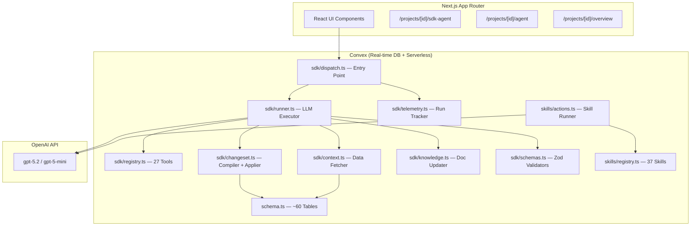

# 00 — System Overview

> **Scope**: Current SDK agent stack only. Legacy agent and flow-agent stacks are excluded.

## Mission

StudioAgent is an AI-powered project management platform for **Emi Studio (סטודיו נוי)**, a Tel-Aviv set-design & fabrication studio.  
It transforms messy human requests into executable studio plans following the canonical pipeline:

```
Elements → Tasks → Accounting (BOM + Labor) → Quote → Procurement → Install → Teardown
```

## High-Level Architecture



## Core Entity Model

| Entity | Hebrew | Purpose | Key Schema Table |
|--------|--------|---------|-----------------|
| **Project** | פרויקט | Root entity, owns everything | `projects` |
| **Element** | אלמנט | Single deliverable/installation unit | `elements` |
| **Task** | משימה | Actionable work item linked to an element | `tasks` |
| **MaterialLine** | שורת חומר | BOM entry (purchases, rentals, consumables) | `accountingLines` |
| **WorkLine** | שורת עבודה | Labor entry (hours × rate) | `accountingLines` |
| **ChangeSet** | סט שינויים | Batched DB mutations awaiting approval | `changeSets` |
| **Conversation** | שיחה | Agent conversation thread | `agentConversations` |
| **SdkRun** | ריצה | Single agent execution session | `sdkRuns` |
| **MemoryDoc** | מסמך ידע | Project knowledge document | `memoryDocs` |
| **QAPair** | שאלה ותשובה | Clarification Q&A | `qaPairs` |

## Project Lifecycle Stages

```
intake → planning → costing → quote → review → execution
```

| Stage | SDK Tools Used | Skills Used |
|-------|----------------|-------------|
| **intake** | `intake.parse_brief`, `clarify.next_questions` | `V3_Q_A_INTAKE`, `CONTEXT_GENERATION` |
| **planning** | `plan.elements`, `plan.tasks`, `plan.execution_phases` | `ELEMENTS_BUILDER_FULL`, `TASKS_BUILDER_FULL` |
| **costing** | `cost.build_budget`, `pricing.resolve_lines` | `ACCOUNTING_BUILDER_FULL`, `SHOPPING_PLANNER_WEB` |
| **quote** | `quote.generate` | `QUOTE_WRITER_FULL`, `V3_BUILD_E_QUOTE` |
| **review** | `audit.project`, `maint.sync_and_repair` | `GAP_AUDIT`, `RISK_REVIEW`, `BOM_DUPLICATE_ANALYZER` |
| **execution** | `runbook.installation`, `ops.daily_plan`, `procurement.shopping_plan` | `INSTALL_RUNBOOK_BUILDER`, `DAILY_EXECUTION_PLANNER` |

## Two Agent Systems (Co-existing)

| System | Entry Point | Registry | Prompt Source | Use Case |
|--------|-------------|----------|---------------|----------|
| **SDK Agent** | `sdk/dispatch.ts` | `sdk/registry.ts` (27 tools) | `sdk/prompts.ts` (25 constants) | Conversational + Planning flow |
| **Skills System** | `skills/actions.ts` | `skills/registry.ts` (37 skills) | `skills/prompts.ts` (37 addons) | Structured skill execution |

## Run Modes

The SDK agent operates in two modes, tracked via `sdkRuns.runMode`:

- **`PLANNING_FLOW`**: Structured project planning pipeline (Brain Dump → Questions → Final Plan)
- **`CHAT_EDIT`**: Flexible conversational interface for ongoing project management

## Language Rules

- Default communication: **Hebrew**
- English allowed for: material/product names, technical terms, SKUs, vendor names, URLs
- All JSON keys: **ASCII English only**
- Human-facing values: **Hebrew-first**
