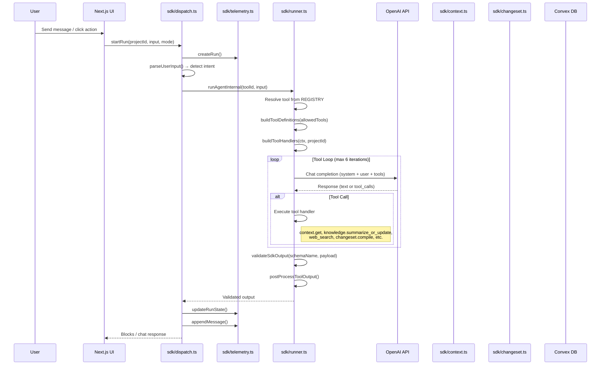

# 01 — Runtime Architecture

## Request Lifecycle

## Key Runtime Components

### Dispatch Layer (`sdk/dispatch.ts` — 3670 lines, 83 functions)

The dispatch layer is the entry point for all SDK agent interactions. Key functions:

| Function | Purpose |
|----------|---------|
| `startRun` | Creates a run, parses input, selects initial tool, executes |
| `parseUserInput` | Detects intent from user message (planning vs. chat) |
| `handlePlanningFlow` | Manages structured planning pipeline stages |
| `handleChatMode` | Routes free-form conversation to orchestrator |
| `processToolResult` | Handles tool output, manages conversation state |
| `processSkillResult` | Handles skill system results, applies changesets |

### Runner (`sdk/runner.ts` — 480 lines)

The LLM execution engine. Handles tool-calling loops, schema validation, and error recovery.

| Function | Purpose |
|----------|---------|
| `runAgentInternal` | Iterative agent loop (up to `MAX_TOOL_LOOPS=6`) |
| `runToolInternal` | Single-shot tool execution |
| `buildToolDefinitions` | Converts REGISTRY allowed tools → OpenAI function definitions |
| `buildToolHandlers` | Creates runtime handlers for `context.get`, `web_search`, `changeset.*`, `knowledge.*` |
| `resolveRuntimeLlm` | Resolves model + params from tool definition |

### Context Fetcher (`sdk/context.ts` — 339 lines)

Lazy data loading with configurable "packs":

| Pack | Data Returned |
|------|---------------|
| `project` | Project summary, name, dates, status |
| `elements` | All elements with fields |
| `tasks` | All tasks with fields |
| `accounting` | Material lines + work lines |
| `qa` | Recent QA pairs |
| `knowledge` | Memory docs (PROJECT_CONTEXT, QA_DIGEST) |
| `pricing` | Catalog price records |
| `files` | Uploaded file metadata |

### Telemetry (`sdk/telemetry.ts` — 180 lines)

All DB writes for run tracking:

| Mutation | Purpose |
|----------|---------|
| `createRun` | Initialize `sdkRuns` record with mode, stage |
| `updateRunState` | Patch status, stage, progress counters |
| `appendMessage` | Insert into `agentMessages` |
| `logEvent` | Insert into `sdkRunEvents` |
| `clearPendingChangeSet` | Reset approval state |

Run statuses: `running` → `paused` | `blocked` | `needs_input` | `awaiting_approval` | `completed` | `failed` | `cancelled`

### Knowledge Manager (`sdk/knowledge.ts` — 199 lines)

Single source of truth for project knowledge. Produces a Hebrew markdown document stored as `memoryDocs(kind='PROJECT_CONTEXT')`.

Features:
- Grounding from uploaded files (max 80 files, 70K chars text budget)
- Structured document with 14 Hebrew sections
- Merge rules: never delete, only overwrite on contradiction
- Model: `gpt-5-mini`

## Error Handling

- Schema validation failures are caught by `validateSdkOutput()` and reported in meta
- Tool loop has hard limit of 6 iterations to prevent runaway
- Run failures update status to `failed` with `lastError` field
- Changeset compilation errors are non-fatal and reported in `meta.compileErrorsHe[]`
