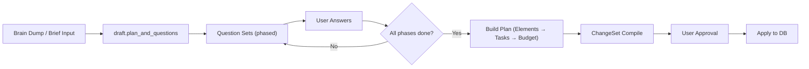
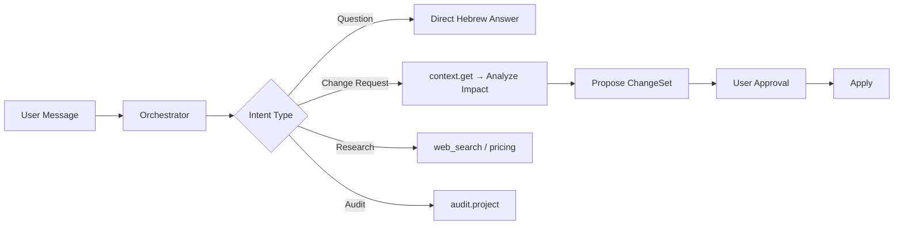
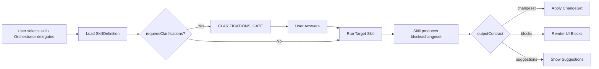

# 02 — App Routes and User Flows

## Route Map (Next.js App Router)

Source: `src/app/` — 33 page routes discovered.

### Project Workspace Routes

| Route | Purpose | Primary Agent Mode |
|-------|---------|-------------------|
| `/projects/[id]/sdk-agent` | SDK Agent — Planning flow | `PLANNING_FLOW` |
| `/projects/[id]/agent` | Agent Tab — Conversational chat | `CHAT_EDIT` |
| `/projects/[id]/overview` | Project dashboard | — |
| `/projects/[id]/elements` | Elements list/editor | — |
| `/projects/[id]/tasks` | Task board/editor | — |
| `/projects/[id]/accounting` | BOM + Labor accounting | — |
| `/projects/[id]/quote` | Quote viewer/editor | — |
| `/projects/[id]/receipts` | Receipt management | — |
| `/projects/[id]/knowledge` | Knowledge docs viewer | — |
| `/projects/[id]/studio` | Studio workspace | — |
| `/projects/[id]/suggested` | AI suggestions panel | — |
| `/projects/[id]/flow-agent` | Legacy flow agent (excluded) | — |

### Management Routes

| Route | Purpose |
|-------|---------|
| `/management` | Management dashboard |
| `/management/analytics` | Analytics |
| `/management/catalog` | Product catalog |
| `/management/customers` | Customer management |
| `/management/employees` | Employee management |
| `/management/inventory` | Inventory management |
| `/management/prices` | Pricing management |
| `/management/vendors` | Vendor management |
| `/management/web-prices` | Web price research |
| `/management/purchases` | Purchase orders |
| `/management/receipts` | Receipt tracking |
| `/management/tracing` | Agent tracing/debugging |
| `/management/proposed` | Proposed changes |
| `/management/settings` | System settings |

### Other Routes

| Route | Purpose |
|-------|---------|
| `/` | Landing / home |
| `/projects` | Projects list |
| `/tasks` | Global task view |
| `/accounting` | Global accounting view |
| `/customers` | Customer directory |
| `/customers/[customerId]` | Customer detail |

## User Flows

### Flow 1: New Project Planning (SDK Agent)

### Flow 2: Conversational Chat (Agent Tab)

### Flow 3: Skill Execution (Skills System)

