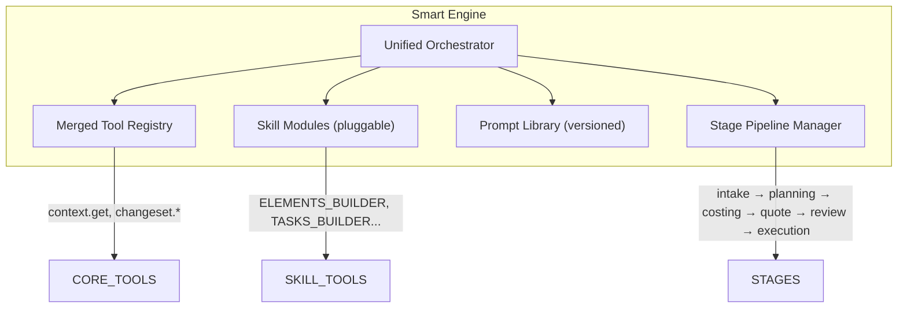

# 05 — Orchestrator Design Target: Smart Engine

> **Status**: Future target design. Not yet implemented.

## Vision

Consolidate both agent stacks (SDK Agent + Skills System) into a unified "Smart Engine" that:

1. Uses a single orchestrator with unified tool registry
2. Eliminates duplicate prompt maintenance across `sdk/prompts.ts` and `skills/prompts.ts`
3. Provides a consistent experience across both planning and chat modes
4. Supports hot-swappable skill modules
5. Maintains backward compatibility with existing conversation and run data

## Proposed Architecture

## Key Changes Required

1. **Unified Registry**: Merge `sdk/registry.ts` (27 tools) and `skills/registry.ts` (37 skills) into a single registry with consistent `ToolDefinition` interface
2. **Prompt Deduplication**: Single prompt source that generates both system prompts and skill addons
3. **Pipeline Manager**: Replace the current split between `dispatch.ts` planning flow and V3 flow skills with a unified stage pipeline
4. **Context Unification**: Merge `context.get` (SDK) and `agent.data()` (Skills) into a single data access layer

## Migration Strategy

See [15_Implementation_Blueprint_Smart_Agent.md](file:///c:/Users/elira/Dev/StudioAgent/Specs/StudioAgent_FullSpec/15_Implementation_Blueprint_Smart_Agent.md) for detailed implementation plan.
