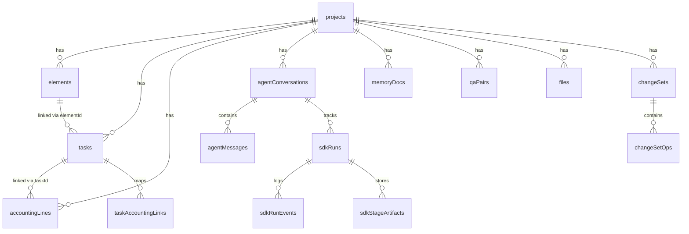

# 06 — Data Model Full

> **Source of truth**: [schema.ts](file:///c:/Users/elira/Dev/StudioAgent/convex/schema.ts) — 2227 lines, ~60 tables

## Table Groups

### Core Project Entities

| Table | Purpose | Key Fields | Key Indexes |
|-------|---------|------------|-------------|
| `projects` | Root entity | `name`, `clientName`, `status`, `eventDate`, `stageKey`, `overviewSummary`, `healthScore`, `approvedForQuote` | `by_status`, `by_client` |
| `elements` | Deliverable units | `projectId`, `title`, `type`, `status`, `order`, `tags`, `description` | `by_project`, `by_project_status` |
| `tasks` | Work items | `projectId`, `elementId`, `title`, `status`, `stage`, `workType`, `workTypeLabelHe`, `estimatedHours`, `assignee`, `checklist[]`, `dependencies` | `by_project`, `by_element`, `by_status` |
| `taskDependencies` | Task ordering | `taskId`, `dependsOnTaskId` | `by_task`, `by_depends_on` |
| `taskChecklistItems` | Atomic checklist | `taskId`, `title`, `done`, `order`, `estimatedHours`, `workType` | `by_task` |

### Accounting

| Table | Purpose | Key Fields | Indexes |
|-------|---------|------------|---------|
| `accountingLines` | Material + Labor lines | `projectId`, `elementId`, `taskId`, `lineType(material\|work)`, `sectionKey`, `sectionLabelHe`, `itemName`/`roleHe`, `quantity`, `uomCode`/`rateTypeCode`, `plannedUnitCost`, `plannedTotalCost`, `actualTotalCost`, `confidence`, `pricingSourceCode`, `dedupKey` | `by_project`, `by_element`, `by_task`, `by_section` |
| `taskAccountingLinks` | Task↔Line mapping | `taskId`, `lineType`, `workLineId`/`materialLineId`, `allocatedHours` | `by_task`, `by_line` |
| `quoteSnapshots` | Generated quotes | `projectId`, `contentMd_he`, `totals`, `status` | `by_project` |

### ChangeSet System

| Table | Purpose | Key Fields | Indexes |
|-------|---------|------------|---------|
| `changeSets` | Batched mutations | `projectId`, `status(pending\|approved\|applied\|rejected)`, `ops[]`, `createdBy`, `approvalToken`, `appliedAt` | `by_project`, `by_status` |
| `changeSetOps` | Individual operations | `changeSetId`, `op(create\|patch\|delete)`, `entity`, `tempId`/`id`, `payload` | `by_changeset` |
| `auditLogs` | Change history | `projectId`, `action`, `entity`, `entityId`, `payload`, `userId` | `by_project`, `by_entity` |

### Agent & Conversation

| Table | Purpose | Key Fields | Indexes |
|-------|---------|------------|---------|
| `agentConversations` | Chat threads | `projectId`, `engine(sdk)`, `isActive`, `runMode` | `by_project`, `by_active` |
| `agentMessages` | Chat messages | `conversationId`, `role(user\|assistant\|system)`, `text`, `blocks[]`, `runId` | `by_conversation` |
| `sdkRuns` | Agent runs | `projectId`, `conversationId`, `status`, `engine`, `currentAgentName`, `stageKey`, `runMode(PLANNING_FLOW\|CHAT_EDIT)`, `pendingChangeSetId`, `approvalToken`, `progressCount`, `noProgressCount`, `regenStatus` | `by_project`, `by_conversation`, `by_status` |
| `sdkRunEvents` | Run telemetry | `runId`, `type`, `payload`, `createdAt` | `by_run` |
| `sdkStageArtifacts` | Planning artifacts | `runId`, `stageKey`, `artifactType`, `payload` | `by_run`, `by_stage` |

### Knowledge & Memory

| Table | Purpose | Key Fields | Indexes |
|-------|---------|------------|---------|
| `memoryDocs` | Project knowledge | `projectId`, `kind(PROJECT_CONTEXT\|RUNNING_MEMORY\|QA_DIGEST)`, `title_he`, `contentMd_he` | `by_project_kind` |
| `qaPairs` | Q&A log | `projectId`, `runId`, `questionKey`, `questionText`/`questionHe`, `answerText`/`answerHe`, `status`, `topicKey`, `stageKey` | `by_project`, `by_run`, `by_key` |

### Skills

| Table | Purpose | Key Fields | Indexes |
|-------|---------|------------|---------|
| `skills` | Skill records | `projectId`, `skillId`, `status`, `params`, `result`, `runId` | `by_project`, `by_skill` |

### Vendors & Pricing

| Table | Purpose | Key Fields | Indexes |
|-------|---------|------------|---------|
| `vendors` | Vendor directory | `name`, `type`, `contactInfo`, `rating` | `by_name`, `by_type` |
| `catalogTemplates` | Product catalog | `nameHe`, `category`, `specs`, `defaultUom` | `by_category` |
| `catalogVariants` | Product variants | `templateId`, `sku`, `specs` | `by_template` |
| `catalogPriceRecords` | Price evidence | `templateId`/`variantId`, `sourceType(catalog\|web\|receipt)`, `amount`, `currency`, `url`, `confidence` | `by_template`, `by_variant` |
| `pricebook` | Labor rates | `projectId`, `workTypeKey`, `rate`, `currency` | `by_project` |

### Files & Attachments

| Table | Purpose | Key Fields | Indexes |
|-------|---------|------------|---------|
| `files` | Uploaded files | `projectId`, `fileName`, `storageId`, `summary`, `extractedText`, `topics[]`, `facts[]`, `entities[]` | `by_project` |

### Other Tables

| Table | Purpose |
|-------|---------|
| `users` | Application users |
| `customers` | Client records |
| `receipts` | Receipt records |
| `inventory` | Inventory tracking |
| `employees` | Employee records |
| `laborAllocations` | Time tracking |
| `runbooks` | Execution guides |
| `notifications` | System notifications |
| `projectTags` | Tag taxonomy |

## Key Relationships



## Canonical Enums

### Work Types
```
carpentry | metal_fab | paint_finish | printing_graphics | props_sculpt | rigging_install | transport_logistics | purchasing | management
```

### Stage Keys
```
prep | build | finish | qa | pack | transport | install | teardown | management
```

### Section Keys (Accounting)
```
materials_wood | materials_metal | materials_paint | materials_print | materials_props | consumables | packaging | transport | meals | equipment_rental | permits | storage | teardown | management
```

### Run Statuses
```
running | paused | blocked | needs_input | awaiting_approval | completed | failed | cancelled
```

### Pipeline Stages
```
intake | planning | costing | quote | review | execution
```
