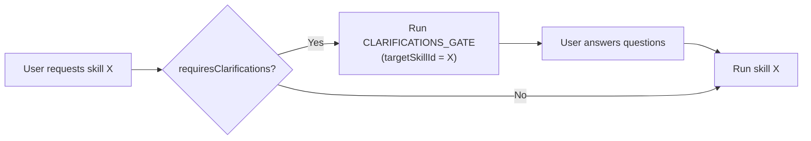
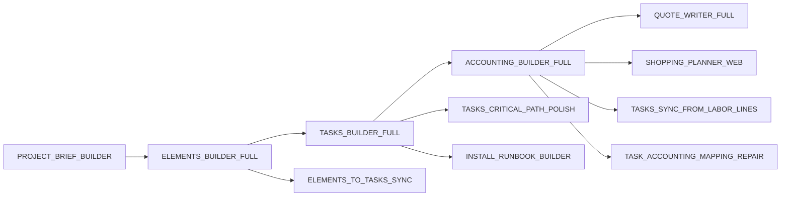

# 09 — Skills Registry and Gating

> **Source**: [skills/registry.ts](file:///c:/Users/elira/Dev/StudioAgent/convex/skills/registry.ts) — 1060 lines, 37 skill definitions

## SkillDefinition Interface

```typescript
interface SkillDefinition {
  skillId: string;
  labelHe: string;
  descriptionHe: string;
  category: "planning" | "tasks" | "knowledge" | "review" | "shopping";
  flow: "ideation" | "planning" | "execution" | "review" | "optimization";
  scheduling?: {
    suggestAfter?: string[];
    suggestAtStage?: ("ideation" | "planning" | "execution" | "review")[];
  };
  config: {
    requiresClarifications: boolean;
    clarificationsTargetSkillId?: string;
    allowedTools: {
      webSearch: boolean;
      ragSearch: boolean;
      fileInspect: boolean;
      runSkill?: boolean;
      generateQuote?: boolean;
      estimateTasks?: boolean;
      agentData?: boolean;
    };
    outputContract: "blocks" | "changeset" | "suggestions";
  };
  prompts: {
    systemHeaderRef: string;   // Always "studioops_v7_1"
    promptAddon: string;       // From SKILL_SYSTEM_ADDONS
  };
  model: string;
  llmParams?: Record<string, any>;
  isEnabled?: boolean;
}
```

## Full Skill Catalog (37 Skills)

### Knowledge & Orchestration (5 skills)

| Skill ID | Label | Flow | Output | Web | Enabled |
|----------|-------|------|--------|-----|---------|
| `knowledge` | אורקסטרטור | ideation | blocks | ❌ | ✅ |
| `HELLO_WORLD_TEST` | Test | ideation | blocks | ❌ | ✅ |
| `CLARIFICATIONS_GATE` | שאלות הבהרה | planning | blocks | ❌ | ❌ |
| `CONTEXT_GENERATION` | איסוף ידע | ideation | blocks | ❌ | ✅ |
| `CHANGESET_REVIEWER` | סקירת שינויים | review | blocks | ❌ | ❌ |

### Planning (10 skills)

| Skill ID | Label | Flow | Output | Clarify? | Enabled |
|----------|-------|------|--------|----------|---------|
| `PROJECT_BRIEF_BUILDER` | בניית בריף | ideation | blocks | ❌ | ❌ |
| `ELEMENTS_BUILDER_FULL` | תכנון אלמנטים | planning | changeset | ✅ | ✅ |
| `TASKS_BUILDER_FULL` | תכנון משימות | planning | changeset | ✅ | ✅ |
| `ACCOUNTING_BUILDER_FULL` | תכנון תקציב | planning | changeset | ✅ | ✅ |
| `QUOTE_WRITER_FULL` | הפקת הצעת מחיר | planning | changeset | ✅ | ✅ |
| `BUILD_PLANNER` | תכנון ביצוע | planning | blocks | ❌ | ✅ |
| `OVERHEAD_AND_LOGISTICS_COMPLETER` | השלמות לוגיסטיקה | planning | changeset | ❌ | ✅ |
| `QUOTE_BUILD_OR_FIX` | בניית הצעת מחיר | planning | changeset | ❌ | ✅ |
| `setLaborRates` | עדכון תעריפים | planning | changeset | ❌ | ✅ |
| `confirmMeasurements` | אישור מידות | planning | blocks | ❌ | ✅ |

### Tasks (6 skills)

| Skill ID | Label | Flow | Output | Enabled |
|----------|-------|------|--------|---------|
| `ELEMENTS_TO_TASKS_SYNC` | סנכרון אלמנטים למשימות | execution | changeset | ✅ |
| `TASKS_CRITICAL_PATH_POLISH` | נתיב קריטי | review | changeset | ✅ |
| `TASK_ACCOUNTING_MAPPING_REPAIR` | תיקון מיפוי תקציב | review | changeset | ✅ |
| `TASKS_SYNC_FROM_LABOR_LINES` | סנכרון עבודה | execution | changeset | ✅ |
| `TASKS_ENRICH_FROM_ACCOUNTING_BATCH` | העשרת משימות | planning | changeset | ✅ |
| `DAILY_EXECUTION_PLANNER` | תכנון יומי | execution | blocks | ❌ |

### Review (5 skills)

| Skill ID | Label | Flow | Output | Enabled |
|----------|-------|------|--------|---------|
| `GAP_AUDIT` | בדיקת חוסרים | review | suggestions | ✅ |
| `RISK_REVIEW` | סקירת סיכונים | review | suggestions | ✅ |
| `COST_VARIANCE_ANALYZER` | ניתוח עלויות | optimization | suggestions | ❌ |
| `BOM_DUPLICATE_ANALYZER` | זיהוי כפילויות | review | changeset | ✅ |
| `FINAL_AUDIT_FIXER` | תיקונים סופיים | review | changeset | ✅ |

### Shopping & Pricing (6 skills)

| Skill ID | Label | Flow | Web | Output |
|----------|-------|------|-----|--------|
| `SHOPPING_PLANNER_WEB` | תכנון קניות | execution | ✅ | changeset |
| `BUYING_ASSISTANT_WEB` | עוזר קניות | execution | ✅ | suggestions |
| `RESEARCH_INSPIRATION_WEB` | צ'אט יועץ | ideation | ✅ | suggestions |
| `RESEARCH_PRICING_ESTIMATES_WEB` | הערכת מחירים | planning | ✅ | changeset |
| `PRICING_LOOKUP_CATALOG_BATCH` | בדיקת מחירון | planning | ❌ | changeset |
| `PRICING_RESEARCH_WEB_BATCH` | מחקר מחיר באינטרנט | planning | ✅ | changeset |
| `PRICING_ESTIMATE_FALLBACK_BATCH` | הערכת מחיר חליפית | planning | ❌ | changeset |

### Execution (2 skills)

| Skill ID | Label | Flow | Output |
|----------|-------|------|--------|
| `INSTALL_RUNBOOK_BUILDER` | הוראות התקנה | execution | blocks |
| `RECEIPT_PARSE_AND_MAP` | פענוח קבלות | optimization | changeset |

### V3 Flow Skills (10 skills)

| Skill ID | Label | Stage | Type |
|----------|-------|-------|------|
| `V3_Q_A_INTAKE` | V3 שאלות שלב A | A | Questions |
| `V3_Q_B_PLAN` | V3 שאלות שלב B | B | Questions |
| `V3_Q_C_COST` | V3 שאלות שלב C | C | Questions |
| `V3_Q_D_POLISH_APPROVALS` | V3 שאלות שלב D | D | Questions |
| `V3_Q_E_QUOTE` | V3 שאלות שלב E | E | Questions |
| `V3_BUILD_A_MEMORYDOCS` | V3 בניה שלב A | A | Builder |
| `V3_BUILD_B_PLAN` | V3 בניה שלב B | B | Builder |
| `V3_BUILD_BC_COMBINED_PLAN_ACCOUNTING` | V3 בניה BC | B | Builder |
| `V3_BUILD_C_ACCOUNTING` | V3 בניה שלב C | C | Builder |
| `V3_BUILD_D_POLISH` | V3 בניה שלב D | D | Builder |
| `V3_BUILD_E_QUOTE` | V3 בניה שלב E | E | Builder |

## Clarification Gating

Skills that set `requiresClarifications: true` must go through `CLARIFICATIONS_GATE` first:



Gated skills: `ELEMENTS_BUILDER_FULL`, `TASKS_BUILDER_FULL`, `ACCOUNTING_BUILDER_FULL`, `QUOTE_WRITER_FULL`

## Skill Scheduling

Skills declare `suggestAfter` and `suggestAtStage` to control when they appear in suggestions:


