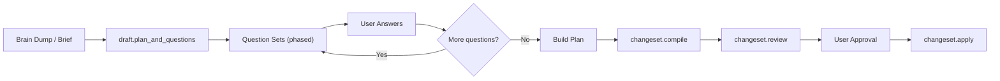
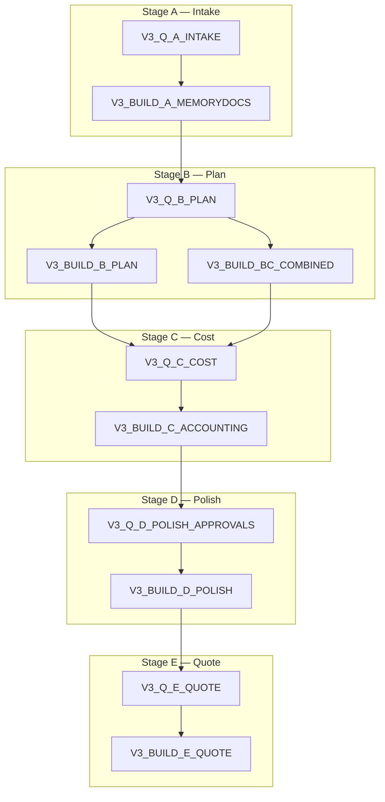
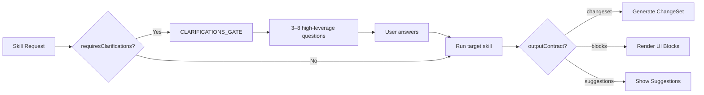

# 11 — Flow Pipelines and Gates

## SDK Planning Flow (PLANNING_FLOW Mode)

The structured planning pipeline operates through `dispatch.ts` and is triggered when a user enters via the SDK Agent tab.

### Pipeline Stages



### draft.plan_and_questions (Entry Agent)

The planning flow entry point generates:
1. An initial plan skeleton (elements + tasks outline)
2. Phased question sets to refine the plan

Question phases follow a priority order:
1. **Project anchors**: What, where, when, budget, access
2. **Build logic**: Construction methods, materials, finishes
3. **Operations**: Transport, install, teardown, safety
4. **Polish**: Dedup policies, approval gates

### Answer Processing

When the user submits answers:
1. Answers are stored as `qaPairs` in the database
2. The pipeline checks if more questions are needed for the current phase
3. If complete, advances to the build phase
4. The build phase generates changeset ops for elements, tasks, and optionally accounting

## VNext Pipeline (V3 Flow Skills)

A parallel pipeline using the Skills System, operating through 5 defined stages:



### Stage Details

| Stage | Key | Question Focus | Build Output |
|-------|-----|---------------|--------------|
| A | `brief` | Project anchors, budget, timeline | Memory docs (PROJECT_CONTEXT, QA_DIGEST) |
| B | `scope` / `concept` | Elements, construction methods, materials | Element + Task changeset |
| C | `tasks` / `budget` | Sourcing, install window, crew, transport | Material + Work line changeset |
| D | `pricing` / `ops` | Dedup policy, delete policy, relink, rename | Polish changeset (patch/archive/neutralize) |
| E | `quote` / `audit` | VAT, breakdown, exclusions, payment terms | Quote draft payload |

### VNext Contracts (Typed)

```typescript
const VNEXT_STAGE_ORDER = [
  'brief', 'scope', 'concept', 'tasks', 'budget',
  'pricing', 'ops', 'quote', 'audit', 'compile'
] as const;

type VNextStageKey = (typeof VNEXT_STAGE_ORDER)[number];

type StageArtifactMap = Record<VNextStageKey, {
  questions?: QuestionBlock[];
  answers?: Record<string, string>;
  changeset?: ChangeSetOps;
  metadata?: Record<string, unknown>;
}>;
```

## Skill Execution Gating

### Clarification Gate Flow



### Gate Priority Rules

1. **Construction method / materials first** — always before logistics
2. **No repeats** — check `qaPairs` + `memoryDocs` for existing answers
3. **Include ≥1 open-ended question** covering missing domains
4. **Stable ASCII `topicKey`** per question for dedup

## Scheduling / Suggestion Engine

Skills declare scheduling hints:

```typescript
scheduling: {
  suggestAfter: ["TASKS_BUILDER_FULL"],   // Show after these skills run
  suggestAtStage: ["planning", "review"]   // Show at these project stages
}
```

The orchestrator uses these hints to populate `SuggestionsBlock` recommendations.
