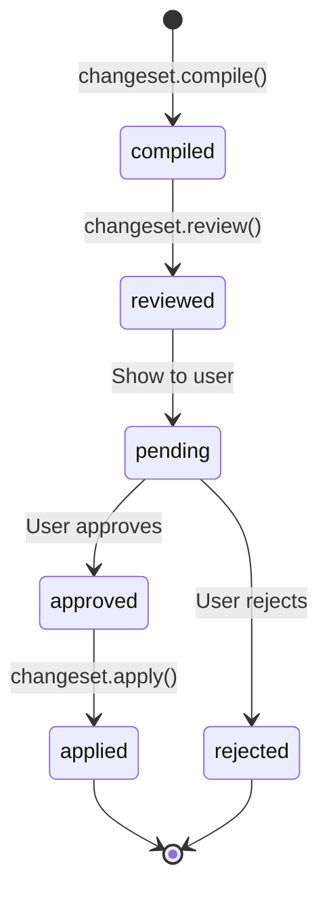
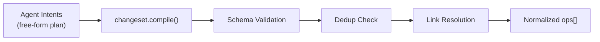

# 12 — ChangeSet and Approval Model

> **Source**: [sdk/changeset.ts](file:///c:/Users/elira/Dev/StudioAgent/convex/sdk/changeset.ts) — 988 lines, 22 functions

## ChangeSet Lifecycle



## ChangeSet Operations (11 Kinds)

### Entity Operations

| Kind | Purpose | Required Fields |
|------|---------|----------------|
| `element.create` | Create new element | `tempId`, `element: { title, type, status }` |
| `element.patch` | Update element | `elementId`, `fields: { ... }` |
| `task.create` | Create new task | `tempId`, `elementTempOrId`, `fields: { title, status, stage, workType, estimatedHours, checklist[] }` |
| `task.patch` | Update task | `taskId`, `fields: { ... }` |
| `task.syncFromLabor` | Sync task from work line | `taskId`, `workLineId` |
| `task.delete` | Delete task | `taskId` |

### Accounting Operations

| Kind | Purpose | Required Fields |
|------|---------|----------------|
| `materialLine.create` | Create material line | `tempId`, `taskTempOrId`, `fields: { itemName, quantity, uomCode, sectionKey, plannedUnitCost, plannedTotalCost }` |
| `materialLine.patch` | Update material line | `lineId`, `fields: { ... }` |
| `materialLine.delete` | Delete material line | `lineId` |
| `workLine.create` | Create labor line | `tempId`, `taskTempOrId`, `fields: { roleHe, sectionKey, plannedQuantity, rateTypeCode, plannedUnitCost, plannedTotalCost }` |
| `workLine.delete` | Delete labor line | `lineId` |

### Link Operations

| Kind | Purpose | Required Fields |
|------|---------|----------------|
| `taskAccountingLink.create` | Link task to line | `taskId`, `lineType`, `workLineId`/`materialLineId`, `allocatedHours` |
| `taskAccountingLink.delete` | Unlink | `linkId` |

## TempId Resolution

ChangeSets use `tempId` references for cross-referencing within a single batch:

```
element.create → tempId: "e1"
task.create    → elementTempOrId: "e1", tempId: "t1"
materialLine.create → taskTempOrId: "t1"
```

During `changeset.apply()`, temp IDs are resolved to real Convex `Id<>` values.

## Compilation Pipeline



### Compiler (`changeset.compile`)

- **Model**: gpt-5.2
- **Input**: Free-form plan from planning tools
- **Output**: Structured `ops[]` array
- Validates all ops against the 11-kind schema
- Resolves `tempId` cross-references
- Reports compile errors in `meta.compileErrorsHe[]`

### Deterministic ChangeSet Compiler (`vnext/compiler.ts`)

For V3 flows, a deterministic (non-LLM) compiler:
- Takes structured artifacts from stage builders
- Directly produces ops without LLM intermediation
- Used by `V3_BUILD_*` skills

## Review Process (`changeset.review`)

PR-style validation that checks:

1. **Structural validity**: All required fields present
2. **Reference integrity**: All `elementId`, `taskId` references resolve
3. **Dedup safety**: No duplicate creates for same entity
4. **Accounting consistency**: Line totals match quantity × unit cost
5. **Risk scoring**: Flag high-impact operations (deletes, large cost changes)

Output includes:
- `findings[]`: Issues found with severity
- `recommendations[]`: Suggested fixes
- `riskScore`: Overall risk assessment

## Apply Process (`changeset.apply`)

Gated by user approval:

1. Verify `approvalToken` matches
2. Resolve temp IDs → real IDs
3. Execute ops in dependency order:
   - `element.create` first
   - `task.create` next (needs element IDs)
   - `materialLine.create` / `workLine.create` (needs task IDs)
   - `taskAccountingLink.create` (needs both)
   - Patches and deletes last
4. Create audit log entries
5. Update run status to `completed`

## ChangeSetBlock UI Contract

```typescript
{
  type: "ChangeSetBlock",
  titleHe: string,
  summaryHe: string,
  stats: {
    elementsCreated?: number,
    taskCreated?: number,
    materialLinesCreated?: number,
    workLinesCreated?: number,
    // ... counts per op kind
  },
  changeSet: {
    ops: ChangeSetOp[]
  },
  nextActions: Action[]
}
```
