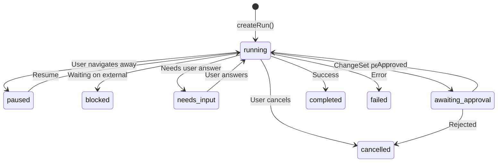
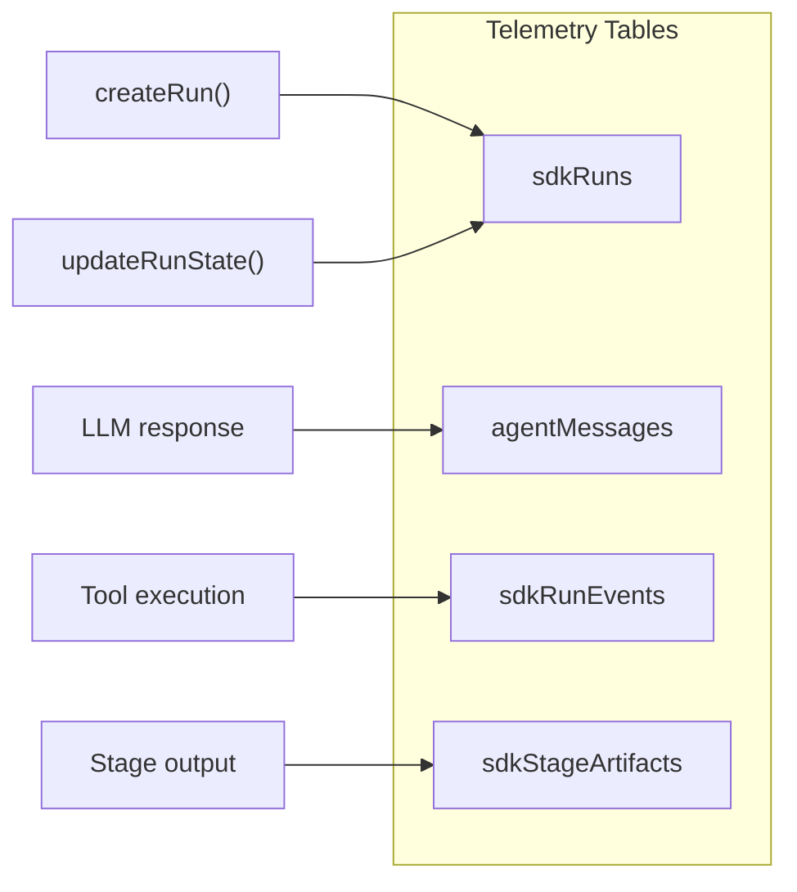

# 13 — Observability and Run Telemetry

> **Source**: [sdk/telemetry.ts](file:///c:/Users/elira/Dev/StudioAgent/convex/sdk/telemetry.ts) — 180 lines

## Run Lifecycle

## Data Flow

## sdkRuns Table

| Field | Type | Purpose |
|-------|------|---------|
| `projectId` | Id | Parent project |
| `conversationId` | Id | Parent conversation |
| `status` | string | Current run state |
| `engine` | string | Always `"sdk"` |
| `currentAgentName` | string? | Active tool/agent ID |
| `stageKey` | string? | Current pipeline stage |
| `runMode` | `PLANNING_FLOW` \| `CHAT_EDIT` | Run mode |
| `shadowMode` | boolean? | Shadow/test mode |
| `pendingChangeSetId` | Id? | Awaiting approval |
| `approvalToken` | string? | Token for approval matching |
| `progressCount` | number | Steps completed |
| `noProgressCount` | number | Consecutive no-progress steps |
| `regenStatus` | string? | Regeneration state |
| `lastError` | string? | Error message if failed |
| `createdAt` | number | Timestamp |
| `updatedAt` | number | Timestamp |

## sdkRunEvents Table

Events logged during execution:

| Event Type | When Logged |
|------------|-------------|
| `tool_start` | Before each tool execution |
| `tool_end` | After tool completes |
| `tool_error` | On tool failure |
| `llm_call` | Before LLM invocation |
| `llm_response` | After LLM responds |
| `changeset_compiled` | After changeset compilation |
| `changeset_applied` | After changeset application |
| `stage_advanced` | Pipeline stage change |
| `user_input` | User message/answer received |

## Message Compression

For long conversations, the runner uses message compression (`messageCompression.ts`):

| Function | Purpose |
|----------|---------|
| `buildMessageStats` | Count tokens/messages for context window management |
| `summarizeToolResultCompact` | Compress verbose tool results into shorter summaries |

## Post-Processing

After tool output validation, `postProcessToolOutput` handles:
- Extracting `SuggestionsBlock` actions for UI
- Extracting `QuestionsBlock` for answer collection
- Extracting `ChangeSetBlock` for approval flow
- Injecting next-step recommendations

## Monitoring Points

| What to Monitor | Where | Why |
|-----------------|-------|-----|
| `noProgressCount > 3` | `sdkRuns` | Agent may be stuck in a loop |
| `status === 'failed'` | `sdkRuns` | Run errors |
| `regenStatus !== null` | `sdkRuns` | Regeneration in progress |
| Tool loop count approaching 6 | `sdkRunEvents` | Approaching MAX_TOOL_LOOPS |
| `meta.compileErrorsHe` non-empty | ChangeSet output | Compilation issues |
