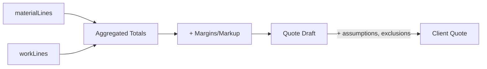

# Appendix C — Accounting Deep Dive

## Dual-Line Architecture

All accounting data lives in the `accountingLines` table, differentiated by `lineType`:

| Line Type | Purpose | Key Fields |
|-----------|---------|------------|
| `material` | Purchases, rentals, consumables | `itemName`, `quantity`, `uomCode`, `plannedUnitCost`, `plannedTotalCost` |
| `work` | Labor hours | `roleHe`, `plannedQuantity`, `rateTypeCode`, `plannedUnitCost`, `plannedTotalCost` |

## Line Scoping

Lines can be scoped to an element or to the project level:

| Scope | How | Example |
|-------|-----|---------|
| **Element-level** | Set `elementId` or `elementTempOrId` | "Plywood for Main Stage" |
| **Project-level** | Set `elementScope: "project"` | "Transport to venue", "Crew meals" |

## Pricing Source Cascade

The system uses a three-tier pricing resolution:

```
1. Catalog (internal price book) → confidence: high
2. Web search (live prices)       → confidence: medium
3. Agent estimate (fallback)       → confidence: low
```

### Pricing Fields

| Field | Purpose |
|-------|---------|
| `pricingSourceCode` | `catalog` \| `web` \| `receipt` \| `estimate` |
| `confidence` | `0.0–1.0` (numeric) or `"high"` \| `"medium"` \| `"low"` |
| `priceUrl` | Evidence URL for web/catalog prices |
| `priceCheckedAt` | Timestamp of last price check |
| `dedupKey` | Stable key for idempotent re-runs |
| `notesHe` | Hebrew assumptions about the price |

## Rules (from prompts)

1. **Never set price to 0** — always estimate if unknown
2. **Never mark as RFP** — provide a number with low confidence
3. **Never present estimate as vendor quote**
4. **Dedup is mandatory** — check existing lines before creating
5. **Management lines** use `isManagement: true` flag
6. **Overhead** includes: transport, meals, safety, consumables, equipment rental

## Task←→Accounting Links

The `taskAccountingLinks` table maps tasks to their cost lines:

```
Task (t1) ←→ materialLine (m1)  via taskAccountingLink
Task (t1) ←→ workLine (w1)      via taskAccountingLink
```

### Link Fields

| Field | Purpose |
|-------|---------|
| `taskId` | Parent task |
| `lineType` | `labor` \| `material` |
| `workLineId` / `materialLineId` | Target line |
| `allocatedHours` | Hours allocated (for labor) |

## Budget Aggregation

```
Element Budget = Σ(element's materialLines.plannedTotalCost) + Σ(element's workLines.plannedTotalCost)
Project Budget = Σ(all elements) + Σ(project-level lines)
```

## Quote Integration

The quote system pulls from accounting totals:


